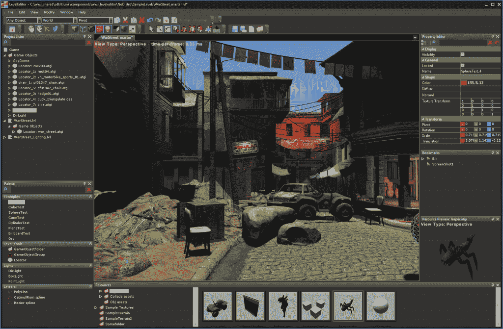
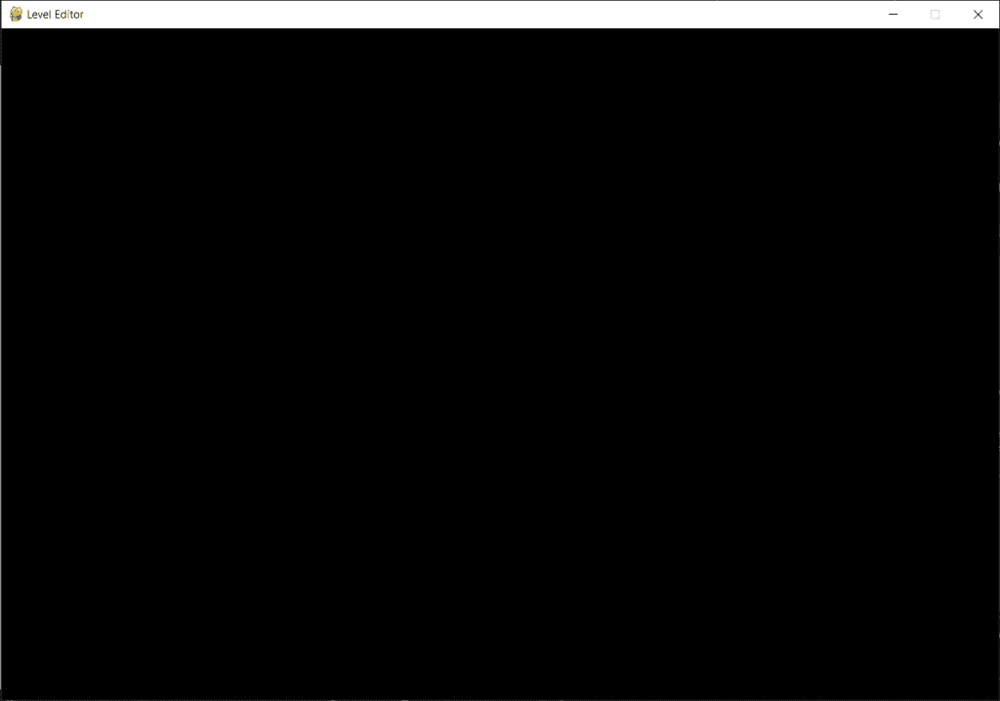
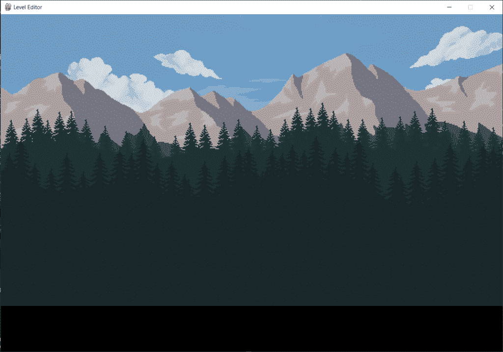

# 第 1 部分:Python 中的关卡编辑器——设置和背景图片

> 原文：<https://www.askpython.com/python/examples/level-editor-in-python-part-1>

嘿伙计们！在接下来的几个系列教程中，我们将学习如何使用 pygame 从头开始创建关卡编辑器！你需要对 Python 和 Pygame 有一个基本的了解才能完成本教程。所以如果你是第一次做，我建议你从 [Python Pygame 简介](https://www.askpython.com/python-modules/python-pygame)开始。

我们先来了解一下编辑都是什么水平。

***也看: [PyGame 教程:Python 中的图形化 Hi-Lo 游戏](https://www.askpython.com/python/examples/pygame-graphical-hi-lo-game)***

* * *

## 什么是关卡编辑器？

关卡编辑器是一个程序/窗口，它允许游戏开发者利用各种资源为数字游戏设计环境，以便设计游戏的多个关卡。



LevelEditor Real Life Demo

这也包括所有的挑战，字符必须面对和行动，他们必须采取措施，以征服他们，走向胜利！

* * *

## 用 Python 实现关卡编辑器

和往常一样，我们从导入模块开始，这里我们将使用`init`函数初始化 pygame 窗口。

```py
import pygame

pygame.init()

```

### 1.创建关卡编辑器窗口

接下来，我们必须为关卡编辑器创建窗口。为此，我们将设置一些参数，如高度、宽度和边距。

现在，我们将保持宽度和高度分别为 800 和 640，下边距和侧边距分别为 100 和 300。您可以根据自己的喜好更改尺寸。

此处的页边距将用于以下功能:

1.  下边距:`START`和`LOAD`选项
2.  侧边空白:显示可放置在屏幕上的`BLOCKS`

接下来，我们将在`set_mode`函数的帮助下创建屏幕，该函数将获取屏幕的高度和宽度。与此同时，我们将在`set_caption`函数的帮助下设置窗口的标题。

现在我们希望我们的屏幕保持不动，直到点击右上角的`X`按钮。因此，我们将创建一个 while 循环，它将一直运行，直到变量`running`保持为`True`。

为了捕捉点击`X`时的事件，我们将使用`event.get`函数，该函数将考虑屏幕上发生的所有事件。

现在 pygame 中的每个事件都有一个定义好的名称。按下 X 的事件属于`QUIT`类型，因此如果事件类型为 QUIT，我们将运行变量设为`False`。

```py
import pygame
pygame.init()

screen_width = 800
screen_height = 640

lower_margin = 100
side_margin = 300

screen = pygame.display.set_mode((screen_width+side_margin,screen_height+lower_margin))
pygame.display.set_caption('Level Editor')

running = True
while(running):

    for event in pygame.event.get():
        if(event.type==pygame.QUIT):
            running = False

pygame.quit()

```



LevelEditor Blank Screen

现在的输出是一个空白的屏幕，现在已经准备好了一些背景图像和附加功能放在上面。

让我们开始在程序中加载图像吧！

### 2.在应用程序中加载图像

图像在`load`功能的帮助下加载，需要图像的路径，这取决于图像在系统中的位置。

加载发生在运行循环之前，如`line 13 to 16`之间所示。

```py
import pygame
pygame.init()

screen_width = 800
screen_height = 640

lower_margin = 100
side_margin = 300

screen = pygame.display.set_mode((screen_width+side_margin,screen_height+lower_margin))
pygame.display.set_caption('Level Editor')

grass1 = pygame.image.load('Images/Background_Images/grass1.png').convert_alpha()
grass2 = pygame.image.load('Images/Background_Images/grass2.png').convert_alpha()
mountain = pygame.image.load('Images/Background_Images/mountain.png').convert_alpha()
sky = pygame.image.load('Images/Background_Images/sky.png').convert_alpha()

running = True
while(running):

    for event in pygame.event.get():
        if(event.type==pygame.QUIT):
            running = False

pygame.quit()

```

### 3.将图像绘制到背景

现在接下来我们需要将图像绘制到背景中，我们将为其创建一个新的函数，如下面提到的从`line 18`开始的代码所示。

为了绘制图像，我们使用了`blit`函数，并且有必要在运行 while 循环的每次迭代中对视图进行`update`处理。

我们还需要图像的坐标，我已经根据我的屏幕尺寸设置了它们。你可以在你那端的定位上玩玩！

```py
import pygame
pygame.init()

screen_width = 800
screen_height = 640

lower_margin = 100
side_margin = 300

screen = pygame.display.set_mode((screen_width+side_margin,screen_height+lower_margin))
pygame.display.set_caption('Level Editor')

tree1 = pygame.image.load('Images/Background_Images/grass1.png').convert_alpha()
tree2 = pygame.image.load('Images/Background_Images/grass2.png').convert_alpha()
mountain = pygame.image.load('Images/Background_Images/mountain.png').convert_alpha()
sky = pygame.image.load('Images/Background_Images/sky.png').convert_alpha()

def paint_bg():
    screen.blit(sky,(0,0))
    screen.blit(mountain,(0,screen_height-mountain.get_height()-300))
    screen.blit(tree1,(0,screen_height-tree1.get_height()-150))
    screen.blit(tree2,(0,screen_height-tree2.get_height()))

running = True
while(running):

    paint_bg()

    for event in pygame.event.get():
        if(event.type==pygame.QUIT):
            running = False

    pygame.display.update()

pygame.quit()

```



LevelEditor Draft1

* * *

## 结论

到这一部分结束时，我们已经清楚了什么是关卡编辑器，以及如何为关卡编辑器创建一个基本的设置。在下一部分，我们将学习如何在屏幕上添加更多的元素。

更多零件敬请期待！快乐学习！😇

* * *