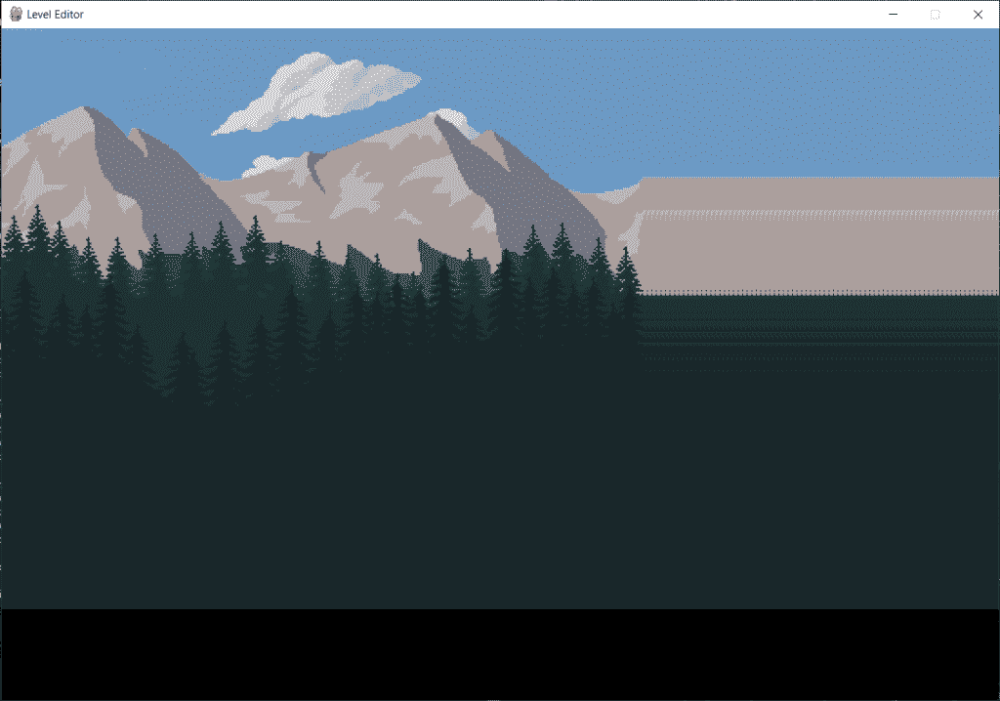
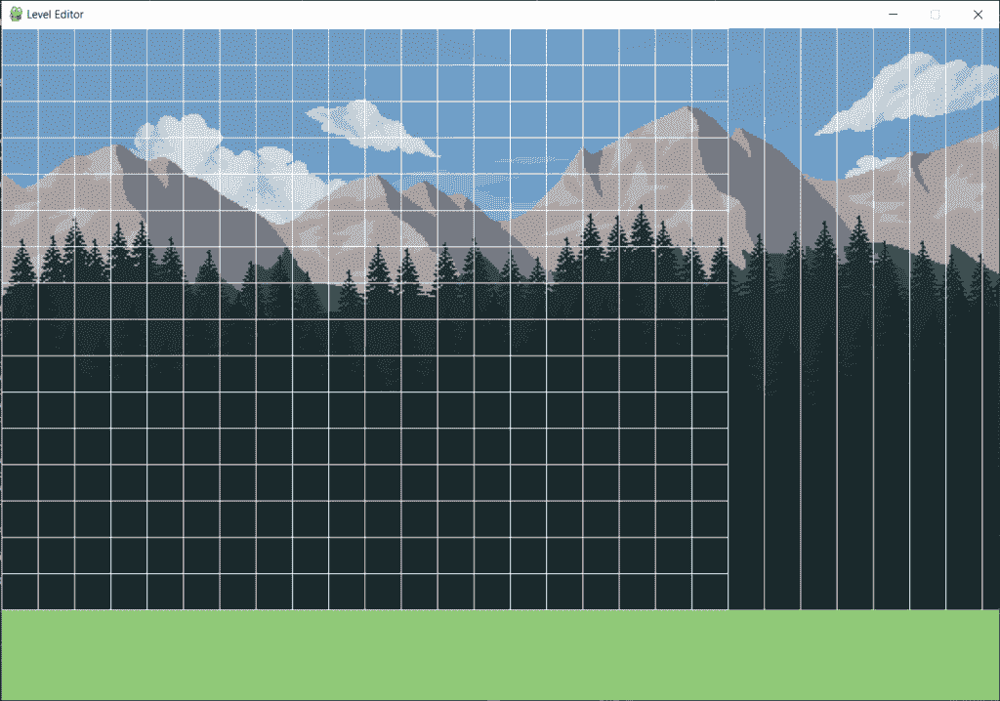

# 第 2 部分:Python 中的关卡编辑器——滚动背景和网格

> 原文：<https://www.askpython.com/python/examples/level-editor-in-python-part-2>

你好。所以在本教程中，我们将继续建立我们的水平编辑器。关卡编辑器对于为玩家创造一个惊人的挑战性游戏环境非常有用。

在这一部分，我们将致力于创建一个滚动背景和网格。让我们先来看看到目前为止我们所取得的成就。

***阅读:[第一部分:Python 中的关卡编辑器——设置和背景图](https://www.askpython.com/python/level-editor-in-python-part-1)***

* * *

## 第 1 部分–最终代码

在这个[的最后一部分](https://www.askpython.com/python/level-editor-in-python-part-1)，我们成功地创建了关卡编辑器的设置，并在窗口中添加了背景图片。最后一部分的代码如下:

```py
import pygame
pygame.init()

screen_width = 800
screen_height = 640

lower_margin = 100
side_margin = 300

screen = pygame.display.set_mode((screen_width+side_margin,screen_height+lower_margin))
pygame.display.set_caption('Level Editor')

tree1 = pygame.image.load('Images/Background_Images/grass1.png').convert_alpha()
tree2 = pygame.image.load('Images/Background_Images/grass2.png').convert_alpha()
mountain = pygame.image.load('Images/Background_Images/mountain.png').convert_alpha()
sky = pygame.image.load('Images/Background_Images/sky.png').convert_alpha()

def paint_bg():
    screen.blit(sky,(0,0))
    screen.blit(mountain,(0,screen_height-mountain.get_height()-300))
    screen.blit(tree1,(0,screen_height-tree1.get_height()-150))
    screen.blit(tree2,(0,screen_height-tree2.get_height()))

running = True
while(running):

    paint_bg()

    for event in pygame.event.get():
        if(event.type==pygame.QUIT):
            running = False

    pygame.display.update()

pygame.quit()

```


LevelEditor Draft1

* * *

## 背景的滚动能力

在我们使用滚动背景之前，我们需要声明下面列出的一些变量:

1.  向左滚动
2.  向右滚动
3.  卷起
4.  滚动速度

声明发生在运行函数之前。下面声明从`line 13`开始的变量。

在声明了这些变量之后，为了具备滚动能力，我们需要根据事件发生的情况，在运行循环中添加条件语句。

### 1.声明滚动变量和键

现在，要发生滚动事件，需要按下`LEFT`箭头键向左移动，按下`RIGHT`箭头键向右移动。因此，事件的类型将是一个`KEYDOWN`事件类型。

此外，我们将检查关键字是否为`K_LEFT`，然后使`scroll_left`变量为真，类似的情况也会发生在`K_RIGHT`和`scroll_right`变量上。

我们还需要添加释放键时的动作，因为这时滚动需要停止，两个变量再次被设置为 False。这种事件类型就是`KEYUP`事件。

查看下面提到的代码，了解前面解释的所有内容。

```py
import pygame
pygame.init()

screen_width = 800
screen_height = 640

lower_margin = 100
side_margin = 300

screen = pygame.display.set_mode((screen_width+side_margin,screen_height+lower_margin))
pygame.display.set_caption('Level Editor')

scroll_left = False
scroll_right = False
scroll = 0
scroll_speed = 1

tree1 = pygame.image.load('Images/Background_Images/grass1.png').convert_alpha()
tree2 = pygame.image.load('Images/Background_Images/grass2.png').convert_alpha()
mountain = pygame.image.load('Images/Background_Images/mountain.png').convert_alpha()
sky = pygame.image.load('Images/Background_Images/sky.png').convert_alpha()

def paint_bg():
    screen.blit(sky,(0,0))
    screen.blit(mountain,(0,screen_height-mountain.get_height()-300))
    screen.blit(tree1,(0,screen_height-tree1.get_height()-150))
    screen.blit(tree2,(0,screen_height-tree2.get_height()))

running = True
while(running):

    paint_bg()

    for event in pygame.event.get():
        if(event.type==pygame.QUIT):
            running = False

        if(event.type == pygame.KEYDOWN):
            if(event.key == pygame.K_LEFT):
                scroll_left = True
            if(event.key == pygame.K_RIGHT):
                scroll_right = True

        if(event.type == pygame.KEYUP):
            if(event.key == pygame.K_LEFT):
                scroll_left = False
            if(event.key == pygame.K_RIGHT):
                scroll_right = False

    pygame.display.update()

pygame.quit()

```

但是这还不会增加滚动功能。因为我们已经给一些变量赋值了，但是还没有做任何事情。

### 2.创建滚动条件

为了实现这一点，我们将在调用背景绘画函数后在运行循环中创建一些条件语句，如下面提到的代码所示。

我们想让窗口滚动 5 的**像素值，我们需要做的另一个重要步骤是确保背景图像从滚动开始向两个方向绘制。**

因此，在`paint_bg`函数中，我们将改变图像的起始坐标为`scroll`。我们需要做的另一件重要的事情是在坐标前添加一个`minus`(–)，以使滚动方向正确。

看到输出，你会大吃一惊。你自己去看看吧！

```py
import pygame
pygame.init()

screen_width = 800
screen_height = 640

lower_margin = 100
side_margin = 300

screen = pygame.display.set_mode((screen_width+side_margin,screen_height+lower_margin))
pygame.display.set_caption('Level Editor')

scroll_left = False
scroll_right = False
scroll = 0
scroll_speed = 1

tree1 = pygame.image.load('Images/Background_Images/grass1.png').convert_alpha()
tree2 = pygame.image.load('Images/Background_Images/grass2.png').convert_alpha()
mountain = pygame.image.load('Images/Background_Images/mountain.png').convert_alpha()
sky = pygame.image.load('Images/Background_Images/sky.png').convert_alpha()

def paint_bg():
    screen.blit(sky,(-scroll,0))
    screen.blit(mountain,(-scroll,screen_height-mountain.get_height()-300))
    screen.blit(tree1,(-scroll,screen_height-tree1.get_height()-150))
    screen.blit(tree2,(-scroll,screen_height-tree2.get_height()))

running = True
while(running):

    paint_bg()

    if(scroll_left==True):
        scroll-=5

    if(scroll_right==True):
        scroll+=5

    for event in pygame.event.get():
        if(event.type==pygame.QUIT):
            running = False

        if(event.type == pygame.KEYDOWN):
            if(event.key == pygame.K_LEFT):
                scroll_left = True
            if(event.key == pygame.K_RIGHT):
                scroll_right = True

        if(event.type == pygame.KEYUP):
            if(event.key == pygame.K_LEFT):
                scroll_left = False
            if(event.key == pygame.K_RIGHT):
                scroll_right = False

    pygame.display.update()

pygame.quit()

```



LevelEditor Scroll Output 1

哦，看看滚动后我们的图像变得多么混乱！我们想要这样吗？没有权利。

先搞定背景吧！

### 3.优化滚动背景

首先，让我们使滚动背景一些随机的颜色。为了做到这一点，我们要确保在每次迭代中，我的背景都用颜色填充，稍后，我们将在绘制的颜色上填充原始背景图像。

为了实现这一点，我们将获取一个变量`x`并对其进行多次迭代`n`(这个 n 可以是任何值，现在我取 4)。然后，我们将改变初始坐标，并增加图像的宽度。

这里图像的宽度是一样的，所以我们可以取一个变量。在您的情况下，如果宽度不同，请单独使用。

我们需要做的另一件事是滚动。为此，我们在下面提到的代码的第 38 行添加了一个附加条件。

```py
import pygame
pygame.init()

screen_width = 800
screen_height = 640

lower_margin = 100
side_margin = 300

screen = pygame.display.set_mode((screen_width+side_margin,screen_height+lower_margin))
pygame.display.set_caption('Level Editor')

scroll_left = False
scroll_right = False
scroll = 0
scroll_speed = 1

tree1 = pygame.image.load('Images/Background_Images/grass1.png').convert_alpha()
tree2 = pygame.image.load('Images/Background_Images/grass2.png').convert_alpha()
mountain = pygame.image.load('Images/Background_Images/mountain.png').convert_alpha()
sky = pygame.image.load('Images/Background_Images/sky.png').convert_alpha()

def paint_bg():

    screen.fill((144,201,120)) # Green Color
    width = sky.get_width()
    for x in range(4):
        screen.blit(sky,((x*width)-scroll,0))
        screen.blit(mountain,((x*width)-scroll,screen_height-mountain.get_height()-300))
        screen.blit(tree1,((x*width)-scroll,screen_height-tree1.get_height()-150))
        screen.blit(tree2,((x*width)-scroll,screen_height-tree2.get_height()))

running = True
while(running):

    paint_bg()

    if(scroll_left==True and scroll>0):
        scroll-=5

    if(scroll_right==True):
        scroll+=5

    for event in pygame.event.get():
        if(event.type==pygame.QUIT):
            running = False

        if(event.type == pygame.KEYDOWN):
            if(event.key == pygame.K_LEFT):
                scroll_left = True
            if(event.key == pygame.K_RIGHT):
                scroll_right = True

        if(event.type == pygame.KEYUP):
            if(event.key == pygame.K_LEFT):
                scroll_left = False
            if(event.key == pygame.K_RIGHT):
                scroll_right = False

    pygame.display.update()

pygame.quit()

```

* * *

## 在屏幕上绘制网格

为了有网格线，首先我们需要声明一些变量，包括你在屏幕上需要的行数和列数(你可以根据你的喜好设置它们)。我们还需要计算网格上每个`square`瓷砖的大小，我们定义了颜色`WHITE`来给网格添加颜色。

为了在屏幕上绘制网格线，我们声明了一个函数，它将在屏幕上绘制垂直线和水平线。我们将使用循环来确保网格线随着滚动而移动，而不是静止在屏幕上。

在下面提到的代码中，网格线的代码从`Line 34`开始。

```py
import pygame
pygame.init()

screen_width = 800
screen_height = 640

lower_margin = 100
side_margin = 300

screen = pygame.display.set_mode((screen_width+side_margin,screen_height+lower_margin))
pygame.display.set_caption('Level Editor')

scroll_left = False
scroll_right = False
scroll = 0
scroll_speed = 1

tree1 = pygame.image.load('Images/Background_Images/grass1.png').convert_alpha()
tree2 = pygame.image.load('Images/Background_Images/grass2.png').convert_alpha()
mountain = pygame.image.load('Images/Background_Images/mountain.png').convert_alpha()
sky = pygame.image.load('Images/Background_Images/sky.png').convert_alpha()

def paint_bg():

    screen.fill((144,201,120)) # Green Color
    width = sky.get_width()
    for x in range(4):
        screen.blit(sky,((x*width)-scroll,0))
        screen.blit(mountain,((x*width)-scroll,screen_height-mountain.get_height()-300))
        screen.blit(tree1,((x*width)-scroll,screen_height-tree1.get_height()-150))
        screen.blit(tree2,((x*width)-scroll,screen_height-tree2.get_height()))

no_rows = 16
no_columns = 150
tile_size = screen_height//no_rows
WHITE = (255, 255, 255)

def draw_gridlines():
    #vertical lines
	for c in range(no_columns + 1):
		pygame.draw.line(screen, WHITE, (c * tile_size - scroll, 0), (c * tile_size - scroll, screen_height))
	#horizontal lines
	for c in range(no_rows + 1):
		pygame.draw.line(screen, WHITE, (0, c * tile_size), (screen_width, c * tile_size))

running = True
while(running):

    paint_bg()
    draw_gridlines()

    if(scroll_left==True and scroll>0):
        scroll-=5

    if(scroll_right==True):
        scroll+=5

    for event in pygame.event.get():
        if(event.type==pygame.QUIT):
            running = False

        if(event.type == pygame.KEYDOWN):
            if(event.key == pygame.K_LEFT):
                scroll_left = True
            if(event.key == pygame.K_RIGHT):
                scroll_right = True

        if(event.type == pygame.KEYUP):
            if(event.key == pygame.K_LEFT):
                scroll_left = False
            if(event.key == pygame.K_RIGHT):
                scroll_right = False

    pygame.display.update()

pygame.quit()

```



LevelEditor GridLines Addition

我知道你可能想知道只有垂直线的部分。在后面的章节中，这个部分将被侧板覆盖。

所以不用担心。😇

* * *

## 结论

在这一部分的最后，我们学会了在关卡编辑器上添加滚动效果，并添加网格线来帮助我们稍后为关卡添加方块。在下一部分，我们将学习如何在屏幕上添加更多的元素。

更多零件敬请期待！快乐学习！😇

* * *