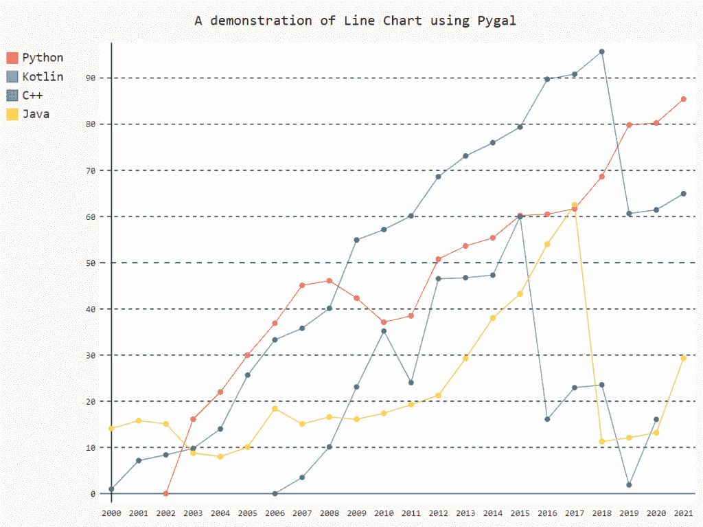

# 使用 Pygal 实现折线图可视化

> 原文：<https://www.askpython.com/python-modules/line-chart-visualization-pygal>

Python 有不同的可视化包，可以用来制作不同种类的图表、图形和绘图。Pygal 是一个开源 Python 包，它不仅可以生成高度交互的图形，还可以生成图形和图形的 SVG 图片，允许我们根据需要使用和修改它们。Pygal 非常灵活，只需要几行代码就可以生成图形。

***也可阅读: [4 易绘图库为 Python 配实例](https://www.askpython.com/python-modules/plotting-libraries-python)***

在本教程中，我们将探索可以使用`PyGal`创建的折线图可视化，以及如何以`SVG`格式下载。

* * *

在我们开始检查 pygal 之前，它必须安装有`pip install pygal`。安装后，我们将导入 pygal 进行可视化。

我们将使用下面的代码从一个简单的折线图开始我们的可视化。我们将从使用`Line`函数创建一个空折线图开始，并使用`title`属性设置图表的标题。

接下来，我们将随机设置`x_labels`，然后我们将为四种不同的编程语言制作折线图，并为每个折线图添加线标签和值。最后，我们将使用`render_to_file`方法保存并呈现 SVG 格式的绘图。

```py
# Create an empty Line Chart
Line_Chart = pygal.Line()

# Set title of the Line Chart
Line_Chart.title = 'A demonstration of Line Chart using Pygal'

# Set x labels/values
Line_Chart.x_labels = map(str, range(2000, 2022)) 

# Adding Line Chart for each language popularity over the years
Line_Chart.add('Python', [None, None, 0, 16.1, 22, 30, 36.9, 45.1, 
                          46.1, 42.33, 37.11, 38.5,50.78, 53.62, 55.37, 
                          60.22, 60.5, 61.68, 68.65, 79.83, 80.25, 85.44]) 

Line_Chart.add('Kotlin', [None, None, None, None, None, None, 0, 3.5, 10.1, 
                          23.1, 35.2,24.03, 46.53, 46.74, 47.31, 59.93,
                          16.11, 22.94, 23.56,1.86, 16.07]) 

Line_Chart.add('C++', [0.99, 7.15, 8.39, 9.78, 14.0, 25.66, 33.3, 35.8, 40.11, 
                       54.92, 57.17, 60.14, 68.63, 73.11, 75.99, 79.37, 89.73, 
                       90.82, 95.71,60.66,61.43, 64.94]) 

Line_Chart.add('Java', [14.1, 15.8, 15.1, 8.8, 8, 10.1, 18.4, 15.1, 16.6, 
                        16.1, 17.4,19.27, 21.24, 29.29, 38.04, 43.24, 
                        54.0, 62.55,11.28, 12.08, 13.19,29.35]) 

# Save the plot in svg format
Line_Chart.render_to_file('Line_Chart_Demo.svg')

```



Line Chart Pygal

我们还可以借助下面代码所示的`HorizontalLine`方法来可视化`Horizontal Line Chart`。其余的代码保持不变。

```py
# Create an empty Line Chart
Line_Chart = pygal.HorizontalLine()

# Set title of the Line Chart
Line_Chart.title = 'A Horizontal Line Chart using Pygal'

# Set x labels/values
Line_Chart.x_labels = map(str, range(2000, 2022)) 

# Adding Line Chart for each language popularity over the years
Line_Chart.add('Python', [None, None, 0, 16.1, 22, 30, 36.9, 45.1, 
                          46.1, 42.33, 37.11, 38.5,50.78, 53.62, 55.37, 
                          60.22, 60.5, 61.68, 68.65, 79.83, 80.25, 85.44]) 

Line_Chart.add('Kotlin', [None, None, None, None, None, None, 0, 3.5, 10.1, 
                          23.1, 35.2,24.03, 46.53, 46.74, 47.31, 59.93,
                          16.11, 22.94, 23.56,1.86, 16.07]) 

Line_Chart.add('C++', [0.99, 7.15, 8.39, 9.78, 14.0, 25.66, 33.3, 35.8, 40.11, 
                       54.92, 57.17, 60.14, 68.63, 73.11, 75.99, 79.37, 89.73, 
                       90.82, 95.71,60.66,61.43, 64.94]) 

Line_Chart.add('Java', [14.1, 15.8, 15.1, 8.8, 8, 10.1, 18.4, 15.1, 16.6, 
                        16.1, 17.4,19.27, 21.24, 29.29, 38.04, 43.24, 
                        54.0, 62.55,11.28, 12.08, 13.19,29.35]) 

# Save the plot in svg format
Line_Chart.render_to_file('Horizontal_Line_Chart_Demo.svg')

```


Horizontal Line Chart Pygal

我们还可以借助下面代码所示的`StackedLine`方法来可视化`Stacked Line Chart`。我们可以通过一个属性`fill`作为`True`来填充线条剧情，有创意！

```py
# Create an empty Line Chart
Line_Chart = pygal.StackedLine(fill=True)

# Set title of the Line Chart
Line_Chart.title = 'A Stacked Line Chart (Filled) using Pygal'

# Set x labels/values
Line_Chart.x_labels = map(str, range(2000, 2022)) 

# Adding Line Chart for each language popularity over the years
Line_Chart.add('Python', [None, None, 0, 16.1, 22, 30, 36.9, 45.1, 
                          46.1, 42.33, 37.11, 38.5,50.78, 53.62, 55.37, 
                          60.22, 60.5, 61.68, 68.65, 79.83, 80.25, 85.44]) 

Line_Chart.add('Kotlin', [None, None, None, None, None, None, 0, 3.5, 10.1, 
                          23.1, 35.2,24.03, 46.53, 46.74, 47.31, 59.93,
                          16.11, 22.94, 23.56,1.86, 16.07]) 

Line_Chart.add('C++', [0.99, 7.15, 8.39, 9.78, 14.0, 25.66, 33.3, 35.8, 40.11, 
                       54.92, 57.17, 60.14, 68.63, 73.11, 75.99, 79.37, 89.73, 
                       90.82, 95.71,60.66,61.43, 64.94]) 

Line_Chart.add('Java', [14.1, 15.8, 15.1, 8.8, 8, 10.1, 18.4, 15.1, 16.6, 
                        16.1, 17.4,19.27, 21.24, 29.29, 38.04, 43.24, 
                        54.0, 62.55,11.28, 12.08, 13.19,29.35]) 

# Save the plot in svg format
Line_Chart.render_to_file('Stacked_Filled_Line_Chart_Demo.svg')

```


Stacked Filled Line Chart Pygal

* * *

我希望你通过这篇教程学到了一些新的有趣的东西。
感谢您的阅读！

我也向您推荐这些教程:

1.  [Python 中棒棒糖图介绍](https://www.askpython.com/python/examples/lollipop-charts-in-python)
2.  [如何用 Python 绘制和自定义饼状图？](https://www.askpython.com/python/plot-customize-pie-chart-in-python)
3.  [Python 中的小提琴情节——简单指南](https://www.askpython.com/python/examples/violin-plots-in-python)

* * *