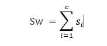
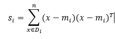
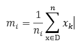
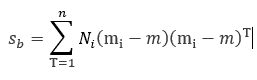
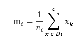
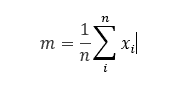
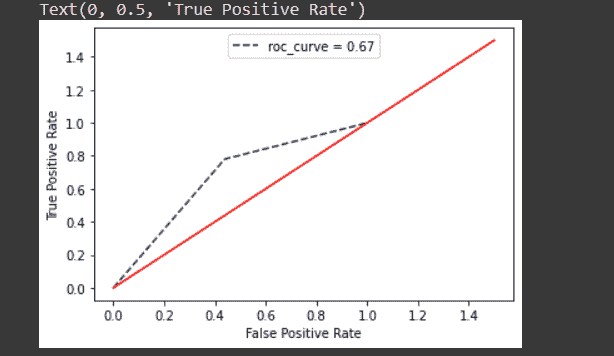

# Python 中的线性判别分析——详细指南

> 原文：<https://www.askpython.com/python/examples/linear-discriminant-analysis>

线性判别分析是一种解决多分类器问题的降维技术。它也被用于大多数监督分类问题。它提供了一种寻找对象或类的特征之间的线性组合的方法。通过分析这个分析过程中涉及的步骤，我们可以更好地理解这一点。

***也读作:[Python 中的潜在狄利克雷分配(LDA)算法](https://www.askpython.com/python/examples/latent-dirichlet-allocation-lda)***

*   不同类别特征的计算方法。
*   计算散布类内的**和散布类**间的**。**

散布类矩阵由公式确定，其中 c 是类的总数

，其中 X [k] 为样品，n 为样品编号。

类间散布矩阵由决定；其中和

*   使用算法计算特征值和特征向量。
*   将特征值和特征向量转换成矩阵。
*   一旦矩阵形成，它可以用于分类和降维。

假设我们有两类不同的特征，因为我们知道仅使用单一特征对这两类进行分类是困难的。因此，我们需要最大化特征，使我们的分类更容易。这也是我们在这个主题中的目标。

## 线性判别分析的应用

**让我们来看看线性判别分析的应用**。

*   分类，例如将电子邮件分类为垃圾邮件、重要邮件或其他邮件。
*   人脸识别。
*   条形码和二维码扫描。
*   购物平台中使用人工智能的客户识别。
*   决策。
*   未来预测的预测。

通过创建一个模型并使用它，我们可以更好地理解这一点。我们用 python 预装了数据集，这是生化数据集。我们将根据数据集中的特征对婚姻状况进行分类。

## 用 Python 实现线性判别分析算法

为此，我们将从该数据集中提取一些数据，并将其分别作为独立变量和从属变量加载到变量中。然后，我们也将应用线性判别分析来降低这些变量的维数，并在图表中绘制这些变量。让我们看看下面的代码片段。

### 步骤 1:导入模块

```py
import pandas as pd
from pydataset import data
from matplotlib import pyplot as plt
from sklearn.discriminant_analysis import LinearDiscriminantAnalysis
from sklearn.model_selection import train_test_split
from sklearn.metrics import classification_report
from sklearn import metrics

```

在上面的代码片段中，我们也导入了所需的模块。如果它在导入上述模块或库时显示任何错误，您可以使用 pip 安装程序在命令提示符下手动安装它们。

### 步骤 2:加载数据集

在我们今天的代码中，我们将使用一个预加载的数据集。我们将获取一个数据集，并将其加载到数据框 df 中。快速浏览一下下面的代码。

```py
#loading our preloaded dataset into a dataframe df
df = data('bioChemists')

#printing our dataframe
df.head()

```

#### 步骤 3:分别为自变量和因变量赋值

我们将分别为自变量和因变量分配一些值或数据。在此之前，我们将创建一些所需数据的列，并将它们全部添加到我们的数据框架中，以便更好地进行分析。

```py
#creating columns for each value in fem and assigning 1 for positve and 0 for negative
dummy = pd.get_dummies(df['fem'])
#adding the resultant icolumns to our dataframe using concat() method
df = pd.concat([df, dummy], axis = 1)

#repeat the same for the values of mar columns
dummy = pd.get_dummies(df['mar'])
df = pd.concat([df, dummy], axis = 1)

#independent variable
x = df[['Men', 'kid5', 'phd', 'ment', 'art']]

#dependent variable
y = df['Married']

```

### 第四步:拆分

我们将使用**[train _ test _ split()](https://www.askpython.com/python/examples/split-data-training-and-testing-set)**方法**将数组和度量拆分为数据子集，分别作为 trains 和 tests** (二维数组转化为线性)。我们使用参数 **`random_state=0`在每次执行**后获得相同的训练和测试集。

我们已经通过了 **`test_size=0.3`，这意味着 30%的数据将在测试集中，其余的将在训练集中。**

```py
x_train, x_test, y_train, y_test = train_test_split(x, y, test_size = 0.3, random_state = 0)

```

### 步骤 5:创建模型

我们将创建我们需要的**线性判别分析模型**，我们将检查**其工作的准确性**。

```py
#creating our linear discrimanant analysis model 
clf = LinearDiscriminantAnalysis()

#checking for the model accuracy using score method
clf.fit(x_train, y_train).score(x_train, y_train)

```

### 步骤 6: ROC(接收机工作特性)

**ROC 曲线(接收器工作特性)是一个图表，显示分类模型在所有阈值水平的性能**。

这条曲线绘出了两个参数:**真阳性率。假阳性率**。

下面的函数使用两个缩减的维度计算**接收器的工作特性。我们不绘制线性缩减变量，而是绘制相同变量的 ROC 曲线。**

```py
fpr, tpr, threshold = metrics.roc_curve(y_test, y_pred)

#calculating area under the curve(AUC)
auc = metrics.auc(fpr, tpr)
auc

```

### 步骤 7:使用 pyplot 绘制数据

现在，我们将绘制**接收器工作特性曲线**，用于分别从因变量和自变量的缩减维度获得的真阳性率和假阳性率。

```py
#plotting our ROC curve using above terminologies
plt.title("Linear Discriminant Analysis")

plt.clf()

#plotting for roc curve
plt.plot(fpr, tpr, color="navy", linestyle="--", label = "roc_curve = %0.2f"% auc)
plt.legend(loc = "upper center")

#assigning the axis values
plt.plot([0,1.5], [0,1.5], ls = '-', color="red")

plt.xlabel("False Positive Rate")
plt.ylabel("True Positive Rate")

```



## 摘要

今天我们讨论了一个线性判别分析模型的例子。希望你们已经从我们的代码片段中学到了。我们必须带着一些令人兴奋的话题再次访问。