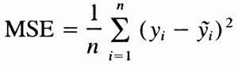

# Python 中从头开始的线性回归

> 原文：<https://www.askpython.com/python/examples/linear-regression-from-scratch>

在本文中，我们将学习使用 Python 从头实现线性回归。线性回归是一种基本且最常用的预测分析类型。

它用于根据一个变量的值预测另一个变量的值。我们要预测的变量叫做因变量。

我们用来预测因变量的值的变量叫做自变量。

一个因变量和一个自变量的回归方程的最简单形式。

y = m * x + b

在哪里，

*   y =估计的相关值。
*   b =常数或偏差。
*   m =回归系数或斜率。
*   x =独立变量的值。

## 从头开始线性回归

在本文中，我们将只使用 [Numpy](https://www.askpython.com/python-modules/numpy/python-numpy-module) 从头开始实现线性回归。

### 1.理解损失函数

虽然有许多损失函数要实现，但我们将使用[均方误差](https://www.askpython.com/python/examples/rmse-root-mean-square-error)函数作为我们的损失函数。



MSE

顾名思义，均方误差函数是真实值和预测值之差的平方和的平均值。

由于 y 的预测值取决于斜率和常数，因此我们的目标是找到斜率和常数的值，使损失函数最小化，或者换句话说，使 y 预测值和真实值之间的差异最小化。

### 2.最优化算法

优化算法用于在给定最小化损失函数的训练数据集的情况下找到最佳参数集，在我们的情况下，我们需要找到斜率(m)和常数(b)的最佳值。

一种这样的算法是梯度下降。

梯度下降是迄今为止机器学习中最常用的优化算法。

使用梯度下降，我们迭代地计算损失函数相对于参数的梯度，并持续更新参数，直到我们达到局部最小值。

### 3.实施梯度下降的步骤

我们先来了解一下梯度下降算法的幕后工作原理。

**步骤 1 初始化参数**

这里，我们需要初始化参数的值。还是保留`slope = 0`和`constant = 0`吧。

我们还需要一个学习率来确定每次迭代的步长，同时向损失函数的最小值移动。

**步骤 2 计算关于参数**的偏导数

这里，我们对损失函数相对于现有参数进行部分求导。


Gradient Of Slope And Bias

**步骤–3 更新参数**

现在，我们使用下面给出的公式更新参数值:


Updating Parameters

我们参数的更新值将是每一步最小化我们的损失函数并减少真实值和预测值之间的差异的值。

重复该过程以达到局部最小值点。

### 4.在 Python 中从头开始实现线性回归

既然我们已经了解了如何使用梯度下降实现线性回归，那么让我们用 Python 来编写代码。

我们将用两个方法`.fit( )`和`.predict( )`定义`LinearRegression`类

```py
#Import required modules
import numpy as np

#Defining the class
class LinearRegression:
    def __init__(self, x , y):
        self.data = x
        self.label = y
        self.m = 0
        self.b = 0
        self.n = len(x)

    def fit(self , epochs , lr):

        #Implementing Gradient Descent
        for i in range(epochs):
            y_pred = self.m * self.data + self.b

            #Calculating derivatives w.r.t Parameters
            D_m = (-2/self.n)*sum(self.data * (self.label - y_pred))
            D_b = (-1/self.n)*sum(self.label-y_pred)

            #Updating Parameters
            self.m = self.m - lr * D_m
            self.c = self.b - lr * D_c

    def predict(self , inp):
        y_pred = self.m * inp + self.b 
        return y_pred

```

我们创建了一个`LinearRegression`类的实例，将训练数据作为该类的输入，并将偏差和常数值初始化为 0。

我们类中的`.fit( )`方法实现了梯度下降，在每次迭代中，我们计算函数相对于参数的偏导数，然后使用学习率和梯度值更新参数。

使用`.predict( )`方法，我们简单地评估函数`y = m * x + b`，使用参数的最佳值，换句话说，该方法估计最佳拟合线。

### 4.测试线性回归模型

现在，当我们创建类时，让我们测试数据。了解有关如何分割训练和测试数据集的更多信息。你可以在[这里](https://github.com/Ash007-kali/Article-Datasets/tree/main/Linear%20Regression)找到本教程中使用的数据集和其他资源。

```py
#importing Matplotlib for plotting
import matplotlib.pyplot as plt

#Loding the data
df = pd.read_csv('data_LinearRegression.csv')

#Preparing the data
x = np.array(df.iloc[:,0])
y = np.array(df.iloc[:,1])

#Creating the class object
regressor = LinearRegression(x,y)

#Training the model with .fit method
regressor.fit(1000 , 0.0001) # epochs-1000 , learning_rate - 0.0001

#Prediciting the values
y_pred = regressor.predict(x)

#Plotting the results
plt.figure(figsize = (10,6))
plt.scatter(x,y , color = 'green')
plt.plot(x , y_pred , color = 'k' , lw = 3)
plt.xlabel('x' , size = 20)
plt.ylabel('y', size = 20)
plt.show()

```


Prediction Linear Regression

工作正常！

## 结论

这篇文章讲的是我们如何只用 Numpy 从头开始建立一个线性回归模型。本教程的目标是给你一个更深层次的线性回归的概念，以及它是如何工作的。

直到我们下次见面。

快乐学习！