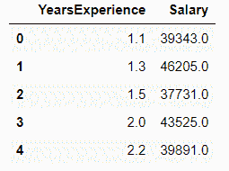
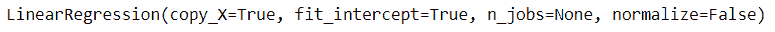
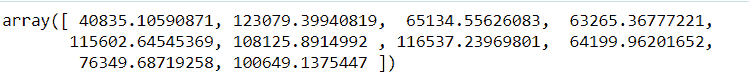
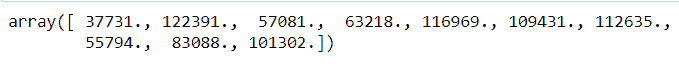
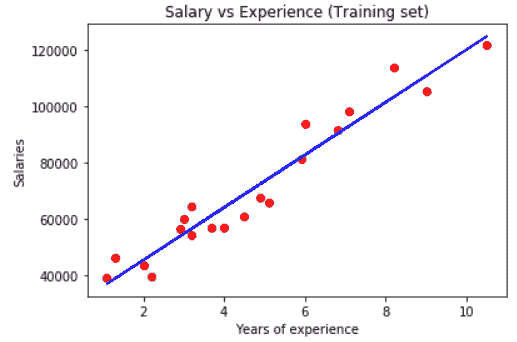
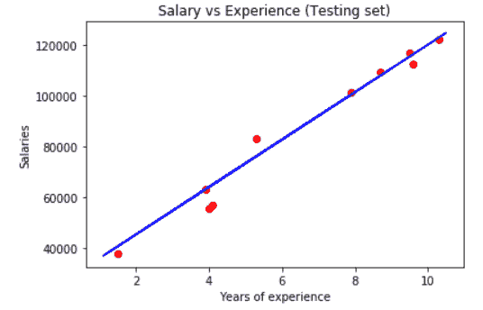
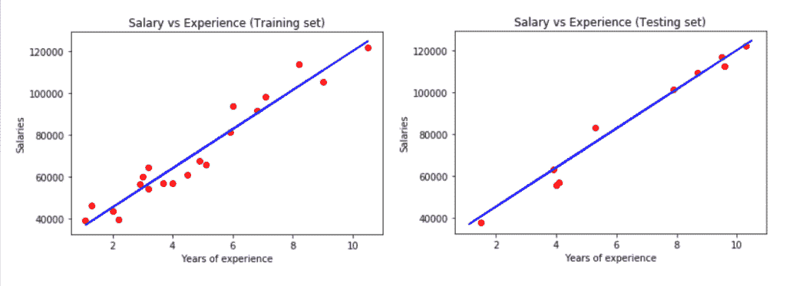

# 简单线性回归:Python 中的实用实现

> 原文：<https://www.askpython.com/python/examples/linear-regression-in-python>

欢迎阅读这篇关于简单线性回归的文章。今天，我们将看看如何建立一个简单的线性回归模型给定一个数据集。在本文的编码示例之前，您可以仔细阅读我们详述简单线性回归概念的文章。

## 建立线性回归模型的 6 个步骤

步骤 1:导入数据集
步骤 2:数据预处理
步骤 3:拆分测试集和训练集
步骤 4:将线性回归模型拟合到训练集
步骤 5:预测测试结果
步骤 6:可视化测试结果

现在我们已经看到了这些步骤，让我们从编写相同的代码开始

## 用 Python 实现线性回归模型

在本文中，我们将使用工资数据集。我们的数据集将有 2 列，即工作经验和薪水。

到数据集的链接是-[https://github.com/content-anu/dataset-simple-linear](https://github.com/content-anu/dataset-simple-linear)

### 1.导入数据集

我们将从使用 [pandas](https://www.askpython.com/python-modules/pandas/python-pandas-module-tutorial) 导入数据集开始，也导入其他库，如 [numpy](https://www.askpython.com/python-modules/numpy/python-numpy-module) 和 [matplotlib](https://www.askpython.com/python-modules/matplotlib/python-matplotlib) 。

```py
import numpy as np
import pandas as pd
import matplotlib.pyplot as plt

dataset = pd.read_csv('Salary_Data.csv')
dataset.head()

```

`dataset.head()`显示了我们数据集的前几列。上述代码片段的输出如下:



Dataset

### 2.数据预处理

既然我们已经导入了数据集，我们将执行数据预处理。

```py
X = dataset.iloc[:,:-1].values  #independent variable array
y = dataset.iloc[:,1].values  #dependent variable vector

```

`X`是自变量数组，`y`是因变量向量。注意数组和向量的区别。因变量必须是向量，自变量必须是数组本身。

### 3.分割数据集

我们需要将数据集分成测试集和训练集。一般我们分别遵循二八政策或者三七政策。

**为什么需要进行拆分？**这是因为我们希望根据年龄和工资来训练我们的模型。然后我们在测试集上测试我们的模型。

我们检查模型对测试集数据做出的预测是否与数据集中给出的预测相匹配。

如果匹配，这意味着我们的模型是准确的，并且做出了正确的预测。

```py
from sklearn.model_selection import train_test_split
X_train, X_test, y_train, y_test = train_test_split(X,y,test_size=1/3,random_state=0)

```

我们不需要为线性回归应用特性缩放，因为库会处理它。

### 4.将线性回归模型拟合到训练集中

从 sklearn 的线性模型库中，导入线性回归类。为名为 regressor 的线性回归类创建一个对象。

为了使回归量适合训练集，我们将调用 fit method–function 来使回归量适合训练集。

我们需要将 X_train(特征矩阵的训练数据)拟合到目标值 y_train 中。因此，该模型学习相关性，并学习如何根据自变量预测因变量。

```py
from sklearn.linear_model import LinearRegression
regressor = LinearRegression()
regressor.fit(X_train,y_train) #actually produces the linear eqn for the data

```



Output equation

### 5.预测测试集结果

我们创建一个包含所有测试集薪水预测的向量。然后将预测的工资放入名为`y_pred`的向量中。(包含测试集中所有观察值的预测)

`predict`方法对测试集进行预测。因此，输入是测试集。predict 的参数必须是数组或稀疏矩阵，因此输入是 X_test。

```py
y_pred = regressor.predict(X_test) 
y_pred

```



y-pred output

```py
y_test

```



y-test output

`y_test`是测试集的真实工资。
`y_pred`是预测的薪资。

### 可视化结果

让我们看看当我们可视化代码时，它的结果会是什么样子。

#### 1.绘制点(观察值)

为了可视化数据，我们使用 matplotlib 绘制图表。绘制实际观测点，即绘制实际给定值。

X 轴代表多年的经验，Y 轴代表预测的薪水。

`plt.scatter`绘制数据的散点图。参数包括:

1.  X 坐标(X_train:年数)
2.  y 坐标(y_train:员工的实际工资)
3.  颜色(红色回归线和蓝色观察线)

#### 2.绘制回归线

plt.plot 有以下参数:

1.  X 坐标(X _ train)-年数
2.  y 坐标(在 X_train 上预测)-X-train 的预测(基于若干年)。

注意:y 坐标不是 y_pred，因为 y_pred 是测试集观测值的预测工资。

```py
#plot for the TRAIN

plt.scatter(X_train, y_train, color='red') # plotting the observation line

plt.plot(X_train, regressor.predict(X_train), color='blue') # plotting the regression line

plt.title("Salary vs Experience (Training set)") # stating the title of the graph

plt.xlabel("Years of experience") # adding the name of x-axis
plt.ylabel("Salaries") # adding the name of y-axis
plt.show() # specifies end of graph

```

**上述代码为列车组生成一个图，如下所示:**



Output graph for training set

```py
#plot for the TEST

plt.scatter(X_test, y_test, color='red') 
plt.plot(X_train, regressor.predict(X_train), color='blue') # plotting the regression line

plt.title("Salary vs Experience (Testing set)")

plt.xlabel("Years of experience") 
plt.ylabel("Salaries") 
plt.show() 

```

**上面的代码片段生成了一个如下所示的图:**



Output graph for test set

## 实现线性回归的完整 Python 代码

```py
# importing the dataset
import numpy as np
import pandas as pd
import matplotlib.pyplot as plt

dataset = pd.read_csv('Salary_Data.csv')
dataset.head()

# data preprocessing
X = dataset.iloc[:, :-1].values  #independent variable array
y = dataset.iloc[:,1].values  #dependent variable vector

# splitting the dataset
from sklearn.model_selection import train_test_split
X_train, X_test, y_train, y_test = train_test_split(X,y,test_size=1/3,random_state=0)

# fitting the regression model
from sklearn.linear_model import LinearRegression
regressor = LinearRegression()
regressor.fit(X_train,y_train) #actually produces the linear eqn for the data

# predicting the test set results
y_pred = regressor.predict(X_test) 
y_pred

y_test

# visualizing the results
#plot for the TRAIN

plt.scatter(X_train, y_train, color='red') # plotting the observation line
plt.plot(X_train, regressor.predict(X_train), color='blue') # plotting the regression line
plt.title("Salary vs Experience (Training set)") # stating the title of the graph

plt.xlabel("Years of experience") # adding the name of x-axis
plt.ylabel("Salaries") # adding the name of y-axis
plt.show() # specifies end of graph

#plot for the TEST

plt.scatter(X_test, y_test, color='red') 
plt.plot(X_train, regressor.predict(X_train), color='blue') # plotting the regression line
plt.title("Salary vs Experience (Testing set)")

plt.xlabel("Years of experience") 
plt.ylabel("Salaries") 
plt.show() 

```

上述代码片段的输出如下所示:



Output graphs

## 结论

关于简单的线性回归，我们已经到了这篇文章的结尾。希望你喜欢我们的例子，并尝试编码模型。请在下面的评论区告诉我们您的反馈。

如果你对更多的回归模型感兴趣，请通读[多元线性回归模型](https://www.askpython.com/python/examples/multiple-linear-regression)。