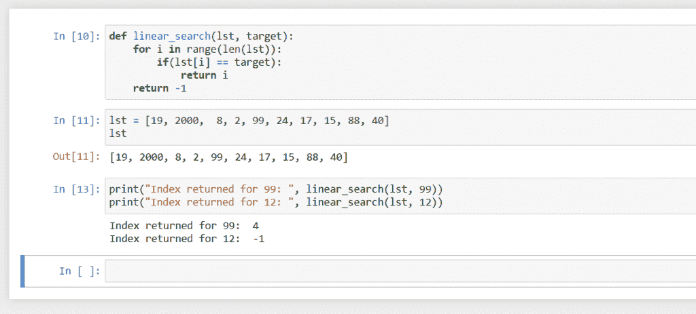

# Python 中的线性搜索——一种实用的方法

> 原文：<https://www.askpython.com/python/examples/linear-search-algorithm>

让我们了解一下 Python 中一个简单明了的搜索算法。

## 线性搜索算法

线性搜索的工作方式非常类似于我们在一个随机的列表中进行搜索。

假设我们需要在给定的页面上找到一个单词，我们将从顶部开始，逐个查看每个单词，直到找到我们要找的单词。

与此类似，线性搜索从第一个项目开始，然后检查列表中的每个项目，直到找到项目或列表用尽。

让我们举一个例子:

### 线性搜索算法的理论示例

考虑一下，

*   名单:2000 年 19 日，8 日，2 日，99 日，24 日，17 日，15 日，88 日，40 日
*   目标:99

所以，我们需要在给定的列表中找到 99。我们从第一项开始，然后仔细检查清单上的每一项。

*   项目 1: 19，未找到。
*   第二项:2000，未找到。
*   项目 3: 8，未找到。
*   项目 4: 2，未找到。
*   项目 5，99，发现目标，结束循环。

因此，我们在位置 5 经过五次检查后找到了给定的目标。

如果给定的目标不在列表中，那么我们会遍历整个列表而找不到该项，在列表结束后，我们会将该项声明为未找到。

请注意，我们以线性方式查看列表中的每一项，这就是为什么该算法如此命名的原因。

### 关于效率的一个注记

线性搜索并不是一个非常有效的算法，它遍历列表中的每一项，所以算法直接受列表中项目数量的影响。

换句话说，该算法的时间复杂度为 O(n)。这意味着，如果列表中的项目数乘以一个数量，那么完成该算法所需的时间将乘以该数量。

有更好的搜索算法，如 Sentinel、 [Binary](https://www.askpython.com/python/examples/binary-search-algorithm-in-python) 或 Fibonacci Search，但线性搜索是所有这些算法中最简单和最基本的，这意味着每个程序员都应该知道如何使用它。

## 用 Python 实现线性搜索算法

```py
def linear_search(lst, target):
    for i in range(len(lst)):
        if(lst[i] == target):
            return i
    return -1

```

让我们看看代码，

*   我们正在创建一个接受两个参数的线性搜索函数。第一个参数是包含项目的列表，第二个参数是要查找的目标项目。
*   然后，我们用计数器`i`，`i`创建一个循环，将保存给定列表的所有索引，即`i`将从 0 到列表长度-1。
*   在每次迭代中，我们都将目标与索引`i`处的列表项进行比较。
*   如果它们是相同的，那么这意味着我们已经在列表中的那个索引处找到了目标，所以我们简单地返回那个索引并结束循环和函数。
*   如果检查了整个列表，但没有返回任何项，那么控件将移出列表，现在我们确信目标项不在列表中，所以我们返回-1，以此来表明没有找到该项。

让我们看看对于列表中的一个项目和不在列表中的另一个项目，算法将如何表现:

### 输出



Linear Search

这里，我们发送两个项目作为目标:99，它在列表中的索引 4 处，12，它不在列表中。

正如我们所看到的，算法为 99 返回了索引 4，为 12 返回了-1。这表明 99 在索引 4 处，12 不在列表中，因此算法正在工作。

## 结论

在本教程中，我们学习了一个非常简单的搜索算法，叫做线性搜索。

我们讨论了线性搜索是如何工作的，我们谈到了它的效率以及为什么它被命名为“线性”。

然后，我们看了算法是如何用 Python 编写的，它做了什么，并通过查看代码的输出证实了这一点。我希望你学到了一些东西，下节课再见。