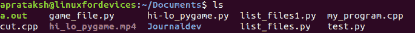

# 如何用 Python 列出一个目录下的文件？

> 原文：<https://www.askpython.com/python/examples/list-files-in-a-directory-using-python>

在本教程中，我们将介绍如何使用 Python 列出目录中的文件。

Python 是一种通用语言，用于各种领域，如数据科学、机器学习，甚至是 Web 开发。Python 语言的应用似乎没有限制。

因此，似乎很简单的 Python 可以用来列出任何系统中的文件和目录。这篇文章的目的是向读者阐明使用 Python 在系统中列出文件的方法。

## 使用 Python 列出目录中的所有文件

为了使用 Python 与系统中的目录进行交互，使用了`os`库。

### 1.使用“操作系统”库

我们要练习的方法是 listdir()。顾名思义，它用于[列出目录](https://www.askpython.com/python/examples/python-directory-listing)中的项目。

```py
# Importing the os library
import os

# The path for listing items
path = '.'

# The list of items
files = os.listdir(path)

# Loop to print each filename separately
for filename in files:
	print(filename)

```

**输出:**

```py
game_file.py
hi-lo_pygame.py
Journaldev
list_files1.py
hi_lo_pygame.mp4
test.py
list_files.py
my_program.cpp
a.out
cut.cpp

```

Linux 用户可以在终端上使用标准的`ls`命令轻松匹配上面的输出。



List Items using ‘ls’ command

正如我们所看到的，每个方法的输出都是匹配的。

* * *

### 2.使用“glob”库

`glob`主要是一个文件名模式匹配库，但是它可以通过以下方式列出当前目录中的项目:

```py
# Importing the glob library
import glob 

# Path to the directory
path = ''

# or 
# path = './'

# Extract the list of filenames
files = glob.glob(path + '*', recursive=False)

# Loop to print the filenames
for filename in files:
	print(filename)

```

**输出:**

```py
game_file.py
hi-lo_pygame.py
Journaldev
list_files1.py
hi_lo_pygame.mp4
test.py
list_files.py
my_program.cpp
a.out
cut.cpp

```

通配符`'*'`用于匹配当前目录中的所有项目。因为我们希望显示当前目录的条目，所以我们需要关闭`glob()`函数的递归特性。

* * *

### 3.仅列出当前目录中的文件

在上面的方法中，python 代码返回当前目录中的所有项目，而不管它们的性质如何。我们可以使用`os`库中的`path.isfile()`函数只提取文件。

```py
# Importing the os library
import os

# The path for listing items
path = '.'

# List of only files
files = [f for f in os.listdir(path) if os.path.isfile(f)]

# Loop to print each filename separately
for filename in files:
	print(filename)

```

**输出:**

```py
game_file.py
hi-lo_pygame.py
list_files1.py
hi_lo_pygame.mp4
test.py
list_files.py
my_program.cpp
a.out
cut.cpp

```

在上面的代码片段中， [List Comprehension](https://www.askpython.com/python/list/python-list-comprehension) 用于过滤掉那些实际上是文件的项目。

这里需要注意的另一个关键点是，上面的代码不适用于其他目录，因为变量`'f'`不是绝对路径，而是当前目录的相对路径。

* * *

## 递归列出目录中的所有文件

为了打印目录及其子目录中的文件，我们需要递归地遍历它们。

### 1.使用“操作系统”库

在`walk()`方法的帮助下，我们可以逐个遍历目录中的每个子目录。

```py
# Importing the os library
import os

# The path for listing items
path = './Documents/'

# List of files in complete directory
file_list = []

"""
	Loop to extract files inside a directory

	path --> Name of each directory
	folders --> List of subdirectories inside current 'path'
	files --> List of files inside current 'path'

"""
for path, folders, files in os.walk(path):
	for file in files:
		file_list.append(os.path.join(path, file))

# Loop to print each filename separately
for filename in file_list:
	print(filename)

```

**输出:**

```py
./Documents/game_file.py
./Documents/hi-lo_pygame.py
./Documents/list_files1.py
./Documents/hi_lo_pygame.mp4
./Documents/test.py
./Documents/list_files.py
./Documents/my_program.cpp
./Documents/a.out
./Documents/cut.cpp
./Documents/Journaldev/mastermind.py
./Documents/Journaldev/blackjack_terminal.py
./Documents/Journaldev/lcm.cpp
./Documents/Journaldev/super.cpp
./Documents/Journaldev/blackjack_pygame.py
./Documents/Journaldev/test.java

```

`os.walk()`方法简单地跟随每个子目录，默认情况下以自顶向下的方式提取文件。有三个迭代器用于遍历`os.walk()`函数的输出:

*   `**path**`–该变量包含函数在某次迭代中观察的当前目录
*   `**folders**`–该变量是`'path'`目录中的目录列表。
*   `**files**`–目录`'path'`中的文件列表。

`join()`方法用于将文件名与其父目录连接起来，为我们提供文件的相对路径。

* * *

### 2.使用“glob”库

类似于上面的过程，`glob`可以递归地访问每个目录，提取所有项目并返回。

```py
# Importing the glob library
import glob 

# Importing the os library
import os

# Path to the directory
path = './Documents/'

# Extract all the list of items recursively
files = glob.glob(path + '**/*', recursive=True)

# Filter only files
files = [f for f in files if os.path.isfile(f)]

# Loop to print the filenames
for filename in files:
	print(filename)

```

**输出:**

```py
./Documents/game_file.py
./Documents/hi-lo_pygame.py
./Documents/list_files1.py
./Documents/hi_lo_pygame.mp4
./Documents/test.py
./Documents/list_files.py
./Documents/my_program.cpp
./Documents/a.out
./Documents/cut.cpp
./Documents/Journaldev/mastermind.py
./Documents/Journaldev/blackjack_terminal.py
./Documents/Journaldev/lcm.cpp
./Documents/Journaldev/super.cpp
./Documents/Journaldev/blackjack_pygame.py
./Documents/Journaldev/test.java

```

与 path 变量一起使用的符号`'**'`告诉`glob()`函数匹配任何子目录中的文件。`'*'`告诉函数匹配一个目录中的所有项目。

因为我们希望只提取完整目录中的文件，所以我们使用之前使用的`isfile()`函数过滤掉这些文件。

* * *

## 列出一个目录中的所有子目录

我们可以列出特定目录中的所有子目录，而不是列出文件。

```py
# Importing the os library
import os

# The path for listing items
path = './Documents/'

# List of folders in complete directory
folder_list = []

"""
	Loop to extract folders inside a directory

	path --> Name of each directory
	folders --> List of subdirectories inside current 'path'
	files --> List of files inside current 'path'

"""
for path, folders, files in os.walk(path):
	for folder in folders:
		folder_list.append(os.path.join(path, folder))

# Loop to print each foldername separately
for foldername in folder_list:
	print(foldername)

```

**输出:**

```py
./Documents/Journaldev

```

列出文件和目录的微小区别在于`os.walk()`函数过程中迭代器的选择。对于文件，我们迭代 files 变量。这里，我们循环遍历 folders 变量。

* * *

## 用绝对路径列出目录中的文件

一旦我们知道如何列出目录中的文件，那么显示绝对路径就是小菜一碟。`abspath()`方法为我们提供了文件的绝对路径。

```py
# Importing the os library
import os

# The path for listing items
path = './Documents/'

# List of files in complete directory
file_list = []

"""
	Loop to extract files inside a directory

	path --> Name of each directory
	folders --> List of subdirectories inside current 'path'
	files --> List of files inside current 'path'

"""
for path, folders, files in os.walk(path):
	for file in files:
		file_list.append(os.path.abspath(os.path.join(path, file)))

# Loop to print each filename separately
for filename in file_list:
	print(filename)

```

**输出:**

```py
/home/aprataksh/Documents/game_file.py
/home/aprataksh/Documents/hi-lo_pygame.py
/home/aprataksh/Documents/list_files1.py
/home/aprataksh/Documents/hi_lo_pygame.mp4
/home/aprataksh/Documents/test.py
/home/aprataksh/Documents/list_files.py
/home/aprataksh/Documents/my_program.cpp
/home/aprataksh/Documents/a.out
/home/aprataksh/Documents/cut.cpp
/home/aprataksh/Documents/Journaldev/mastermind.py
/home/aprataksh/Documents/Journaldev/blackjack_terminal.py
/home/aprataksh/Documents/Journaldev/lcm.cpp
/home/aprataksh/Documents/Journaldev/super.cpp
/home/aprataksh/Documents/Journaldev/blackjack_pygame.py
/home/aprataksh/Documents/Journaldev/test.java

```

这里需要注意的一点是，`abspath()`必须提供文件的相对路径，这也是`join()`函数的目的。

* * *

## 通过匹配模式列出目录中的文件

有多种方法可以过滤出符合特定模式的文件名。让我们一个一个地看一遍。

### 1.使用“fnmatch”库

顾名思义，`fnmatch`是一个文件名模式匹配库。将`fnmatch`与我们的标准文件名提取库一起使用，我们可以过滤出那些匹配特定模式的文件。

```py
# Importing the os and fnmatch library
import os, fnmatch

# The path for listing items
path = './Documents/'

# List of files in complete directory
file_list = []

"""
	Loop to extract files containing word "file" inside a directory

	path --> Name of each directory
	folders --> List of subdirectories inside current 'path'
	files --> List of files inside current 'path'

"""
print("List of files containing \"file\" in them")
for path, folders, files in os.walk(path):
	for file in files:
		if fnmatch.fnmatch(file, '*file*'):
			file_list.append(os.path.join(path, file))

# Loop to print each filename separately
for filename in file_list:
	print(filename)

```

**输出:**

```py
List of files containing "file" in them
./Documents/game_file.py
./Documents/list_files1.py
./Documents/list_files.py

```

`fnmatch()`函数接受两个参数，文件名后面跟着要匹配的模式。在上面的代码中，我们查看了所有包含单词`file`的文件。

* * *

### 2.使用“glob”库

正如我们之前提到的，`glob's`的主要目的是文件名模式匹配。

```py
# Importing the glob library
import glob 

# Importing the os library
import os

# Path to the directory
path = './Documents/'

# Extract items containing numbers in name
files = glob.glob(path + '**/*[0-9]*.*', recursive=True)

# Filter only files
files = [f for f in files if os.path.isfile(f)]

# Loop to print the filenames
for filename in files:
	print(filename)

```

**输出:**

```py
./Documents/list_files1.py

```

上面的模式匹配[正则表达式](https://www.askpython.com/python/regular-expression-in-python) `'**/*[0-9]*.*'`可以解释为:

*   `**'**'**`–遍历路径内的所有子目录
*   `**'/*'**`–文件名可以以任何字符开头
*   `**'[0-9]'**`–文件名中包含一个数字
*   `**'*.*'**`–文件名可以以任何字符结尾，可以有任何扩展名

* * *

### 3.使用“pathlib”库

遵循面向对象的方式与文件系统交互。库中的`rglob()`函数可用于通过某个路径对象递归提取文件列表。

这些文件列表可以使用`rglob()`函数中的模式进行过滤。

```py
# Importing the pathlib library
import pathlib

# Creating a Path object
path = pathlib.Path('./Documents/')

# Extracting a list of files starting with 'm'
files = path.rglob('m*')

# Loop to print the files separately
for file in files:
	print(file)

```

**输出:**

```py
Documents/my_program.cpp
Documents/Journaldev/mastermind.py

```

上面的代码片段用于列出所有以字母`'m'`开头的文件。

* * *

## 列出目录中具有特定扩展名的文件

在 Python 中列出带有特定扩展名的文件有点类似于模式匹配。为此，我们需要创建一个关于文件扩展名的模式。

```py
# Importing the os and fnmatch library
import os, fnmatch

# The path for listing items
path = './Documents/'

# List to store filenames 
file_list = []

"""
	Loop to extract python files 

	path --> Name of each directory
	folders --> List of subdirectories inside current 'path'
	files --> List of files inside current 'path'

"""
print("List of python files in the directory:")
for path, folders, files in os.walk(path):
	for file in files:
		if fnmatch.fnmatch(file, '*.py'):
			file_list.append(os.path.join(path, file))

# Loop to print each filename separately
for filename in file_list:
	print(filename)

```

**输出:**

```py
List of python files in the directory:
./Documents/game_file.py
./Documents/hi-lo_pygame.py
./Documents/list_files1.py
./Documents/test.py
./Documents/list_files.py
./Documents/Journaldev/mastermind.py
./Documents/Journaldev/blackjack_terminal.py
./Documents/Journaldev/blackjack_pygame.py

```

`fnmatch()`函数过滤掉那些以`'.py'`结尾的文件，也就是 python 文件。如果我们想要提取不同扩展名的文件，那么我们必须修改这部分代码。例如，为了只获取 C++文件，必须使用`'.cpp'`。

这总结了使用 Python 获取目录中文件列表的方法。

* * *

## 结论

可以有多种方法来解决手头的任何问题，最方便的方法并不总是答案。关于这篇文章，Python 程序员必须知道我们可以在目录中列出文件的每一种方式。

我们希望这篇文章容易理解。如有任何疑问或建议，欢迎在下方留言。