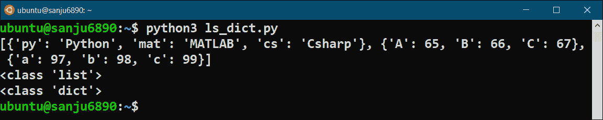
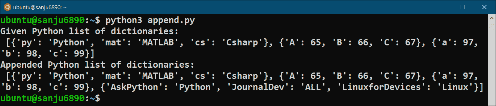
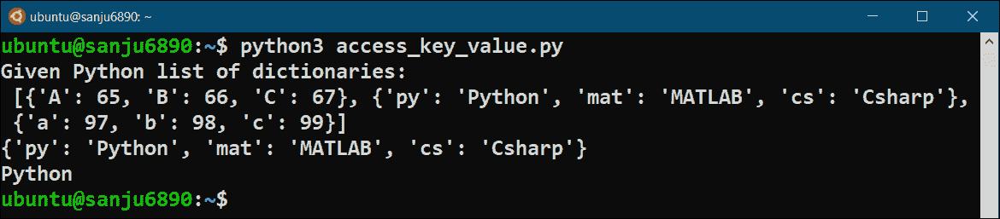
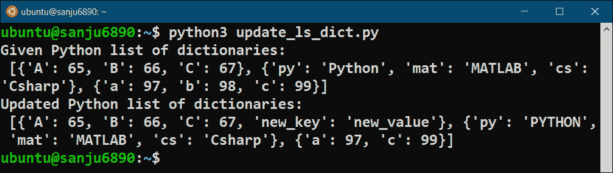

# 如何用 Python 创建字典列表？

> 原文：<https://www.askpython.com/python/list/list-of-dictionaries>

在本教程中，我们将讨论 Python 中的字典列表。我们将讨论如何

*   创建词典列表
*   访问**键:值**对
*   更新**键:值**对
*   在清单上附加一本词典

所以事不宜迟，让我们开始吧。

* * *

## Python 中的字典列表是什么？

我们都知道，在 Python 中，列表是一种线性数据结构，可以以有序的方式存储值的集合。这些值可以是任何 Python 对象。

字典也是一个 Python 对象，它以 key:value 格式存储数据。

因此我们可以创建一个 Python `list`，它的每个元素都是 Python `dictionary`。这就是为什么我们用一个特殊的名字来称呼这样一种类型的 Python`list`——**字典列表**。

## 用 Python 创建字典列表的步骤

要用 Python 创建字典列表，我们只需创建一个简单的 [Python list](https://www.askpython.com/python/difference-between-python-list-vs-array) ，并确保它的每个元素都是一个 Python 字典。让我们用 Python 来实现它。

```py
# Defining a list of dictionaries in Python 
ls_dict = [{'py': 'Python', 'mat': 'MATLAB', 'cs': 'Csharp'}, 
{'A': 65, 'B': 66, 'C': 67}, 
{'a': 97, 'b': 98, 'c': 99}]

# Printing the results
print(ls_dict)

# Validating the type of 'ls_dict' and its element
print(type(ls_dict))
print(type(ls_dict[0]))

```

**输出:**



## 将词典附加到词典列表中

我们还可以用一个新的 Python dictionary 对象作为其元素来追加一个字典列表。这里我们使用 Python list `append()`方法。

这类似于附加一个普通的 Python 列表。

唯一的区别是传递给`append()`方法的参数必须是 Python 字典。`append()`方法将传递的 Python 对象(这里是一个字典)添加到现有 Python 字典列表的末尾。

例如，我们将用一个新的 dictionary 对象更新上面创建的字典列表。让我们为此编写 Python 代码。

```py
# Defining a list of dictionaries in Python 
ls_dict = [{'py': 'Python', 'mat': 'MATLAB', 'cs': 'Csharp'},
{'A': 65, 'B': 66, 'C': 67},
{'a': 97, 'b': 98, 'c': 99},]

# Printing the given list of dictionaries
print("Given Python list of dictionaries:\n", ls_dict)

# Creating a new Python dictionary
ds = {'AskPython': "Python", 'JournalDev': "ALL", 
'LinuxforDevices': "Linux"} 

# Appending the list of dictionaries with the above dictionary
# Using append() method
ls_dict.append(ds)

# Printing the appended list of dictionaries
print("Appended Python list of dictionaries:\n", ls_dict)

```

**输出:**



## 从字典列表中访问键:值对

要访问字典列表的键:值对，首先我们必须使用[索引](https://www.askpython.com/python/list/indexing-in-python)来访问字典。当我们得到字典时，我们可以很容易地访问字典的任何键:值对。让我们通过 Python 代码来理解这一点。

```py
# Defining a list of dictionaries in Python 
ls_dict = [{'A': 65, 'B': 66, 'C': 67}, 
{'py': 'Python', 'mat': 'MATLAB', 'cs': 'Csharp'}, 
{'a': 97, 'b': 98, 'c': 99}]

# Printing the given list of dictionaries
print("Given Python list of dictionaries:\n", ls_dict)

# Accessing and printing the key: value pairs of a list of dictionary
print(ls_dict[1])
print(ls_dict[1]['py'])

```

**输出:**



## 更新字典列表中的键:值对

我们可以通过以下方式更新字典列表中任何字典的键:值对:

*   添加新的键:值对
*   更新现有键:值
*   删除现有的键:值对

让我们通过 Python 代码以上面讨论的所有方式更新上面的 Python 字典列表。

```py
# Defining a list of dictionaries in Python 
ls_dict = [{'A': 65, 'B': 66, 'C': 67}, 
{'py': 'Python', 'mat': 'MATLAB', 'cs': 'Csharp'}, 
{'a': 97, 'b': 98, 'c': 99}]

# Printing the given list of dictionaries
print("Given Python list of dictionaries:\n", ls_dict)

# Adding a new key: value pair to the 1st dictionary in the list
ls_dict[0]['new_key'] = 'new_value'

# Updating an existing key: value pair in the 2nd dictionary in the list
ls_dict[1]['py'] = 'PYTHON'

# Deleting an existing key: value pair from the 3rd dictionary in the list
del ls_dict[2]['b']

# Printing the updated list of dictionaries
print("Updated Python list of dictionaries:\n", ls_dict)

```

**输出:**



## 总结

在本教程中，我们学习了什么是 Python 中的字典列表，创建 Python 字典列表，追加 Python 字典列表，使用列表索引和字典键从 Python 字典列表中访问不同的键:值对，以及以三种不同的方式更新 Python 字典列表。