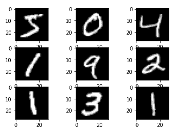

# 如何在 Python 中加载和绘制 MNIST 数据集？

> 原文：<https://www.askpython.com/python/examples/load-and-plot-mnist-dataset-in-python>

本教程讲述了在 Python 中加载 MNIST 数据集的步骤。 **MNIST 数据集**是一个手写数字的大型数据库。它通常用于训练各种图像处理系统。

*MNIST 是美国国家标准技术研究院数据库的缩写。*

该数据集用于训练模型来识别手写数字。这可用于扫描信件上的手写 pin 码。

MNIST 包含了从 T2 0 到 9 的 70，000 张 28×28 的手写数字图像。

## 为什么 MNIST 数据集如此受欢迎？

MNIST 受欢迎的原因有很多，这些是:

*   MNSIT 数据集**公开提供。**
*   这些数据在使用前几乎不需要处理。
*   这是一个**庞大的**数据集。

此外，该数据集通常用于图像处理和机器学习课程。

## 在 Python 中加载 MNIST 数据集

在本教程中，我们将学习 MNIST 数据集。我们还将了解如何用 python 加载 MNIST 数据集。

### 1.在 Python 中加载数据集

让我们从将数据集加载到 python 笔记本开始。加载数据最简单的方法是通过 Keras。

```py
from keras.datasets import mnist

```

MNIST 数据集由训练数据和测试数据组成。每个图像存储在 28X28 中，相应的输出是图像中的数字。

我们可以通过观察训练和测试数据的形状来验证这一点。

要将数据加载到变量中，请使用:

```py
(train_X, train_y), (test_X, test_y) = mnist.load_data()

```

要打印训练和测试向量的形状，请使用:

```py
print('X_train: ' + str(train_X.shape))
print('Y_train: ' + str(train_y.shape))
print('X_test:  '  + str(test_X.shape))
print('Y_test:  '  + str(test_y.shape))

```

我们得到以下输出:

```py
X_train: (60000, 28, 28)
Y_train: (60000,)
X_test:  (10000, 28, 28)
Y_test:  (10000,)

```

由此我们可以得出以下关于 MNIST 数据集的结论:

*   训练集包含 60k 图像，测试集包含 10k 图像。
*   训练输入向量的尺寸为**【60000 X 28 X 28】。**
*   训练输出向量的大小为**【60000 X 1】。**
*   每个单独的输入向量的大小为**【28 X 28】。**
*   每个单独的输出向量的维数为[ **1]** 。

### 2.绘制 MNIST 数据集

让我们尝试显示 MNIST 数据集中的图像。从导入 **[Matplotlib](https://www.askpython.com/python-modules/matplotlib/python-matplotlib) 开始。**

```py
from matplotlib import pyplot

```

要绘制数据，请使用以下代码:

```py
from matplotlib import pyplot
for i in range(9):	
pyplot.subplot(330 + 1 + i)
pyplot.imshow(train_X[i], cmap=pyplot.get_cmap('gray'))
pyplot.show()

```

输出结果如下:



Mnist Dataset

## 用 Python 加载和绘制 MNIST 数据集的完整代码

本教程的完整代码如下所示:

```py
from keras.datasets import mnist
from matplotlib import pyplot

#loading
(train_X, train_y), (test_X, test_y) = mnist.load_data()

#shape of dataset
print('X_train: ' + str(train_X.shape))
print('Y_train: ' + str(train_y.shape))
print('X_test:  '  + str(test_X.shape))
print('Y_test:  '  + str(test_y.shape))

#plotting
from matplotlib import pyplot
for i in range(9):	
pyplot.subplot(330 + 1 + i)
pyplot.imshow(train_X[i], cmap=pyplot.get_cmap('gray'))
pyplot.show()

```

## 下一步是什么？

现在您已经导入了 MNIST 数据集，您可以将其用于影像分类。

当谈到图像分类的任务时，没有什么可以击败卷积神经网络(CNN)。CNN 包含**卷积层、汇聚层、扁平化层**。

让我们看看每一层都做了什么。

### 1.卷积层

卷积层使用较小的像素过滤器过滤图像。这将减小图像的大小，而不会丢失像素之间的关系。

### 2.汇集层

池层的主要工作是减少卷积后图像的空间大小。

池层通过选择像素内的最大值、平均值或和值来减少参数的数量。

**最大池化**是最常用的池化技术。

### 3.展平层

展平层将多维像素向量表示为一维像素向量。

## 结论

本教程是关于将 MNIST 数据集加载到 python 中的。我们研究了 MNIST 数据集，并简要讨论了可用于 MNIST 数据集图像分类的 CNN 网络。

如果你想进一步了解 Python 中的图像处理，请通读这篇教程，学习如何使用 OpenCV 在 Python 中[读取图像。](https://www.askpython.com/python-modules/read-images-in-python-opencv)