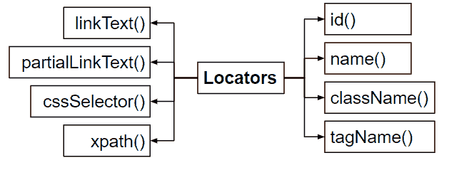

# 使用 Selenium 定位元素的不同方法——Python

> 原文：<https://www.askpython.com/python-modules/locate-elements-using-selenium>

两个或多个 HTML 页面组成一个 web 应用程序。Web 元素是指组成网页的所有组件单元/字段，如文本框、按钮等。

静态元素是由浏览器在任何 HTML 页面上呈现的数据对象模型(DOM)上的所有元素。动态元素是在运行时调用并动态添加到页面中的网页元素。

***也读: [Python 硒介绍及设置](https://www.askpython.com/python-modules/selenium-introduction-and-setup)***

web 应用程序自动化测试中最关键的阶段之一是定位 Web 元素(UI)。

Selenium 中的一些元素选择器:

*   身份证明
*   名字
*   类别名
*   链接文本
*   部分链接文本
*   标签名称
*   XPath
*   和 CSS 选择器

Web 元素的 ID、名称或类名是找到它的最方便的方法。我们可以简单地在代码中输入适当的值，然后运行程序，看看它是否工作。

## 为什么我们需要这么多选择器？

你可能想知道为什么我们需要有或学习不同的方法来定位网页中的元素。这很重要，因为每次我们需要从网页中获取数据时，我们都需要仔细查看该页面的 HTML 代码(DOM ),寻找唯一的或常见的选择器。此外，还有动态加载的动态站点、AJAX 站点等问题。

## Selenium 中的定位器类型



Different Ways To Locate an Element

在 HTML 标签、属性和 HTML 文本的基础上，使用定位器来查找 web 元素。在 Selenium WebDriver 中，有八种不同类型的定位器:

1.  ID T1:每当在网页上寻找网页元素时，这个定位器优先。因为它的值对于整个网页上的每个 web 元素都是唯一的，所以在使用此定位器时，您不会收到重复的匹配。我们在 HTML 代码中的任何地方使用 id 属性。
2.  **Name** :这个位置用在任何 web 元素的 HTML 代码中有 Name 属性的地方。
3.  **className** :每当 HTML 代码有一个 class 属性时，就会用到这个位置，这个属性通常是为批处理样式定义的。
4.  **标记名**:该定位器仅在 web 元素有独特的 HTML 标记时使用。
5.  **linkText** :如果一个链接有一个唯一的 HTML 文本与之连接，那么使用这个定位器。
6.  **partialLinkText** :每当网页上有一个链接带有一个很长的链接文本时，我们通过使用链接中的部分 HTML 文本来使用这个定位器。
7.  CSS selector:CSS selector 是一个比 XPath 快得多的定位器，使用范围也更广。它比其他定位器更复杂，但它是最有效的，因为我们可以用它来识别 web 元素，即使特定的 html 元素丢失了。
8.  XPath :这是一个定位器，使用标签、属性和文本来查找 web 元素。X 路径可以用于 HTML 和 XML 文本。绝对 XPath 和相对 XPath 是 XPath 的两种形式。
9.  **绝对**XPath**–**从根元素到所需的子节点，这个 XPath 定位 web 元素。绝对 XPath 不应该用在实时自动化程序中。
10.  **Relative**XPath**–**这是一个经过修改的 XPath，它使用标签、属性或文本来发现项目。

* * *

现在，我们已经讨论了使用 Selenium 在网页中定位元素的所有不同方法。我们现在讨论 Python Selenium 中最重要和最广泛使用的选择器，以便于选择和归属。

## 1.通过 CSS ID 定位硒元素

这是迄今为止发现元素最直接的方法。CSS ID 保存在 HTML DOM 元素的 ID 属性中，它被设计为对于网页上的每个元素都是唯一的。因此，ID 可以用来唯一地标识元素。

要访问此功能，必须使用 webdriver 类的 find_element_by_id()方法。下面是如何使用它。

```py
from selenium import webdriver
driver = webdriver.Chrome('./chromedriver.exe')
driver.get("https://www.python.org")
search_bar = driver.find_element_by_id("id-search-field")

```

如果没有正在搜索的具有该 ID 的 DOM 元素，则抛出一个**‘No this Element**’异常，这可以通过使用 try-catch 块来有效地处理。

理论上，页面上的每个 DOM 元素都应该有自己的 ID。然而，这并不是现实生活中经常观察到的事情。可能大多数项目没有 ID，或者您会遇到两个具有相同 ID 的元素。在这种情况下，必须使用单独的技术来惟一地标识 DOM 元素。

## 2.通过 CSS 类名定位 Selenium 中的元素

在页面上查找组件的另一种方法是使用类名作为搜索词。类名保存在 HTML 标签的 class 属性中。CSS 类旨在应用于一组 DOM 组件。find_element_by_class_name()函数只返回具有匹配类的第一个元素。

如果没有具有所提供的类名的元素，它将抛出 NoSuchElementException。以下是如何在驱动程序中使用方法的示例。

```py
 from selenium import webdriver
driver = webdriver.Chrome('./chromedriver')
driver.get("https://www.python.org")

first_search_bar = driver.find_element_by_class_name("class-name")

```

**注意**重要的一点:上面的代码**只返回**匹配类的**第一个元素**。对于具有相同匹配类(批量选择)的所有元素，您需要使用循环迭代运行**find element 方法**，并在每次迭代时将信息存储在这个 while 中。

## 3.在 Selenium 中通过 XPath 定位元素

如果元素的 ID、类或名称无法识别它，则必须使用元素的 XML 路径来定位它。

当读取 XML 文档时，也可以使用这个方法。在本文中，我们将研究如何利用相对路径而不是绝对路径，因为当网页的 HTML 结构(DOM)改变时，绝对路径容易出错。

为了在文档中发现合适的元素，我们将利用 find_element_by_xpath()函数。元素的路径作为参数传递给 find_element_by_xpath()函数。

以下代码可用于定位 HTML 表单中的电子邮件输入框:

```py
email_input = driver.find_element_by_xpath("//form[input/@name='email']")

```

这段代码寻找页面的初始表单元素。该表单查找名称为 email、值为 email 的条目，将其限制为所需的元素。

让我们试着发现表单的姓和名输入元素:

```py
first_name = driver.find_element_by_xpath("//form[@id='loginForm']/input[1]")

last_name = driver.find_element_by_xpath("//form[@id='loginForm']/input[2]")

```

它查找 ID 为 login form 的表单，然后选择该表单的第一个和第二个输入元素作为名字和姓氏(如果合适)。

## 4.在 Python Selenium–Misc 中定位单个 HTML 元素

在 Selenium WebDriver 中，除了我们到目前为止提到的常见方法之外，测试人员可能还想研究一些元素定位器。

通过使用 find_element_by_tag_name()函数，可以根据元素的 **HTML 标记名**来查找元素。

```py
page_heading = driver.find_element_by_tag_name('h1')

```

也可以通过在链接文本中搜索来找到**超链接元素**。可以使用 find_element_by_link_text()函数搜索特定链接的文本，或者使用 find _ element _ by _ partial _ link _ text()方法搜索部分链接的文本。

准确的链接文本–

```py
click_here_link = driver.find_element_by_link_text('Click Here')

```

部分链接文本–

```py
click_here_link = driver.find_element_by_partial_link_text('Click')

```

# 结论

至此，我们已经结束了使用 Python 编程语言学习 Selenium 中的定位器的课程。我们讨论了在 HTML 页面中选择项目的许多不同技术。希望你已经很好地学习了在网页中定位元素，并准备好自己实现它们。