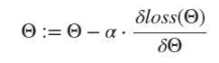

# Python 中从头开始的逻辑回归[算法解释]

> 原文：<https://www.askpython.com/python/examples/logistic-regression-from-scratch>

本教程的目标是从头实现我们自己的逻辑回归。这将不同于我们之前关于同一主题的教程，在之前的教程中，我们使用内置方法来创建函数。

逻辑回归是一种经典的方法，主要用于二元分类问题。尽管经过一些修改，它可以用于多类分类问题，但在本文中，我们将执行二元分类。

## 从头开始实现逻辑回归

我们将一步一步地分解算法来理解它的内部工作，并最终创建我们自己的类。

### 步骤 1:理解 Sigmoid 函数

逻辑回归中的 sigmoid 函数返回一个概率值，然后可以将该概率值映射到两个或多个离散类。给定输入变量集，我们的目标是将该数据点分配到一个类别(1 或 0)。sigmoid 函数输出输入点属于其中一个类的概率。

```py
#Defining a sigmoid function
def sigmoid(z):
    op = 1/(1 + np.exp(-z)) 
    return op

```

### 第二步:损失函数

损失函数由参数/权重组成，当我们说我们希望通过这个优化损失函数时，我们简单地指的是找到参数/权重的最佳值。

逻辑回归的损失函数定义为:


Loss Function

```py
#Loss Function

def loss(h, y):
    return (-y * np.log(h) - (1 - y) * np.log(1 - h)).mean()

```

### 第三步:梯度下降

梯度下降只是损失函数相对于其权重的导数。

我们在找到损失函数的导数后得到这个:


Gradient Of Loss Function

```py
#Gradient_descent

def gradient_descent(X, h, y):
    return np.dot(X.T, (h - y)) / y.shape[0]

```

通过减去导数(梯度下降)乘以学习率来更新权重。更新权重:



Updating Weights

这里—**alpha**是学习率。

## 把所有的放在一起

让我们创建一个类来编译上面提到的步骤。下面是从头开始实现逻辑回归的完整代码。我们已经为这个实现使用了 [Python numpy 模块](https://www.askpython.com/python-modules/numpy/python-numpy-module)。

```py
#import required modules
import numpy as np

class LogisticRegression:
    def __init__(self,x,y):      
        self.intercept = np.ones((x.shape[0], 1))  
        self.x = np.concatenate((self.intercept, x), axis=1)
        self.weight = np.zeros(self.x.shape[1])
        self.y = y

    #Sigmoid method
    def sigmoid(self, x, weight):
        z = np.dot(x, weight)
        return 1 / (1 + np.exp(-z))

    #method to calculate the Loss
    def loss(self, h, y):
        return (-y * np.log(h) - (1 - y) * np.log(1 - h)).mean()

    #Method for calculating the gradients
    def gradient_descent(self, X, h, y):
        return np.dot(X.T, (h - y)) / y.shape[0]

    def fit(self, lr , iterations):
        for i in range(iterations):
            sigma = self.sigmoid(self.x, self.weight)

            loss = self.loss(sigma,self.y)

            dW = self.gradient_descent(self.x , sigma, self.y)

            #Updating the weights
            self.weight -= lr * dW

        return print('fitted successfully to data')

    #Method to predict the class label.
    def predict(self, x_new , treshold):
        x_new = np.concatenate((self.intercept, x_new), axis=1)
        result = self.sigmoid(x_new, self.weight)
        result = result >= treshold
        y_pred = np.zeros(result.shape[0])
        for i in range(len(y_pred)):
            if result[i] == True: 
                y_pred[i] = 1
            else:
                continue

        return y_pred

```

为了实现这个算法，我们定义了一个`fit`方法，它需要学习率和迭代次数作为输入参数。

上面的类可以通过提供输入数据和目标值来初始化。

### 现在，是时候测试我们的实现了。

```py
from sklearn.datasets import load_breast_cancer

#Loading the data
data = load_breast_cancer()

#Preparing the data
x = data.data
y = data.target

#creating the class Object
regressor = LogisticRegression(x,y)

#
regressor.fit(0.1 , 5000)

y_pred = regressor.predict(x,0.5)

print('accuracy -> {}'.format(sum(y_pred == y) / y.shape[0]))

```

**输出:**

```py
fitted successfully to data
accuracy -> 0.9209138840070299

```

我们实现的模型达到了 92%的准确率，还不错。

你可以在我的 GitHub 库的这里找到本教程的笔记本[。](https://github.com/Ash007-kali/Article-Datasets/tree/main/Logistic%20Regression%20From%20Scratch)

## 结论

这篇文章是关于从头实现一个逻辑回归模型来执行一个二进制分类任务。我们还通过从 0 开始编码来展示回归算法的内部工作。

直到我们下次见面。快乐学习！