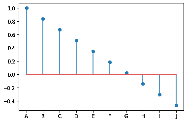
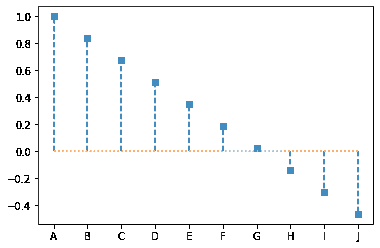
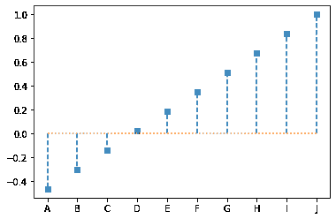

# Python 中棒棒糖图表的介绍

> 原文：<https://www.askpython.com/python/examples/lollipop-charts-in-python>

棒棒糖图表是由一个条形和一个棒状组成的，看起来像一个顶端有冰糖的棒状。实心圆位于条形的顶部，看起来像一个甜甜的棒棒糖。棒棒糖图和条形图一样，用于比较一个类别中的不同类别。因此，这是一个可视化类比较的优秀工具。

棒棒糖图表可以通过将选项传递给. stem()来增强，这提高了可读性和数据描述能力。一些可能的变更示例如下:

Matplotlib 模块可用于在 Python 中有效地绘制棒棒糖图。Matplotlib 包有一个很有用的函数。stem()，用于创建棒棒糖图表。让我们看看情况如何。

* * *

## 导入库

```py
import matplotlib.pyplot as plt
import numpy as np

```

## 创建随机数据

```py
x = ['A', 'B', 'C', 'D', 'E', 'F', 'G', 'H', 'I', 'J']
y = np.linspace(1, (np.log(0.2 * np.pi)), 10)

```

## 绘制棒棒糖图

我们已经在 plt.stem()中将使用行集合选项设置为 True。单独的线条将作为线条集合添加到绘图中。如果我们不提供这个参数，我们将收到一个用户警告，并被提醒将其设置为 True。
这提高了 Stem 图的性能。

```py
plt.stem(x, y, use_line_collection = True)
plt.show()

```



Basic Lollipop Plot

* * *

## 即兴制作棒棒糖图表

棒棒糖图表可以通过将选项传递给. stem()来增强，这提高了可读性和数据描述能力。一些可能的变更示例如下:

### 添加附加参数

```py
import matplotlib.pyplot as plt
import numpy as np
x = ['A', 'B', 'C', 'D', 'E', 'F', 'G', 'H', 'I', 'J']
y = np.linspace(1, (np.log(0.2 * np.pi)), 10)
plt.stem(x, y, markerfmt = 's', linefmt='--', basefmt = ':', use_line_collection=True)
plt.show()

```



Improvised Lollipop Plot 1

### 排序棒棒糖图

```py
import matplotlib.pyplot as plt
import numpy as np
x = ['A', 'B', 'C', 'D', 'E', 'F', 'G', 'H', 'I', 'J']
y = list(np.linspace(1, (np.log(0.2 * np.pi)), 10))
y.sort()
plt.stem(x, y, markerfmt = 's', linefmt='--', basefmt = ':', use_line_collection=True)
plt.show()

```



Improvised Lollipop Plot 2

* * *

## 结论

恭喜你！您刚刚学习了如何用 Python 构建一个基本的棒棒糖图。希望你喜欢它！😇

喜欢这个教程吗？无论如何，我建议你看一下下面提到的教程:

1.  [Python 条形图–可视化 Python 中的分类数据](https://www.askpython.com/python/python-bar-plot)
2.  [如何在 Python 中加载并绘制 MNIST 数据集？](https://www.askpython.com/python/examples/load-and-plot-mnist-dataset-in-python)
3.  [Top 5 最好的 Python 绘图和图形库](https://www.askpython.com/python/python-plotting-and-graph-libraries)

感谢您抽出时间！希望你学到了新的东西！！😄

* * *