# Python 中的机器学习——初学者简易指南

> 原文：<https://www.askpython.com/python/machine-learning-introduction>

机器学习的概念是人工智能领域的最新发展。许多该领域的专家表示，人工智能是人类的未来，它可以在许多方面提供帮助。这个术语起源于 20 世纪 50 年代最著名的数学家**艾伦·图灵**。

他是第一台数字计算机的发明者。首先向他和其他也有贡献的计算机科学家脱帽致敬。让我们朝着洗钱及其发展的完整路线图前进。

## 什么是机器学习？

****机器学习(Machine Learning)是计算机在没有被明确编程的情况下进行学习和运行的能力。**** 这是今天所有初学者学习和应用的最著名的定义。现在让我们确保我们看一下流程图，并确定它与人工智能的另一个分支有什么联系。

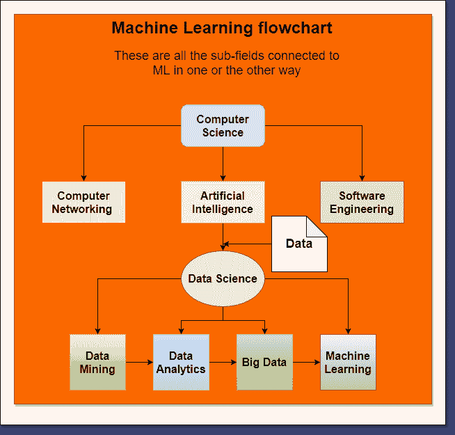

Machine Learning Flowchart

正如我们所看到的，它已经从**计算机科学**中脱颖而出成为核心学科。**人工智能**有一个主要的分支叫做 ***数据科学。*** 它分裂成四个子字段:

1.  数据挖掘
2.  数据分析
3.  大数据
4.  **[机器学习](https://www.askpython.com/python/examples/types-of-machine-learning) (ML)**

现在，如果我们观察图表向我们表明 ***数据是 AI 的主要依赖项。*** 没有任何数据或信息，我们什么也做不了。它需要以原始格式呈现，以便进行分析和处理。

保持所有其他因素，我们还看到数据科学的所有四个子领域在它们之间有一个核心依赖性。

这表明学习者需要有一些其他领域的基础知识才能在其中一个领域发展。这就是为什么对学生来说这是一个即将到来的不同的职业机会。

* * *

## 用 Python 学习机器学习的路线图

这一部分将向你展示我们如何开始学习机器学习，并以此为职业。这是一条完整的路径:

1.  **概率统计**:先从数学基础说起。学习统计学的所有基础知识，如平均值、中位数和众数。回归、曲线拟合等主题也很重要。
2.  **可视化图形:**各种图形，如条形图、散点图、线图、线形图等。对数据可视化很重要。
3.  **编程语言:**学习 ML 必须要有一门编程语言。因为，我们可以依靠计算机进行复杂的数学运算，但是，在获取、表示和分析数据方面，它们被证明是最有用的。Python 和 R 是数据科学爱好者和 ML 工程师中最著名的。
4.  **库:**我们需要对**各种开发库**有很强的理解，才能对我们为 ML 选择的编程语言进行数据分析。它们帮助我们进行数值计算、数据预处理、简单的算法实现和可视化数据。
5.  **算法:**各种算法对于各种预测很重要。朴素贝叶斯、线性回归、决策树、随机森林、XGBosst 等。与他们的理论是重要的。
6.  **数据处理技巧:**要将原始数据转化为有用的、可管理的数据，就要有数据预处理的技巧。像 One Hat 编码和 Label 编码这样的各种编码技术都很重要。

让我们详细看看其中的一些要点。

### 为什么选择 Python 做机器学习？

说到容易学习和理解的编程语言，Python 是开发者的选择。

总的来说，它们是我们实现想法和维持专业工作流程的工具。

代码帮助人们在特定的结构中分享和理解他们的知识。

Python 是一种轻量级通用编程语言。这是一个开源项目。因此，我们可以为它的发展做出贡献。

欲了解更多信息，请访问 https://www.python.org/。

python 的主要特点是 ***[面向对象(OOP)](https://www.askpython.com/python/oops/object-oriented-programming-python) 。***

与其他 OOP 语言**不同的是**类的**实例化、[继承](https://www.askpython.com/python/oops/inheritance-in-python)、[多重继承](https://www.askpython.com/python/oops/python-multiple-inheritance)、[封装](https://www.askpython.com/python/oops/encapsulation-in-python)技术都非常容易在 Python 中实现。**

此外，它对各种应用程序有广泛的库支持，如 web 开发、图形用户界面(GUI)开发、软件开发、数据科学和机器学习。对于机器学习，Python 提供了以下库:

1.  **[熊猫](https://www.askpython.com/python-modules/pandas/python-pandas-module-tutorial)** :
2.  **[Numpy](https://www.askpython.com/python-modules/numpy/numpy-universal-functions)**
3.  **[【matplot lib】](https://www.askpython.com/python-modules/matplotlib/python-matplotlib)**
4.  **[海博](https://www.askpython.com/python-modules/python-seaborn-tutorial)**
5.  **[Scipy](https://www.askpython.com/python-modules/python-scipy)**
6.  **Scikit Learn**

这是六个主要的库，通过它们我们可以执行各种 ML 操作。对于高级 ML，有五个主要库的其他集合:

1.  **Tensorflow.**
2.  **OpenCV**
3.  **指针**
4.  **Keras**
5.  **状态模型**

### 上述库的概述

#### **熊猫**

我们将从用于进行适当的数据清理和预处理的最重要的库开始。

熊猫图书馆。主要是基于 python 的 **Numpy 和 Matplotlib** 包。数据准备是创建 ML 模型中最基本的任务。所以，正是这个库使它变得简单了一些。

我们都知道,**机器理解**,它可以编码数据并创建虚拟变量，为模型训练准备测试数据。访问[链接](https://pandas.pydata.org/pandas-docs/stable/getting_started/index.html#getting-started)获取文档和教程。

#### **Numpy**

完整形式是**数值 python** 。它主要用于计算多维复杂数组和矩阵、数学计算和科学计算。

事实证明，这个库最适合训练 ML 工程师准备的模型。它功能强大，数据类型为 **ndarray** 。最新版本是正在使用的 Numpy-1.21。更多信息请访问 https://numpy.org/doc/官方网站。

#### **【matplot lib】**

该库用于绘制图形，以实现数据可视化和演示目的。一个非常适合和易于使用的 API，用于数据科学和机器学习目的。它可以绘制下列图形。它有两类图 2D 和三维图。

二维图包括:

1.  **散点图**
2.  **[条形地块](https://www.askpython.com/python/python-bar-plot)**
3.  **[线条图](https://www.askpython.com/python-modules/matplotlib/animated-plots)**
4.  **[饼状图](https://www.askpython.com/python/plot-customize-pie-chart-in-python)**
5.  **[方框图](https://www.askpython.com/python/examples/boxplots)**
6.  **频率分布**
7.  **[直方图](https://www.askpython.com/python/examples/animated-histograms)**
8.  **曲线和更多**

三维图形包括:

1.  **三维线图**
2.  **线框图表**
3.  **表面图**
4.  **三面图**

我们还可以使用 matplotlib 中的特殊子模块来分析图像。它就是 ***图像模块*** 。

**高级缩放功能包括图像绘制和伪彩色方案。**访问此[链接](https://matplotlib.org/stable/tutorials/introductory/images.html#sphx-glr-tutorials-introductory-images-py)了解更多信息。

这里是一些样本图像:

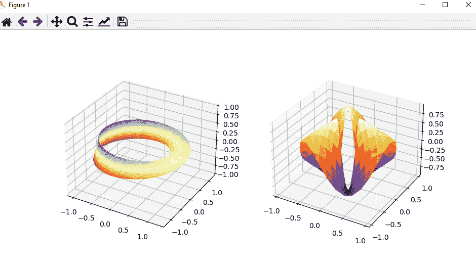

3D Plots

#### **海博**

该库用于统计绘图。就像 matplotlib 一样，我们可以绘制各种数据框架的吸引人的图表。我们还可以可视化不同的**回归模型、函数，并且它具有为同一数据框的不同变量绘制多幅图的特殊功能。**这些是一些样本地块:

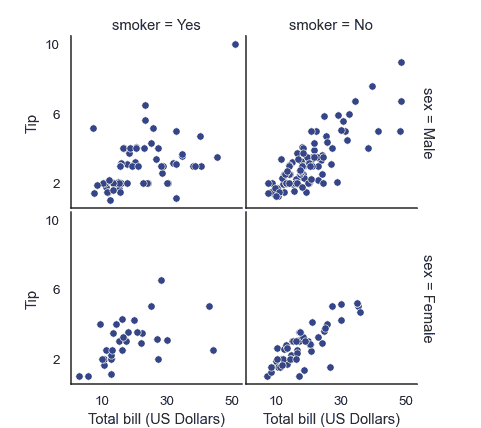

Seaborn multi-plots

#### **Scipy**

Scipy 的意思是科学巨蟒。这个库与 NumPy 非常相似。但是，最核心的区别是，它为物理和高等数学提供了特殊的功能。

像超几何、抛物柱面等主题都可以在这个 API 下找到。此外，它还有一组指数和三角函数来支持复杂的计算。

Scipy over NumPy 的主要优点是 ***它有助于计算积分和求导等微积分问题。*** 想了解更多关于这个包的信息，查看 [**用户指南**](https://docs.scipy.org/doc/scipy/reference/tutorial/index.html#user-guide) 的链接。

* * *

### 不同机器学习算法概述

现在让我们来看看不同的机器学习算法，它们是如何工作的。本节将帮助您了解哪种类型的机器学习技术适合基于需求的特定目的。

### 机器学习技术

机器学习两种不同的技术:

1.  **监督学习:**模型在监督和标记数据下学习的概念。我们用一些独特的值标记数据，然后根据我们的需要训练模型。
2.  **无监督学习**:模型利用无标签数据自行学习的概念。我们只需要做一些数据清理，然后将其他预测交给机器。

### 机器学习算法

没有算法，机器学习只是一夜之间的梦想。因此，人们应该对所有的基本算法有适当的了解。它们为用户规范提供正确和相关的输出。它们依赖于核心统计分析。有两种主要类型:

1.  ***分类*** :针对离散数据或数值差异较大的变化数据。
2.  ***回归*** :用于连续数据或数值略有变化的数据。

它们有相同的算法，但它们在创造上有所不同。下面是 AI/ML 从业者应该知道的七个最基本和最重要的算法。

1.  **[线性回归](https://www.askpython.com/python/examples/linear-regression-from-scratch)** :在图形上的数据点流向中寻找最佳拟合线。
2.  **[逻辑回归](https://www.askpython.com/python/examples/logistic-regression-from-scratch)** :用曲线求特定条件下的概率。
3.  **[决策树](https://www.askpython.com/python/examples/decision-trees)** :根据一棵树节点的不同情况做出决策。
4.  **[随机森林](https://www.askpython.com/python/examples/random-forest-regression)** :各种决策树的集合，对大量数据进行决策预测。
5.  **支持向量机**:将数据点分类分析
6.  **[k-means 聚类算法](https://www.askpython.com/python/examples/k-means-clustering-from-scratch)** :创建不同数据点的聚类，并检测其中的奇数。
7.  **[k 近邻](https://www.askpython.com/python/examples/k-nearest-neighbors-from-scratch)** :为特定测试用例上的数据点寻找最近邻。

## 如何用 Python 执行机器学习——一个简单的例子

对于初学者，要求你解决业务问题和测试用例。这也被称为**预测分析。**

现在，我们有了 ML 的主要工具和技术，我们知道什么是 ML。

让我们应用一些概念，让我们的 ML 之旅有一个良好的开端。ML 是命令机器学习的逐步模式。因此，作为开始，我们将用 python 实现一个带有一些图形的线性回归算法。

想了解更多关于蟒蛇的信息，请访问 https://www.anaconda.com/products/individual

> 基于 Google 不同职位员工的工资数据，实现决策树分类算法

*   环境:蟒蛇
*   **IDE:** Jupyter Notebook
*   **操作系统:** Windows 10+版
*   **Python 版本:** Python 3.8.5(预装了 Anaconda)
*   **数据集:** salary.csv

### 1.读取数据集

熊猫模块帮助我们读取数据集。它可以是任何形式，如文本，CSV，excel。熊猫模块有不同的方法来读取每种文件类型。它还可以通过数据 API 所在的给定链接读取它。

**代码:**

```py
import pandas as pd
data = pd.read_csv('salary.csv')
data.head()

```

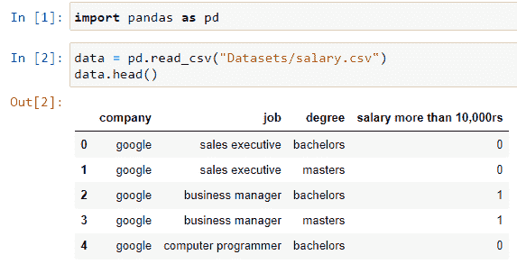

Reading The Dataset From Pandas 1

它是一个 CSV 文件，所以我们使用 **read_csv()** 方法。然后我们将它存储在一个变量中——**‘数据’**。要查看数据集的前五行，使用 **head()** 方法。

### 2.检查数据集的数据类型和形状

为了知道数据集中存在哪种类型的变量，我们需要确保我们有它们所有数据类型的记录。要检查它，熊猫的简单属性类型随时可用。为了计算行数和列数，我们使用了 **shape** 属性。这将返回一组行和列

```py
data.dtypes
data.shape

```

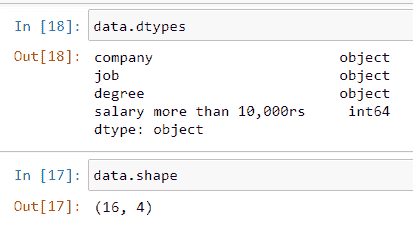

Retrieving The Shape And Datatype of The Dataset we came to know that it has **sixteen rows and four columns.** This helps to understand how large is the dataset.

### 3.检查所有缺失的值

数据集可能由于多种原因而不完整。差异可能非常大，并可能导致错误的预测。但是， **isna()** 函数扫描所有的值，如果任何列没有值，就返回数字。为了检查总值，我们使用了 **sum()** 函数和 isna()。

**代码:**

```py
data.isna().sum()

```

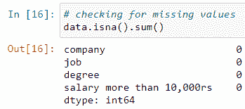

Checking The Missing Values

### 4.选择目标变量

预测依赖于与**目标**变量一起运行的连续变量。这个变量对于测试用例分析是必不可少的。如果我们有一个名义数据集，我们可以很容易地识别它。给出的问题陈述描述了**薪水**是我们的主要目标变量。所以一万多卢比的**工资栏适合那个。**

**代码:**

```py
inputs = data.drop('salary more than 10,000rs', axis = 'columns')

target = data['salary more than 10,000rs']

```

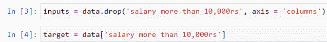

Target Variable Selection

### 5.标注数据集

对于一个**监督学习模型，**我们需要**标记数据**。因为它是这类 ML 算法的核心属性。

这可以通过使用 **sci-kit-learn** 库的**预处理**模块来完成。

我们从中导入了 **LabalEncoder()** 类。 **fit_transform()** 函数标注相关数据，以便机器理解。我们为每一列创建了该类的三个实例。

```py
from sklearn.preprocessing import LabelEncoder
le_company = LabelEncoder()
le_job = LabelEncoder()
le_degree = LabelEncoder()

inputs['company_n'] = le_company.fit_transform(inputs['company'])
inputs['job_n'] = le_job.fit_transform(inputs['job'])
inputs['degree_n'] = le_degree.fit_transform(inputs['degree'])

```

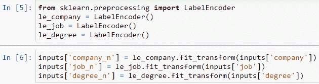

Labelling Data

因此，数据集增加了三个新列。

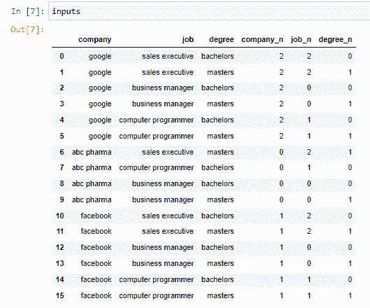

Viewing The Dataset

然后，在获得带标签的数据后，我们删除不需要的列。然后，数据集的新名称被赋予为 **inputs_n** 。

**代码:**

```py
inputs_n = inputs.drop(['company','job','degree'],axis='columns')
inputs_n

```

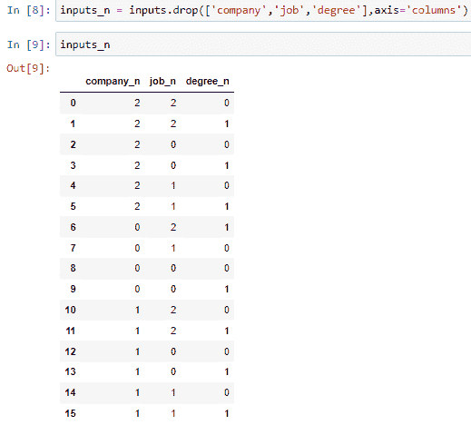

The New Dataset

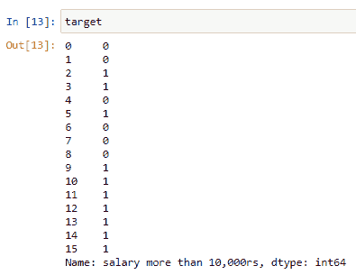

The Target Dataset

### 6.实现算法

我们实现了**分类器**类型的**决策树算法**，因为可用的数据是离散形式的。我们从 scikit-learn 的树模块中导入它。代码如下。

**代码:**

```py
from sklearn.tree import DecisionTreeClassifier
model = DecisionTreeClassifier()

model.fit(inputs_n, target)

model.score(inputs_n,target)

model.predict([[2,1,0]])

model.predict([[2,1,1]])

```

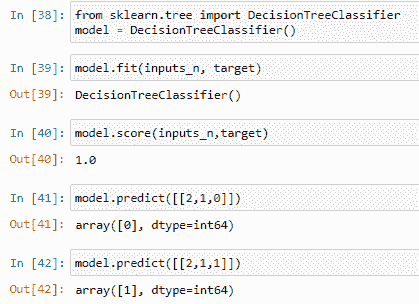

Decision Tree Implementation

**说明:**

1.  我们创建了 DecisionTreeClassifier 类的一个实例。然后，为了进行预测，我们使用拟合函数。这个函数有两个参数:**目标变量**和**连续变量**。这实现了关于参数的算法。
2.  然后使用 **score()** 函数检查训练分数的得分。范围从 0 到 1。如果分数是 1，那么模型是 100%准确的。百分比由小数点前的数字确定。例如，我们的分数是 0.78，那么训练百分比是 78%。
3.  predict 函数将一组输入作为参数。这给出了结果。我们给这个数组三个输入。因为我们有三个测试变量 **1)** **公司 _n** ， **2)** **工作 _n 3)** **学历 _n** 。
4.  该算法将比较每个输入的目标变量以及工资是否会超过**10，000 卢比**。如果答案是 1，那么这个人的收入超过 1 万卢比，但是如果答案是 0，那么这个人的收入不超过**1 万卢比**

### 现实世界中的机器学习

机器学习具有大量的应用，并且在各个领域中使用。这六个主要领域是:

1.  **技术**
2.  **行业**
3.  **金融**
4.  **电子商务**
5.  **物联网**
6.  **天气预报**

## 结论

因此，我们学习了如何在 Python 中执行机器学习。我们了解了各种图书馆及其用途。阅读这篇文章，开始你的机器学习之旅。必须涵盖很多内容，而且还会涵盖更多内容。因此，请确保您通读了本文中的所有内容，以便开始学习 Python 中机器学习的最主要方面。