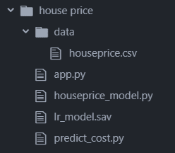
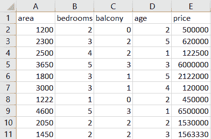
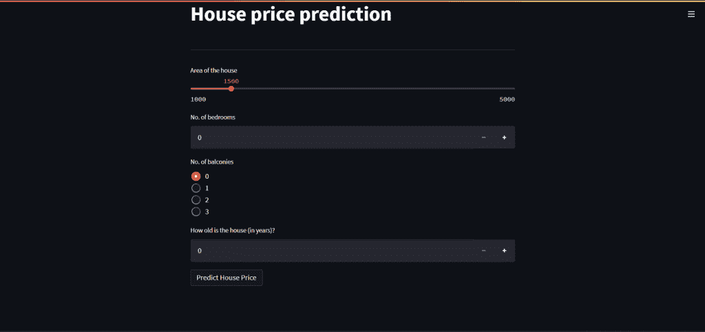
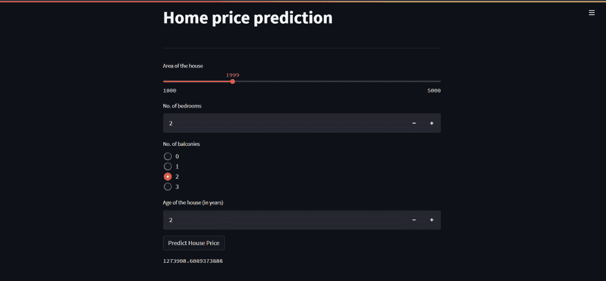

# 使用 Streamlit 部署机器学习模型——房价预测 GUI

> 原文：<https://www.askpython.com/python-modules/machine-learning-model-streamlit-house-price-prediction-gui>

你好，欢迎来到本教程！既然你偶然发现了这篇教程，我们猜测你正在执行一些机器学习任务。通常，在从事机器学习时，我们会使用 Jupyter Notebook、Google Collab 或任何我们喜欢的 IDE。但是对于不熟悉这些 ide 的人来说，在这些 ide 中训练的模型是没有用的。

为了解决这个问题，我们需要创建一个易于使用的应用程序，以便每个人都可以使用机器学习模型。在本教程中，我们将首先创建一个简单的线性回归模型，然后使用 Streamlit 部署它。

在开始之前，请确保您已经阅读了下面关于 Streamlit 的教程，因为在开发应用程序时，我们将使用其中包含的文本元素和小部件。

*   [Streamlit 简介](https://www.askpython.com/python-modules/introduction-to-streamlit)

* * *

## 设置项目结构

预测模型的项目结构如下:



Streamlit Project Structure

我们将需要三个 Python 脚本，`app.py`用于 web 应用，`houseprice_model.py`用于开发机器学习模型，`predict_cost.py`用于预测房屋价格。我们还需要一个`data`文件夹来存储数据集。

* * *

## 开发机器学习模型

我们将在这里使用一个 [**房价**数据集](https://www.askpython.com/python/data-science-projects)。它由 5 列组成，即

*   房子的面积
*   房子里卧室的数量
*   阳台的数量
*   房子的年龄，即房子的年龄
*   房子的价格

数据集如下所示:



houseprice.csv

请记住，该数据集包含其中所有参数的任意值。

因为构建线性回归模型超出了本文的范围，所以我们不会深入讨论它的细节。请随意查阅[从头开始线性回归](https://www.askpython.com/python/examples/linear-regression-from-scratch)教程，了解线性回归及其 Python 实现。
下面是我们机器学习模型的全部代码。

我们将使用 **houseprice_model.py** 文件来编写机器学习模型的代码。

**houseprice.py**

```py
# Importing the required libraries
import numpy as np
import pandas as pd
from sklearn.model_selection import train_test_split
from sklearn.linear_model import LinearRegression

# Reading the dataset
data = pd.read_csv('data/homeprice.csv')

# Seperating the target and features
# target ->y, features -> X
y = data['price']
X = data.drop(columns='price', axis=1)

# Splitting into training and test set
X_train, X_test, y_train, y_test = train_test_split(X, y, test_size=0.3, random_state=1)

# Making the model
lr = LinearRegression()
lr.fit(X_train, y_train)

# Predicting the output
y_pred = lr.predict(X_test)

# Saving the model
import joblib

joblib.dump(lr, "lr_model.sav")

```

最后，在构建模型之后，我们使用`joblib`模块作为`lr_model.sav`保存它，以便以后使用。

* * *

## 用细流设计前端

如果您还没有安装 Streamlit，可以使用命令进行安装

```py
pip install streamlit

```

现在，正如我们前面看到的，我们将为应用程序使用文件`app.py`。所以我们将在这个文件中编写前端代码。

因为我们有 4 个独立的特征，面积，卧室的数量，阳台的数量和房子的年龄，我们将需要 4 个输入字段来获得这些特征的值。因为我们想要预测房子的价格，我们将使用一个按钮，当点击它时将显示房子的价格。

**app.py**

```py
import streamlit as st
from predict_cost import predict
import numpy as np

st.title('Home price prediction')

st.write('---')

# area of the house
area = st.slider('Area of the house', 1000, 5000, 1500)

# no. of bedrooms in the house
bedrooms = st.number_input('No. of bedrooms', min_value=0, step=1)

# no. of balconies in the house
balconies = st.radio('No. of balconies', (0, 1, 2 , 3))

# how old is the house? (age)
age = st.number_input('How old is the house (in years)?', min_value=0, step=1)

if st.button('Predict House Price'):
    cost = predict(np.array([[area, bedrooms, balconies, age]]))
    st.text(cost[0])

```

我们可以使用以下命令运行该应用程序

```py
streamlit run app.py

```



Streamlit Prediction UI

在上面的代码中，所有的参数限制都是任意的。此外，我们已经从 **predict_cost.py** 文件导入了`predict`函数。点击**预测房价**按钮，预测功能被调用。

**predict_cost.py**

```py
import joblib

def predict(data):
    lr = joblib.load('lr_model.sav')
    return lr.predict(data) 

```

这里，在`predict`函数中，我们使用 **joblib** 模块加载我们保存的模型，然后根据发送给该函数的数据返回预测价格。

在将数据传递给`predict`函数时，我们需要将其作为一个二维数组传递。因此，我们将输入数据转换为 NumPy 数组。此外，predict 函数返回一个一维数组，因此在打印值时，我们编写了 cost[0]来获取返回数组中的唯一值。

现在，我们可以使用该应用程序提供一些输入，根据我们的输入来预测房价。下面就是一个这样的例子。



Streamlit Prediction Result

仅此而已！我们已经成功部署了一个机器学习模型作为 Streamlit 应用程序。