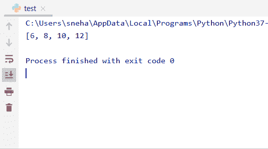

# Python 中的 map()方法

> 原文：<https://www.askpython.com/python/built-in-methods/map-method-in-python>

## 介绍

Python 中的 map()方法广泛用于对数据序列应用函数或操作。将特定函数应用于 iterable 的所有元素后，该方法返回一个 **map 对象**。

此地图对象是可迭代的，可以转换成所需的形式。因此，让我们了解它是如何工作的，以及如何在我们的程序中使用它。

* * *

## map()方法的工作原理

一般来说，`map()`方法的**语法**如下所示，

```py
map_object= map( method , iterable_object, ... )

```

这里，

*   `method`是函数，`map()`方法将把来自**可迭代对象**的单个元素传递给它，
*   `iterable_object`是我们要对其执行函数操作的**数据集**。我们可以将多个可重复项传递给方法`map()`，只需用逗号(**、**)将它们分开。该功能将并行应用于所有这些应用程序，
*   `map_object`是将函数应用于所提供对象的所有元素后，由`map()`方法返回的 iterable 对象。

现在看一个基本的例子来理解这个方法，

```py
def make_even(n):        #defining a function that checks if a number is even or not and makes it even if it was not
  if n%2==0:
      return n
  else:
      return n+1

num = (1, 2, 3, 4)
map_obj = map(make_even, num) #the map() method applies the function make_even to all the elements of the tuple num
print(type(map_obj))   #printing the type of the object returned by map()
print(list(map_obj))   #type-casting the map object to list and printing it

```

**输出:**

```py
<class 'map'>
[2, 2, 4, 4]

```

*   在上面的例子中，我们已经考虑了具有 4 个元素 **1，2，3，**和 **4** 的元组 **num** ，
*   此外，我们定义了一个函数`make_even()`,如果数字是偶数，它将返回数字本身，否则将数字加 1 使其成为偶数，然后最终返回值，
*   在我们使用了`map()` 方法之后，通过函数 **make_even** 和 iterable **num** 作为参数，返回的结果对象被存储到 **map_obj** 中，
*   打印出`type(map_obj)`告诉我们它是什么类型的对象。原来是**地图类**的成员，
*   同样，我们将 **map_obj** 输入到一个列表中，并打印相同的内容来检查结果。正如预期的那样，这给了我们想要的输出。

* * *

## 在 Python 中使用 map()方法

### 1.在 map()中使用 lambda 函数

众所周知，lambda 函数是受限函数，其大小极小，不能重用。如果我们在代码中不再需要函数，并减少函数定义的数量(从而产生更小的代码)，使用一个**λ函数**而不是定义一个全新的函数是很有用的。让我们举一个例子来理解λ函数在`map()`中的使用，

```py
num = (1, 2, 3, 4)
sqrd_obj = map(lambda n: n*n, num) #the map() method applies the lambda function to all the elements of the tuple num
print(list(sqrd_obj))   #type-casting the map object to list for printing it

```

**输出:**

```py
[1, 4, 9, 16]

```

*   因此，在上面的代码中，我们定义了一个临时的**λ**函数，它接受一个数字并返回平方项，
*   正如我们从输出中看到的，我们得到了元组 num 的各个元素的确切的**平方**项，
*   这样，使用 lambda 函数，我们减少了代码大小，甚至不必定义一个单独的函数来完成任务。

### 2.在 map()中使用多个参数

正如我们之前讨论的，我们实际上可以将**多个可迭代的**对象传递给指定给`map()`方法的函数。让我们举一个例子来理解同样的并行工作

```py
num1= (1, 2, 3, 4)  #tuple
num2= [5,6,7,8]     #list
#the map() method applies the lambda function to all the elements of the tuple num1 and list num2 parallelly
sqrd_obj = map(lambda n1,n2: n1+n2, num1, num2 )
print(list(sqrd_obj))   #type-casting the map object to list and printing it

```

**输出:**



Multiple Argument Map Example

因此，我们可以观察到，lambda 函数被**并行**应用于元组`num1`和列表`num2`的元素。输出是作为参数传递的对象的单个元素的总和。

**注意:**当具有**不同大小**的 iterables 被传递给`map()`方法时，那么 map 函数被应用到元素上，直到其中一个元素被用尽。

* * *

## 结论

所以，在本教程中，我们学习了 Python 中的`map()`方法。该方法的用途以及其使用的不同格式。如有任何问题，请随意发表评论。

* * *

## 参考

*   https://www.journaldev.com/22960/python-map-function
*   [https://stack overflow . com/questions/10973766/understanding-the-map-function](https://stackoverflow.com/questions/10973766/understanding-the-map-function)
*   [https://stack overflow . com/questions/890128/why-are-python-lambdas-useful](https://stackoverflow.com/questions/890128/how-are-lambdas-useful)