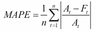

# MAPE——Python 中的平均绝对百分比误差

> 原文：<https://www.askpython.com/python/examples/mape-mean-absolute-percentage-error>

读者朋友们，你们好！在我们的一系列误差指标中，我们已经理解并实现了[均方根误差](https://www.askpython.com/python/examples/rmse-root-mean-square-error)。

今天，我们将关注模型构建中的另一个重要误差指标 Python 中的**平均绝对百分比误差(MAPE)** 。

* * *

## 什么是 MAPE？

**平均绝对百分比误差(MAPE)** 是一种统计度量，用于定义机器学习算法在特定数据集上的准确性。

MAPE 可以被认为是一个损失函数，用于定义模型评估所定义的误差。使用 MAPE，我们可以根据实际 v/s 估计值的差异来估计精度。

让我们看看平均绝对百分比误差的以下解释



**MAPE**

如上所述，在 MAPE，我们首先计算**实际值(A)** 和**估计/预测值(F)** 之间的绝对差值。此外，我们对结果应用均值函数来获得 MAPE 值。

MAPE 也可以用百分数来表示。**MAPE 越低，型号越合适**。

* * *

## NumPy 模块的平均绝对百分比误差

现在让我们使用 [Python NumPy 模块](https://www.askpython.com/python-modules/numpy/python-numpy-arrays)来实现 MAPE。

首先，我们将数据集导入到环境中。你可以在这里找到数据集[。](https://github.com/Safa1615/BIKE-RENTAL-COUNT/blob/master/day.csv)

此外，我们使用 Python **[train_test_split()函数](https://www.askpython.com/python/examples/split-data-training-and-testing-set)** 将数据集分成训练和测试数据集。

然后，我们定义了一个函数来实现 MAPE，如下所示

*   计算实际值和预测值之间的差异。
*   然后，用`numpy.abs() function`求上述差值的绝对值。
*   最后，应用`numpy.mean() function` 来获得 MAPE。

**举例:**

```py
import numpy as np
from sklearn.model_selection import train_test_split 
import pandas as pd
bike = pd.read_csv("Bike.csv")

#Separating the dependent and independent data variables into two data frames.
X = bike.drop(['cnt'],axis=1) 
Y = bike['cnt']

# Splitting the dataset into 80% training data and 20% testing data.
X_train, X_test, Y_train, Y_test = train_test_split(X, Y, test_size=.20, random_state=0)

#Defining MAPE function
def MAPE(Y_actual,Y_Predicted):
    mape = np.mean(np.abs((Y_actual - Y_Predicted)/Y_actual))*100
    return mape

```

现在，我们使用 MAPE 实现了一个[线性回归](https://www.askpython.com/python/examples/linear-regression-in-python)来检查模型的错误率。

这里，我们利用了`LinearRegression() function`对数据集进行线性回归。此外，我们使用了 **[预测()函数](https://www.askpython.com/python/examples/python-predict-function)** 来预测测试数据集的值。

最后，我们调用了上面创建的 **MAPE()函数**来估计预测中的误差值，如下所示:

```py
#Building the Linear Regression Model
from sklearn.linear_model import LinearRegression
linear_model = LinearRegression().fit(X_train , Y_train)

#Predictions on Testing data
LR_Test_predict = linear_model.predict(X_test) 

# Using MAPE error metrics to check for the error rate and accuracy level
LR_MAPE= MAPE(Y_test,LR_Test_predict)
print("MAPE: ",LR_MAPE)

```

**输出:**

```py
MAPE:  16.628873360270358

```

* * *

## 使用 **Python scikit 学习库**的平均绝对百分比误差

在这个例子中，我们使用 Python sklearn 库实现了 MAPE 的概念。

**Python sklearn 库**为我们提供了`mean_absolute_error() function`来计算 MAPE 值，如下所示

**举例:**

```py
from sklearn.metrics import mean_absolute_error
Y_actual = [1,2,3,4,5]
Y_Predicted = [1,2.5,3,4.1,4.9]
mape = mean_absolute_error(Y_actual, Y_Predicted)*100
print(mape)

```

**输出:**

```py
13.999999999999984

```

* * *

## 结论

到此，我们就结束了这个话题。如果你遇到任何问题，欢迎在下面评论。

更多与 Python 相关的帖子，请在这里关注，直到那时，学习愉快！！🙂

* * *

## 参考

*   [平均绝对百分比误差——维基百科](https://en.wikipedia.org/wiki/Mean_absolute_percentage_error)
*   [使用 Python sklearn 库的 MAPE—文档](https://scikit-learn.org/stable/modules/generated/sklearn.metrics.mean_absolute_error.html)