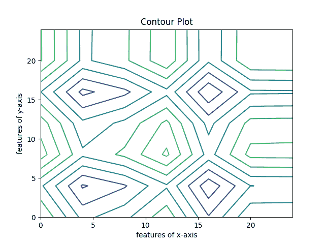
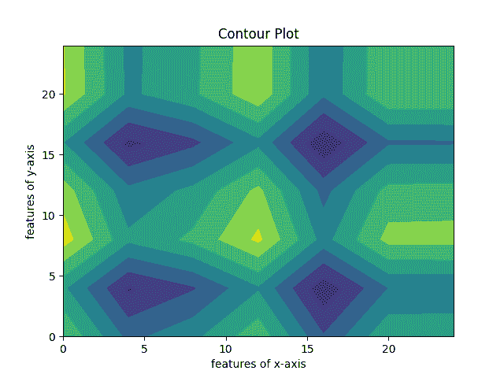
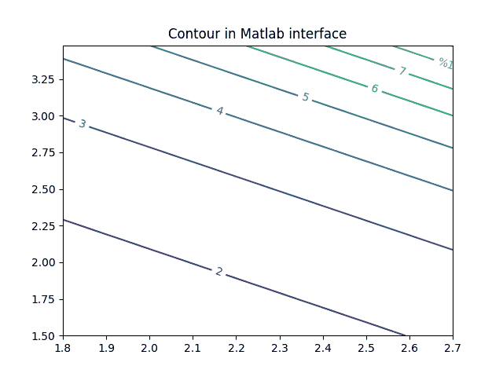

# Matplotlib 等高线图–完整参考

> 原文:# t0]https://www . aspython . com/python-modules/matplotlib/matplotlib-contour-plot

在本文中，我们将学习如何使用 contour 函数和 Matpotlib 在 Python 中创建等值线图。我们将了解不同类型的绘图功能以及通过它们创建的不同类型的绘图。我们还将查看代码以及如何使用它的详细解释。

## 什么是等高线图？



Hollow Contour Plot

轮廓是三维表面的二维表示，带有曲线和连接。它通过使用轮廓函数(Z)绘制，该轮廓函数是两个变量(X，Y)的函数。

为了处理等高线图，我们需要两个库——Matplotlib 和 NumPy。让我们安装它们。

Matplotlib 是一个基于 Python 的绘图库，用于创建图表和绘图。要安装 Matplotlib，请键入以下命令:

```py
pip install matplotlib

```

我们将需要另一个库-[Python Numpy](https://www.askpython.com/python-modules/numpy/python-numpy-module)来创建我们的等高线图。要安装它，请键入命令:

```py
pip install numpy

```

## 创建等高线图

有了基本要求，让我们马上开始绘制等高线图。

### 导入重要的库:

```py
import matplotlib.pyplot as plt
import numpy as nump

```

### 初始化 X，Y 变量

变量 X 和 Y 在下面的代码中用绘图的三维坐标初始化。

```py
element_ofx = nump.arange(0, 25, 4)
element_ofy = nump.arange(0, 26, 4)

```

### 用两个变量创建轮廓函数 Z

```py
[grid_ofX, grid_ofY] = nump.meshgrid(element_ofx, element_ofy)

fig, holowplt= plt.subplots(1, 1)

grid_ofZ = nump.cos(grid_ofX / 1) - nump.sin(grid_ofY / 2)

```

### 绘制等高线图

```py
holowplt.contour(grid_ofX, grid_ofY, grid_ofZ)

holowplt.set_title('Contour Plot')
holowplt.set_xlabel('features of x-axis')
holowplt.set_ylabel('features of y-axis')

plt.show()

```

下面的代码演示了如何创建简单的空心 matplotlib 等值线图:

```py
import matplotlib.pyplot as plt
import numpy as nump

element_ofx = nump.arange(0, 25, 4)
element_ofy = nump.arange(0, 26, 4)

# This numpy function creates 2-dimensional grid
[grid_ofX, grid_ofY] = nump.meshgrid(element_ofx, element_ofy)

# plots 2 graphs in one chart
fig, holowplt = plt.subplots(1, 1)

# Mathematical function for contour
grid_ofZ = nump.cos(grid_ofX / 1) - nump.sin(grid_ofY / 2)

# plots contour lines
holowplt.contour(grid_ofX, grid_ofY, grid_ofZ)

holowplt.set_title('Contour Plot')
holowplt.set_xlabel('features of x-axis')
holowplt.set_ylabel('features of y-axis')

plt.show()

```

### 输出:


Hollow Contour Plot

### 填充等高线图

在本例中，我们将创建填充轮廓图，而不是空心轮廓图。为了创建填充图，我们将使用“contourf”函数。整个程序与前面的例子非常相似，只是有一些细微的变化。

### 绘制等高线图

```py
fillplot.contourf(grid_ofX, grid_ofY, grid_ofZ)

fillplot.set_title('Contour Plot')
fillplot.set_xlabel('features of x-axis')
fillplot.set_ylabel('features of y-axis')

```

让我们看一下整个代码，以便更好地理解:

```py
import matplotlib.pyplot as plt
import numpy as nump

element_ofx = nump.arange(0, 25, 4)
element_ofy = nump.arange(0, 26, 4)

# This numpy function creates 2-dimensional grid
[grid_ofX, grid_ofY] = nump.meshgrid(element_ofx, element_ofy)

# plots 2 graphs in one chart
fig, fillplot = plt.subplots(1, 1)

# Mathematical function for contour
grid_ofZ = nump.cos(grid_ofX / 1) - nump.sin(grid_ofY / 2)

# plots contour lines
fillplot.contourf(grid_ofX, grid_ofY, grid_ofZ)

fillplot.set_title('Contour Plot')
fillplot.set_xlabel('features of x-axis')
fillplot.set_ylabel('features of y-axis')

plt.show()

```

### 输出:



Filled Contour Plot

## 使用基于状态的界面绘制等高线图

Matplotlib 子模块允许我们使用不同的界面绘制等高线。在本节中，我们将了解 matplotlib 模式，它以类似于 MATLAB 界面的方式绘制等高线。

让我们一个代码一个代码地理解，如何使用这个子模块绘制轮廓。

### 导入库

在这个特殊的例子中，我们将主要使用两个库，类似于前面的例子——Matplotlib 和 Numpy。

```py
import numpy as np
import matplotlib.pyplot as plt

```

### 变量的初始化

```py
delta = 0.18
element_ofx = np.arange(1.8, 2.8, delta)
element_ofy = np.arange(1.5, 3.6, delta)
grid_ofX, grid_ofY = np.meshgrid(element_ofx, element_ofy)
grid_ofZ = (np.exp(grid_ofX + grid_ofY))

```

让我们看看完整的代码，以便更好地理解:

```py
# Importing libraries
import numpy as np
import matplotlib.pyplot as plt

# variable initialisation
delta = 0.18
element_ofx = np.arange(1.8, 2.8, delta)
element_ofy = np.arange(1.5, 3.6, delta)
grid_ofX, grid_ofY = np.meshgrid(element_ofx, element_ofy)
grid_ofZ = (np.exp(grid_ofX + grid_ofY))

# Contour plotting
plot = plt.contour(grid_ofX, grid_ofY, grid_ofZ)

grid_format = {}
numscale = ['1', '2', '3', '4', '5', '6', '7']
for lvls, s in zip(plot.levels, numscale):
	grid_format[lvls] = s
plt.clabel(plot, plot.levels, inline = True,
		fmt = grid_format, fontsize = 10)

plt.title('Contour in Matlab interface')
plt.show()

```



Contour Plot in MATLAB interface

## 结论

这篇文章是你学习 Matplotlib 的良好基础。所有的主题和概念都以一种易于理解的方式提出，这样读者可以很容易地掌握所有的基础知识。对整篇文章的一个很好的概述将有助于您轻松地进一步探索更高级的 Matplotlib 概念。