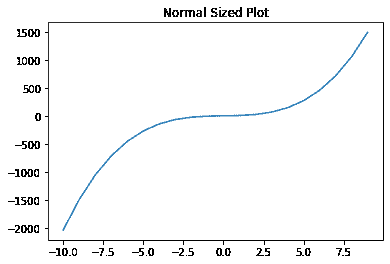
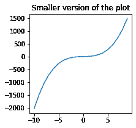
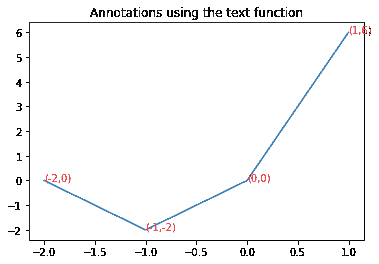
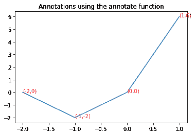
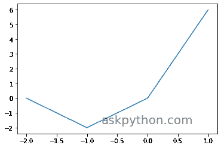
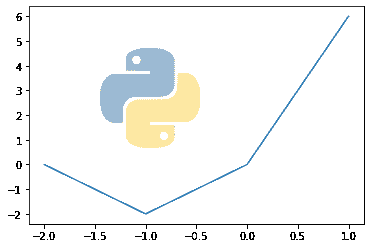

# 3 个 Matplotlib 绘图技巧让绘图更有效

> 原文：<https://www.askpython.com/python-modules/matplotlib/matplotlib-plotting-tips>

今天让我们学习一些 matplotlib 绘图技巧，这些技巧不仅可以改善你的绘图视觉效果，还可以帮助你使事情变得更简单。我很确定你已经知道了流行的绘图模块 matplotlib。但是，您是否知道本模块中还有更多值得探索的内容？

今天，我们将学习一些独特的未知函数，它们存在于模块中，可以使你的情节变得更好。

如果你还不熟悉 matplotlib 库，请务必阅读以下教程。

1.  [Matplotlib 简介](https://www.askpython.com/python-modules/matplotlib/python-matplotlib)
2.  [Matplotlib 中的支线剧情](https://www.askpython.com/python-modules/matplotlib/matplotlib-subplots)
3.  [Matplotlib 中的 3D 绘图](https://www.askpython.com/python-modules/matplotlib/3-dimensional-plots-in-python)
4.  [在 Python 中创建动画情节](https://www.askpython.com/python-modules/matplotlib/animated-plots)

## 技巧 1:改变情节的大小

改变图形的大小有助于更好地显示图形。同样可以在`figure`功能的帮助下完成，并将图形的宽度和高度称为`figsize`。高度和宽度以英寸为单位传递。

我们通过下面提到的代码来看同样的。

```py
import matplotlib.pyplot as plt

x = [i for i in range(-10,10)]
y = [2*i*i*i + 4*i for i in x]

plt.title("Normal Sized Plot")
plt.plot(x,y)
plt.show()

plt.figure(figsize=(3,3))
plt.plot(x,y)
plt.title("Smaller version of the plot")
plt.show()

```

下图显示了这两个图。



Normal Plot Matplot



Reduced Size Plot Matplot

## 技巧 2:添加注释

注释是添加到图中数据点的注释，使图形更容易理解和分析。可以通过两种不同的方式添加注释:`text`和`annotate`函数。

下面显示了这两种方法的实现。

### 2.1:使用`text`函数对 Matplotlib 绘图的注释

使用 text 函数添加注释的代码如下所示。

```py
x = [i for i in range(-2,2)]
y = [2*i*i + 4*i for i in x]
plt.title("Annotations using the text function")
plt.plot(x,y)

for i,j in zip(x,y):
    # x_cordinate, y_cordinate, text, other properties
    plt.text(i,j,"("+str(i)+","+str(j)+")",color="red")

plt.show()

```



Text Function Annotation Plot

### 2.2:使用`annotate`功能

现在，在下面代码的帮助下，看看如何使用 annotate 函数添加注释。

```py
x = [i for i in range(-2,2)]
y = [2*i*i + 4*i for i in x]
plt.title("Annotations using the annotate function")
plt.plot(x,y)

for i,j in zip(x,y):
    t=(i,j)
    # text_to_be_added, x and y cordinate in the form of tuple, other properties
    plt.annotate("("+str(i)+","+str(j)+")",xy=t,color="red")

plt.show()

```



Annotate Function Annotations Plot

## 招数 3:给剧情加水印

matplotlib 中通常不使用水印，但是如果用户想要拥有地块，可以添加水印。

您可以有两种类型的水印:

1.  基于文本的水印
2.  基于图像的水印

为了给绘图添加水印，我们将创建一个返回两个图形对象的 subplot 对象。我们可以使用`text`功能和`figimage`功能直接绘图并在绘图上添加文本和图像水印。

### 3.1 基于文本的水印

文本函数将需要 x 和 y 坐标，以及在绘图上需要的文本，以及文本的必要属性。其代码和输出如下所示。

```py
fig, ax = plt.subplots()
x = [i for i in range(-2,2)]
y = [2*i*i + 4*i for i in x]
ax.plot(x,y)
ax.text(0.0, -1.5, 'askpython.com',ha='center',va='center',fontsize=20,alpha=0.5)

plt.show()

```



Text Watermark Matplot

### 3.2 基于图像的水印

要添加图像水印，我们需要从 matplotlib 库中导入正确的模块，然后使用`imread`函数读取图像。然后我们将在子情节的第二个对象上使用`figimage`函数添加图像。代码和输出如下所示。

```py
import matplotlib.image as image
img = plt.imread('image.png')

fig, ax = plt.subplots()

x = [i for i in range(-2,2)]
y = [2*i*i + 4*i for i in x]
ax.plot(x,y)

fig.figimage(img, 100, 100,alpha=0.5)

plt.show()

```



Image Watermark Matplot

## 结论

恭喜你！今天，您学习了一些简单的技巧，使您的 matplotlib 图更有效、更容易理解。希望你喜欢这个教程，

感谢您的阅读！