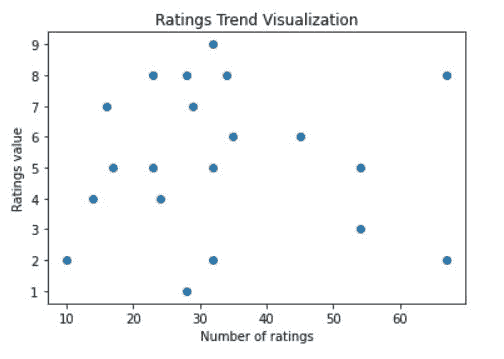
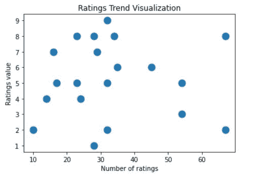
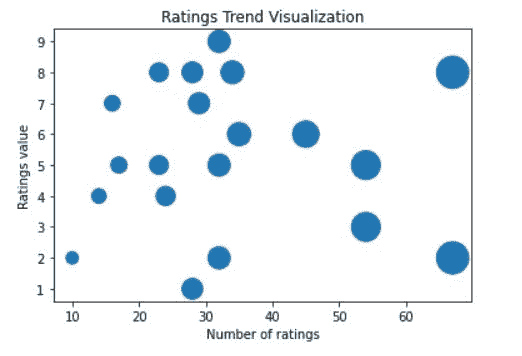
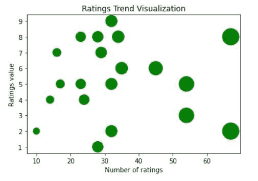
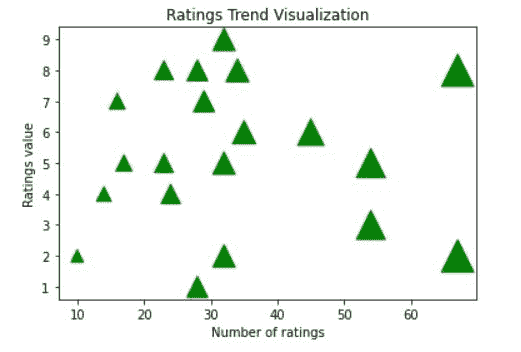
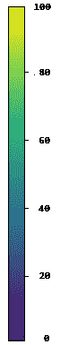
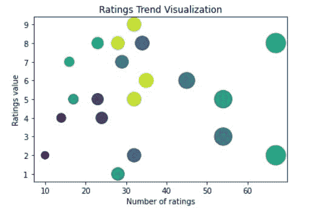
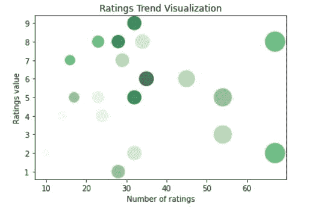
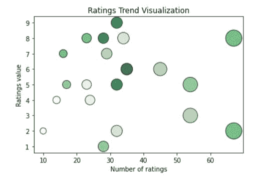

# 使用 Python 中的 matplotlib.pyplot.scatter 进行数据可视化

> 原文：<https://www.askpython.com/python-modules/matplotlib/matplotlib-pyplot-scatter>

任何类型的[数据分析](https://www.askpython.com/python-modules/pandas/data-analysis)的一个重要方法是观察关键特征之间的关系，并查看它们是否以某种方式相互依赖。通过某种情节或图形来可视化这些关系甚至更有用。比方说，我们有一个用例，我们需要在数据中看到某种趋势。我们当然需要某种工具来解决这个问题。

Matplotlib *是一个全面的库，用于在 Python* 中创建静态、动画和交互式可视化。它帮助我们创建交互式的图表、图形和布局，可以根据我们的需要进行定制。

***也读作:[使用 figsize](https://www.askpython.com/python-modules/matplotlib/resize-plots-and-subplots)*调整 Matplotlib 中的剧情和支线剧情大小**

## **散点()**法

**散点图**是我们将在本文中经历的，特别是**matplotlib . py plot . Scatter**方法。它用于创建散点图，以观察特征或变量之间的关系，这可能有助于我们获得洞察力。

使用这个工具的语法非常简单，只需要几行带有特定参数的代码。让我们先浏览一下语法，然后我们将看到如何使用最常用的参数来获得一些漂亮的可视化效果。

## 散布方法的语法

```py
matplotlib.pyplot.scatter(x_axis_array_data, y_axis_array_data, 
                                        s=None, c=None, marker=None, 
                                        cmap=None,  alpha=None, 
                                        linewidths=None, edgecolors=None)

```

*   `x_axis_array_data`:这是 x 轴数据。这是包含 x 轴数据的数组。
*   `y_axis_array_data`:这是 y 轴数据。这是包含 y 轴数据的数组。
*   `s`:该参数用于设置数据点的大小。
*   `c`:该参数用于设置数据点的颜色。
*   `marker`:该参数用于设置数据点的标记样式。
*   `cmap`:该参数用于设置数据点的颜色图。
*   `alpha`:该参数用于设置数据点的透明度。
*   `linewidths`:该参数用于设置数据点连线的宽度。
*   `edgecolors`:该参数用于设置数据点连线的颜色。

## 修改散点图参数以使用 PyPlot 散点图创建可视化效果

您可以使用以下命令安装 [matplotlib](https://www.askpython.com/python-modules/matplotlib/python-matplotlib) :

！pip 安装 matplotlib

或者，您可以使用 [Anaconda](https://www.askpython.com/python-modules/python-anaconda-tutorial) 来安装它。

### x 轴数组数据& y 轴数组数据

***以上提到的所有*****参数都是**可选*** **除了*****x _ axis _ array _ data****和 **y_axis_array_data，*** 顾名思义是取两组值作为数组。最常见的是， [NumPy 数组](https://www.askpython.com/python-modules/numpy/python-numpy-arrays)用于使代码运行更高效， ***shape (n，)，required*** 。*

*例如，我们有一个数据集，其中包含一些社交媒体上的视频帖子的特征 **number_of_ratings** ，我们还有一个 **ratings_value** ，它从 **1 到 9** 不等。我们想从观众那里找到收视率趋势。我们试着做一些剧情，试着把趋势形象化。*

```py
*# Basic scatter plot
import matplotlib.pyplot as plt
import numpy as np

ratings_value = np.asarray([2, 4, 5, 6, 8, 5, 2, 8, 5,
                            3, 2, 8, 6, 5, 4, 7, 8, 9, 7, 1])
number_of_ratings = np.asarray([10, 24, 17, 45, 23, 32, 67, 
                                34, 54, 54, 32, 67, 35, 23, 14, 16, 28, 32, 29, 28])

plt.title("Ratings Trend Visualization")
plt.xlabel("Number of ratings")
plt.ylabel("Ratings value")

plt.scatter(x = number_of_ratings, y = ratings_value)
plt.show()* 
```

*

Basic Scatter Plot* 

### *尺寸参数*

***s**–指数据点的标记大小。它可以是浮点型或阵列型，***(n，)，可选****

```py
*# Scatter plot with one specific size for all the markers: s parameter
import matplotlib.pyplot as plt
import numpy as np

ratings_value = np.asarray([2, 4, 5, 6, 8, 5, 2, 8, 5, 
                            3, 2, 8, 6, 5, 4, 7, 8, 9, 7, 1])
number_of_ratings = np.asarray([10, 24, 17, 45, 23, 32, 67, 
                                34, 54, 54, 32, 67, 35, 23, 14, 16, 28, 32, 29, 28])

plt.title("Ratings Trend Visualization")
plt.xlabel("Number of ratings")
plt.ylabel("Ratings value")

plt.scatter(x = number_of_ratings, y = ratings_value, s = 120)
plt.show()* 
```

*

Scatter Plot With Specific Size Marker* 

```py
*# Providing different sizes for each marker: As an array
import matplotlib.pyplot as plt
import numpy as np

ratings_value = np.asarray([2, 4, 5, 6, 8, 5, 2, 8, 5, 
                            3, 2, 8, 6, 5, 4, 7, 8, 9, 7, 1])
number_of_ratings = np.asarray([10, 24, 17, 45, 23, 32, 67, 
                                34, 54, 54, 32, 67, 35, 23, 14, 16, 28, 32, 29, 28])

plt.title("Ratings Trend Visualization")
plt.xlabel("Number of ratings")
plt.ylabel("Ratings value")

sizes = np.asarray([100, 240, 170, 450, 230, 320, 670, 340, 540, 
                                540, 320, 670, 350, 230, 140, 160, 280, 320, 290, 280])

plt.scatter(x = number_of_ratings, y = ratings_value, s = sizes)
plt.show()* 
```

*

Scatter Plot With Multiple Sized Marker* 

### *颜色参数*

***c**–阵列状或颜色或颜色列表，**T3 可选**。我们可以使用单一颜色，甚至一个颜色代码十六进制值来得到一些非常好看的图。*

```py
*# Using "c" parameter: with a specific color
import matplotlib.pyplot as plt
import numpy as np

ratings_value = np.asarray([2, 4, 5, 6, 8, 5, 2, 8, 5, 
                            3, 2, 8, 6, 5, 4, 7, 8, 9, 7, 1])
number_of_ratings = np.asarray([10, 24, 17, 45, 23, 32, 67, 
                                34, 54, 54, 32, 67, 35, 23, 14, 16, 28, 32, 29, 28])

sizes = np.asarray([100, 240, 170, 450, 230, 320, 670, 340, 540, 
                                540, 320, 670, 350, 230, 140, 160, 280, 320, 290, 280])

plt.title("Ratings Trend Visualization")
plt.xlabel("Number of ratings")
plt.ylabel("Ratings value")

plt.scatter(x = number_of_ratings, y = ratings_value, s = sizes, c = "green")
plt.show()* 
```

*

Scatter Plot With C Parameter* 

### *标记参数*

****标记—****是指标记样式* ***、(默认为:“o”)****

```py
*# Using a different marker: (default: 'o')
import matplotlib.pyplot as plt
import numpy as np

ratings_value = np.asarray([2, 4, 5, 6, 8, 5, 2, 8, 5, 
                            3, 2, 8, 6, 5, 4, 7, 8, 9, 7, 1])
number_of_ratings = np.asarray([10, 24, 17, 45, 23, 32, 67, 
                                34, 54, 54, 32, 67, 35, 23, 14, 16, 28, 32, 29, 28])

sizes = np.asarray([100, 240, 170, 450, 230, 320, 670, 340, 540, 
                                540, 320, 670, 350, 230, 140, 160, 280, 320, 290, 280])

plt.title("Ratings Trend Visualization")
plt.xlabel("Number of ratings")
plt.ylabel("Ratings value")

plt.scatter(x = number_of_ratings, y = ratings_value, s = sizes, c = "green", marker = "^" )
plt.show()* 
```

*

Scatter Plot with Marker Parameter* 

### *颜色图参数*

****cmap***–一个 [**Colormap**](https://matplotlib.org/stable/api/_as_gen/matplotlib.colors.Colormap.html#matplotlib.colors.Colormap) 实例或注册的 Colormap 名称。只有当 c 是浮点数组时，才使用 cmap，(默认为:“viridis”)。我们的颜色数组中的每个浮点值代表不同的颜色强度来绘制我们的数据。*

*Matplotlib 模块有许多可用的颜色映射。*

*色彩映射表就像一个颜色列表，其中每种颜色都有一个从 0 到 100 的值。*

*下面是一个色彩映射表的例子:*

*

Img of Colorbar* 

```py
*# Using cmap parameter: (Default: 'viridis')
import matplotlib.pyplot as plt
import numpy as np

ratings_value = np.asarray([2, 4, 5, 6, 8, 5, 2, 8, 5, 
                            3, 2, 8, 6, 5, 4, 7, 8, 9, 7, 1])
number_of_ratings = np.asarray([10, 24, 17, 45, 23, 32, 67, 
                                34, 54, 54, 32, 67, 35, 23, 14, 16, 28, 32, 29, 28])

sizes = np.asarray([100, 240, 170, 450, 230, 320, 670, 340, 540, 
                                540, 320, 670, 350, 230, 140, 160, 280, 320, 290, 280])

colors = np.asarray([1, 2, 5, 4, 6, 8, 6, 3, 5, 
                                4, 3, 6, 9, 2, 1, 6, 8, 8, 4, 5])

plt.title("Ratings Trend Visualization")
plt.xlabel("Number of ratings")
plt.ylabel("Ratings value")

plt.scatter(x = number_of_ratings, y = ratings_value, s = sizes, c = colors, cmap = "viridis" )
plt.show()* 
```

*

Scatter Plot With Cmap Parameter* 

### *阿尔法参数*

***alpha–**表示生成的标记的透明度强度，范围从 0 到 1。我们还使用 **cmap** 值作为“绿色”，以更好地了解我们的 **alpha** 参数*

```py
*# Using alpha parameter
import matplotlib.pyplot as plt
import numpy as np

ratings_value = np.asarray([2, 4, 5, 6, 8, 5, 2, 8, 5, 
                            3, 2, 8, 6, 5, 4, 7, 8, 9, 7, 1])
number_of_ratings = np.asarray([10, 24, 17, 45, 23, 32, 67, 
                                34, 54, 54, 32, 67, 35, 23, 14, 16, 28, 32, 29, 28])

sizes = np.asarray([100, 240, 170, 450, 230, 320, 670, 340, 540, 
                                540, 320, 670, 350, 230, 140, 160, 280, 320, 290, 280])

colors = np.asarray([1, 2, 5, 4, 6, 8, 6, 3, 5, 
                                4, 3, 6, 9, 2, 1, 6, 8, 8, 4, 5])

plt.title("Ratings Trend Visualization")
plt.xlabel("Number of ratings")
plt.ylabel("Ratings value")

plt.scatter(x = number_of_ratings, y = ratings_value, s = sizes, c = colors, cmap = "Greens",
           alpha = 0.75)
plt.show()* 
```

*

Scatter Plot With Alpha Parameter* 

## *线宽参数*

****线宽-*** 指标记边缘的宽度， ***边缘颜色-***指标记的颜色或颜色序列*

```py
*# Using linewidths: (Default: 1.5)
# Using edgecolors

import matplotlib.pyplot as plt
import numpy as np

ratings_value = np.asarray([2, 4, 5, 6, 8, 5, 2, 8, 5, 
                            3, 2, 8, 6, 5, 4, 7, 8, 9, 7, 1])
number_of_ratings = np.asarray([10, 24, 17, 45, 23, 32, 67, 
                                34, 54, 54, 32, 67, 35, 23, 14, 16, 28, 32, 29, 28])

sizes = np.asarray([100, 240, 170, 450, 230, 320, 670, 340, 540, 
                                540, 320, 670, 350, 230, 140, 160, 280, 320, 290, 280])

colors = np.asarray([1, 2, 5, 4, 6, 8, 6, 3, 5, 
                                4, 3, 6, 9, 2, 1, 6, 8, 8, 4, 5])

plt.title("Ratings Trend Visualization")
plt.xlabel("Number of ratings")
plt.ylabel("Ratings value")

plt.scatter(x = number_of_ratings, y = ratings_value, s = sizes, c = colors, cmap = "Greens",
           alpha = 0.75, linewidths = 1, edgecolors = "Black")
plt.show()* 
```

*

Scatter Plot With Edgecolors And Linewidths* 

## *结论*

*在本文中，我们介绍了 python 中最常用的数据可视化方法之一。在多幅图的帮助下，我们还看到了呈现数据的各种方式，这些方式可以用于各种组合，以获得关于数据的一些重要概述。散点图在 python 社区中被广泛使用，matplotlib 正好提供了一种以非常简单和直观的方式绘制数据的工具。*

## *附加参考*

*   *[Matplotlib 文件](https://matplotlib.org/)*
*   *[matplotlib.pyplot.scatter 文档](https://matplotlib.org/stable/api/_as_gen/matplotlib.pyplot.scatter.html)*