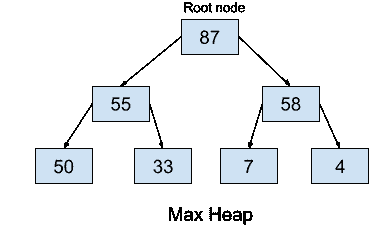
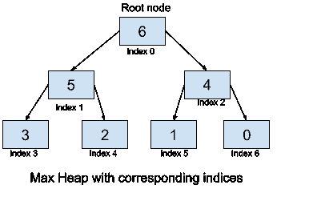
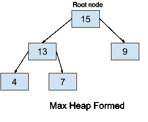

# 最大堆数据结构 Python 中的完整实现

> 原文：<https://www.askpython.com/python/examples/max-heap>

在本文中，我们将了解更多关于 Max Heap(在 Python 中称为堆队列)的知识。我们已经学习了 python *中的[堆及其库函数(在 heapq 模块中)。](https://www.askpython.com/python/examples/heaps-in-python)*我们现在将学习 max heap 及其实现，然后看看我们自己实现 max-heap 的`heapify`、`heappush`和`heappop` 函数的 Python 代码。

## 什么是最大堆？

Max Heap 是一棵完全二叉树(完全二叉树是一棵完全填充的树，除了最深/最后一级中最右边的节点)，其中每个节点大于或等于它的所有子节点。因此堆的根节点是最大的元素。堆数据结构一般用来表示一个优先级队列，max heap 可以理解为一个优先级队列，最大元素为最高优先级。



Max Heap Python AskPython Content 1

## max-heap 在数组中是如何表示的？

我们已经看到了堆是如何在内存中以数组的形式表示的，这只是一个简单的提醒:

*   根元素将位于数组的第零个位置，即 Heap[0]。
*   对于任何其他节点，比如说 Heap[i]，我们有以下内容:
    *   父节点由下式给出:Heap[(i -1) / 2]
    *   左边的子节点由下式给出:Heap[(2 * i) + 1]
    *   右边的子节点由下式给出:Heap[(2 * i) + 2]



Max Heap array representation Python

Python 中的堆默认为[最小堆](https://www.askpython.com/python/examples/min-heap)，使用 heapq 模块的`heapify`、`heappop`和`heappush`函数。

要使用库函数创建和使用 max-heap，我们可以将每个元素乘以-1，然后使用堆库函数，因此它将充当 max-heap。

现在让我们了解 max-heap 函数是如何工作的，以及我们如何从头开始编写代码来实现这些函数。

## 了解实现最大堆的函数

### 1.**最大健康功能**

此函数使一个节点及其所有后代(子节点及其子节点)遵循最大堆属性。它通过交换节点来重新排列它们，从而使给定的堆成为其子树中最大的节点，遵循 max-heap 属性。

它首先在给定节点及其所有子节点中找到具有最大值的节点。然后，它将给定的节点(比如 I)与找到的最大值节点(比如 j)交换，然后对节点 j 调用`max-heapify`函数(递归),以确保分配给节点 j 的新值不会破坏其子树中的 max-heap 属性。

由于最多要遍历树的深度，所以它的时间复杂度是 O(d)，d 是深度，或者，就节点数而言，O(log n)，n 是堆中的元素数。

### 2.**构建堆函数**

这个函数从一个任意列表(或任何其他可迭代的列表)构建一个堆，也就是说，它获取列表并重新排列每个元素，以满足 max-heap 属性。

它可以简单地通过对每个节点重复应用`max-heapify`来实现。这个函数的时间复杂度为 O(n)。

### 3.**heap app****功能**

这个函数弹出堆的最大值(根元素)。

这实际上是通过用最后一个节点交换根节点并删除现在的最后一个节点(现在包含最大值)然后为根节点调用`max-heapify`来完成的，以便在由于交换而改变之后保持堆属性。

因为我们只需要处理后代，所以时间复杂度是 O(log n)，其中 n 是元素的数量，或者是 O(h)，其中 h 是 log n 的树的高度，因为它是一个完整的树。

### 4. **heappush 函数**

该函数将一个新元素推入堆中，并将其排列到正确的位置，同时保持堆属性。

这实际上是通过在堆的末尾添加一个新节点来实现的。现在，为了维护堆属性，我们从最后一个节点向上遍历(并在需要的地方交换)以修复堆属性，由于添加了 pushed 元素，可能会违反堆属性。

与`heappop`类似，这里的时间复杂度是 O(log n ),因为我们只需要遍历子树的高度。

### 5. **extractMax 功能**

这个函数从堆中返回优先级最高的元素(根元素或最大的元素)。因为我们只需要返回根的值，并且不对堆做任何改变，并且根是在 O(1)时间内可访问的，因此该函数的时间复杂度是 O(1)。

## 最大堆的完整 Python 实现

现在，我们将在 Python 中实现一个 max-heap。我们在代码中使用一个列表[15，7，9，4，13],并使用`build-heap`函数将其转换为最大堆。生成的堆将如下所示:



Max Heap Python

实施:

```py
import sys

#defining a class max_heap for the heap data structure

class max_heap: 
    def __init__(self, sizelimit):
        self.sizelimit = sizelimit
        self.cur_size = 0
        self.Heap = [0]*(self.sizelimit + 1)
        self.Heap[0] = sys.maxsize
        self.root = 1

    # helper function to swap the two given nodes of the heap
    # this function will be needed for max-heapify and insertion 
    # in order to swap nodes which are not in order (not satisfy max-heap property)
    def swapnodes(self, node1, node2):
        self.Heap[node1], self.Heap[node2] = self.Heap[node2], self.Heap[node1]

    # THE MAX_HEAPIFY FUNCTION
    def max_heapify(self, i):

        # If the node is a not a leaf node and is lesser than any of its child
        if not (i >= (self.cur_size//2) and i <= self.cur_size):
            if (self.Heap[i] < self.Heap[2 * i]  or  self.Heap[i] < self.Heap[(2 * i) + 1]): 
                if self.Heap[2 * i] > self.Heap[(2 * i) + 1]:
     # Swap the node with the left child and call the max_heapify function on it
                    self.swapnodes(i, 2 * i)
                    self.max_heapify(2 * i)

                else:
                # Swap the node with right child and then call the max_heapify function on it
                    self.swapnodes(i, (2 * i) + 1)
                    self.max_heapify((2 * i) + 1)

    # THE HEAPPUSH FUNCTION
    def heappush(self, element):
        if self.cur_size >= self.sizelimit :
            return
        self.cur_size+= 1
        self.Heap[self.cur_size] = element 
        current = self.cur_size
        while self.Heap[current] > self.Heap[current//2]:
            self.swapnodes(current, current//2)
            current = current//2

    # THE HEAPPOP FUNCTION
    def heappop(self):
        last = self.Heap[self.root]
        self.Heap[self.root] = self.Heap[self.cur_size]
        self.cur_size -= 1
        self.max_heapify(self.root)
        return last

    # THE BUILD_HEAP FUNCTION
    def build_heap(self): 
        for i in range(self.cur_size//2, 0, -1):
            self.max_heapify(i)

    # helper function to print the heap
    def print_heap(self):
        for i in range(1, (self.cur_size//2)+1):
            print("Parent Node is "+ str(self.Heap[i])+" Left Child is "+ str(self.Heap[2 * i]) +                  " Right Child is "+ str(self.Heap[2 * i + 1]))

maxHeap = max_heap(10)
maxHeap.heappush(15)
maxHeap.heappush(7)
maxHeap.heappush(9)
maxHeap.heappush(4)
maxHeap.heappush(13)
maxHeap.print_heap()

```

输出:

```py
Parent Node is 15 Left Child is 13 Right Child is 9
Parent Node is 13 Left Child is 4 Right Child is 7

```

从示例图像中给出的插图可以验证输出。

## 结论

在本文中，我们了解了最大堆。我们研究了`max-heapify`、`heappush`、`heappop`和`build_heap`的功能是如何工作的。我们从零开始用 python 进一步实现了这些功能。请继续关注更多内容丰富的文章。

快乐学习！