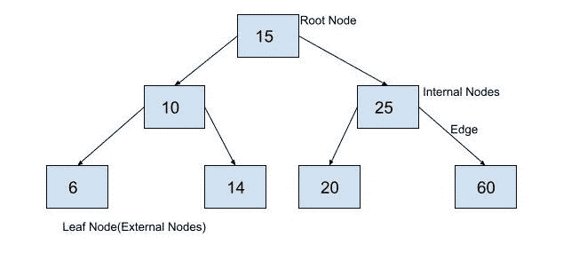

# 找到二叉树的最大宽度

> 原文：<https://www.askpython.com/python/examples/maximum-width-of-a-binary-tree>

在本文中，我们将修改层次顺序树遍历算法，以找到二叉树的最大宽度。在之前关于[平衡二叉树](https://www.askpython.com/python/examples/balanced-binary-tree)的文章中，我们已经制定并实现了一个算法来寻找二叉树的高度。我们还在 Python 中实现了一个[层次顺序二叉树遍历算法。](https://www.askpython.com/python/examples/level-order-binary-tree)

## 二叉树的宽度是多少？

在二叉树中，在任何级别 L 上最多可以出现 2 个^L 数量的节点。但是，每个级别不太可能有 2 个^L 数量的元素。由于没有节点，任何级别的元素数量都可能较少。

例如，下图中给出的二叉树的最大宽度是 4，因为在一个级别上最多有四个节点。



Binary tree

## 如何求二叉树的最大宽度？

我们将使用一种改进的层次顺序树遍历算法来寻找二叉树的最大宽度。这个想法是以某种方式计算每一层的元素数量，以找到它们的最大值。

为此，我们可以使用占位符来分隔树中不同级别的元素。在层级顺序遍历中使用的队列中，我们将在插入一个层级的每个元素后插入一个占位符。这样，无论何时遇到占位符，我们都知道已经遍历了树的一层，因此宽度可以更新。

## 求二叉树最大宽度的算法

我们将在队列中插入根节点。之后，我们将插入一个 None 对象作为占位符。每当在队列中遇到占位符时，树的宽度将被更新，None 对象将被推入队列。

找到二叉树宽度的算法可以用公式表示如下。该算法将二叉树的根作为输入，并返回最大宽度。

1.  如果根为空，则返回 0。
2.  将 maximum_width 变量初始化为-1。
3.  将当前宽度变量初始化为 0。
4.  设 Q 为队列。
5.  在 q 中插入 root。
6.  不将任何内容插入队列。
7.  从 q 中取出一个节点。
8.  如果节点为“无”,请转至 9。否则转到 11。
9.  比较 maximum_width 和 current_width。将两者中的最大值赋给 maximum_width。
10.  将 current_width 设置为 0。如果 Q 为空或 Q 的第一个元素为 None，请转到 14。
11.  将 current_width 增加 1。
12.  将节点的左子节点插入 q。
13.  将节点的右子节点插入 q。
14.  检查 Q 是否为空。如果 Q 不为空，转到 7 else Stop。

## 算法在 Python 中的实现

既然我们已经讨论了总体思路并理解了算法，那么让我们看看它在 Python 中的实现。在这里，我们创建了一个二叉树，并计算了二叉树的最大宽度。

```py
class BinaryTreeNode:
    def __init__(self, data):
        self.data = data
        self.leftChild = None
        self.rightChild = None

def insert(root, newValue):
    # if binary search tree is empty, make a new node and declare it as root
    if root is None:
        root = BinaryTreeNode(newValue)
        return root
    # binary search tree is not empty, so we will insert it into the tree
    # if newValue is less than value of data in root, add it to left subtree and proceed recursively
    if newValue < root.data:
        root.leftChild = insert(root.leftChild, newValue)
    else:
        # if newValue is greater than value of data in root, add it to right subtree and proceed recursively
        root.rightChild = insert(root.rightChild, newValue)
    return root

def width(root):
    if root is None:
        return 0
    max_width = -1
    current_width = 0
    Q = [root, None]
    while Q:
        node = Q.pop(0)
        if node is None:
            if max_width < current_width:
                max_width = current_width
            current_width = 0
            if not Q or Q[0] is None:
                continue
            Q.append(None)
        else:
            current_width = current_width + 1
            Q.append(node.leftChild)
            Q.append(node.rightChild)
    return max_width

root = insert(None, 15)
insert(root, 10)
insert(root, 25)
insert(root, 6)
insert(root, 14)
insert(root, 20)
insert(root, 60)
print("Printing the maximum width of the binary tree.")
print(width(root))

```

输出:

```py
Printing the maximum width of the binary tree.
4

```

## 结论

在这篇文章中，我们讨论了寻找二叉树的最大宽度的算法。请继续关注更多关于 Python 中不同算法实现的文章。