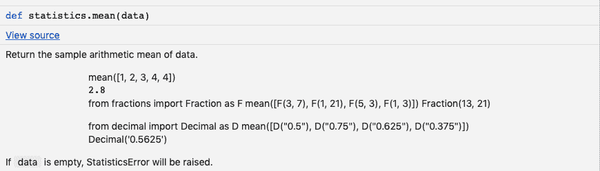
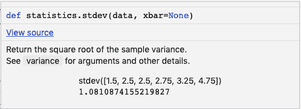

# Python 中的均值和标准差

> 原文：<https://www.askpython.com/python/examples/mean-and-standard-deviation-python>

均值和标准差是统计学中的两个基本指标。我们可以使用统计模块在 Python 中找出均值和标准差。标准差也缩写为 SD。

## 什么是卑鄙？

**平均值**是所有条目的总和除以条目数。例如，如果我们有一个 5 个数字的列表[1，2，3，4，5]，那么平均值将是(1+2+3+4+5)/5 = 3。

## 什么是标准差？

**标准差** 是一组数值的变异量或离差量的度量。我们首先需要计算数值的均值，然后计算方差，最后是标准差。

## 标准差的使用

假设我们有美国各州每平方公里的人口数据。我们可以计算标准差来找出人口是如何均匀分布的。较小的值意味着分布是均匀的，而较大的值意味着一些地方很少有人居住，而一些地区人口稠密。

让我们看看计算平均值和标准差所需的步骤。

## 计算平均值的步骤

1.  取所有条目的总和**。**
2.  **用总数**除以条目数的**。**

## 计算标准差的步骤

1.  **如上所述计算平均值**。[1，2，3，4，5]的平均值是 3。
2.  **从条目值中减去平均值，计算每个条目的方差**。所以方差会是[-2，-1，0，1，2]。
3.  然后对每个结果值求平方，并将结果相加。对于上面的例子，它将变成 4+1+0+1+4=10。
4.  然后将结果除以数据点数减一。这将给出**方差。因此方差将是 10/(5-1) = 2.5**
5.  方差(上面计算的)的**平方根就是标准差。所以标准差会是 sqrt(2.5) = 1.5811388300841898。**

## 在 Python 中求平均值和标准差

让我们用 Python 写代码来计算均值和标准差。我们将使用[统计模块](https://www.askpython.com/python-modules/statistics-module)，稍后尝试编写我们自己的实现。

### 1.使用统计模块

此模块为您提供了直接计算平均值和标准差的选项。

让我们从导入[模块](https://www.askpython.com/python-modules)开始。

```py
import statistics 

```

让我们用样本数据声明一个列表。

```py
data = [7,5,4,9,12,45] 

```

现在，要计算样本数据的平均值，请使用以下函数:

```py
statistics.mean(data)

```

该语句将返回数据的平均值。我们可以使用以下公式打印输出中的平均值:

```py
print("Mean of the sample is % s " %(statistics.mean(data))) 

```

我们得到的输出为:

```py
Mean of the sample is 13.666666666666666

```

如果您使用 IDE 进行编码，您可以将鼠标悬停在该语句上，获得有关 statistics.mean()函数的更多信息。



或者，你可以在这里 阅读文档 **[。](https://docs.python.org/3/library/statistics.html)**

要计算样本数据的标准偏差，请使用:

```py
print("Standard Deviation of the sample is % s "%(statistics.stdev(data)))

```

我们得到的输出为:

```py
Standard Deviation of the sample is 15.61623087261029

```

这里有一个关于 [statistics.stdev](https://www.askpython.com/python/examples/standard-deviation) ()函数的简要文档。



### 在 Python 中查找标准偏差和平均值的完整代码

以上代码片段的完整代码如下:

```py
import statistics 

data = [7,5,4,9,12,45]

print("Standard Deviation of the sample is % s "% (statistics.stdev(data)))
print("Mean of the sample is % s " % (statistics.mean(data))) 

```

### 2.编写自定义函数来计算标准偏差

让我们用 Python 编写计算均值和标准差的函数。

```py
def mean(data):
  n = len(data)
  mean = sum(data) / n
  return mean

```

这个函数将计算平均值。

现在让我们写一个函数来计算标准差。

这可能有点棘手，所以让我们一步一步来。

标准差是方差的**平方根。所以我们可以写两个函数:**

*   第一个函数将计算方差
*   第二个函数将计算方差的平方根并返回标准差。

计算方差的函数如下:

```py
def variance(data):

  n = len(data)

  mean = sum(data) / n

  deviations = [(x - mean) ** 2 for x in data]

  variance = sum(deviations) / n
  return variance

```

可以参考教程开头给出的步骤来理解代码。

现在我们可以写一个函数来计算方差的平方根。

```py
def stdev(data):
  import math
  var = variance(data)
  std_dev = math.sqrt(var)
  return std_dev

```

### 完全码

完整的代码如下:

```py
import numpy as np #for declaring an array or simply use list

def mean(data):
  n = len(data)
  mean = sum(data) / n
  return mean

def variance(data):
  n = len(data)
  mean = sum(data) / n
  deviations = [(x - mean) ** 2 for x in data]
  variance = sum(deviations) / n
  return variance

def stdev(data):
  import math
  var = variance(data)
  std_dev = math.sqrt(var)
  return std_dev

data = np.array([7,5,4,9,12,45])

print("Standard Deviation of the sample is % s "% (stdev(data)))
print("Mean of the sample is % s " % (mean(data))) 

```

## 结论

平均值和标准偏差是统计分析中使用的数学值。Python 统计模块提供了有用的函数来轻松计算这些值。

## 下一步是什么？

*   [Python 数学模块](https://www.askpython.com/python-modules/python-math-module)
*   [NumPy 模块](https://www.askpython.com/python-modules/numpy/python-numpy-module)
*   [Python 数组](https://www.askpython.com/python-modules/numpy/python-numpy-arrays)
*   [Python 中的列表](https://www.askpython.com/python/list/python-list)

## 资源

*   [维基百科上的标准差](https://en.wikipedia.org/wiki/Standard_deviation)
*   [统计模块文档](https://docs.python.org/3/library/statistics.html)