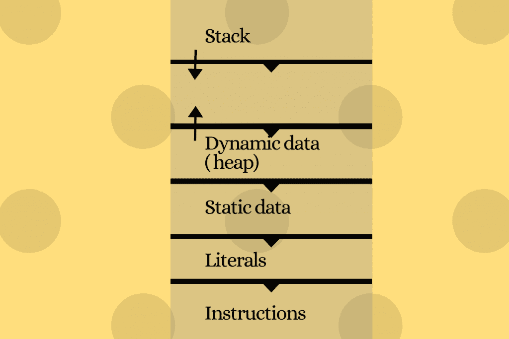

# Python 中的内存管理

> 原文：<https://www.askpython.com/python/examples/memory-management-in-python>

内存管理是动态存储内存并在不使用时释放内存的过程。

* * *

## 理解 Python 中的内存管理

在 python 中，内存的这种分配和释放是由 Python 开发人员创建的 Python 垃圾收集器自动完成的，因此用户不必进行手动垃圾收集。

### 碎片帐集

[Python 中的垃圾收集](https://www.askpython.com/python-modules/garbage-collection-in-python)是解释器为我们的程序释放未使用和不想要的内存的内存管理过程。在 Python 中，这是自动完成的。

垃圾收集器找到没有指向它的引用的对象，然后从堆内存中删除该对象。为此，Python 使用了引用计数算法。

示例:

```py
class Python:

    def __init__(self):
        print('The object is created.')

    def __del__(self):
        print('The object is destroyed.')

obj1 = Python()
obj2 = obj1
obj3 = obj1
print("Set obj1 to None")
obj1 = None
print("Set obj2 to None")
obj2 = None
print("Set obj3 to None")
obj3 = None

```

输出:

```py
The object is created.
Set obj1 to None
Set obj2 to None
Set obj3 to None
The object is destroyed.

```

这里，我们创建了一个类 *Python* 的对象，并将其引用传递给 *obj1，obj2，obj3* 。这使得该对象的引用计数为 3。然后，当我们将这些引用分配给 *none* 时，来自该对象的所有引用都被移除并变成 0。由于没有对该对象的引用，python 垃圾收集器销毁了该对象，并执行 __del__()方法。

### 引用计数

Python 中的引用计数是一种技术，当没有引用指向对象时，从内存中释放对象。当引用计数变为零时，对象被删除。

我们有一个内置函数 **getrefcount()** 存在于 python 模块 **sys** 中，它返回给定 python 对象的引用数。

示例:

```py
import sys
str = "Welcome to Python"
print(sys.getrefcount(str))

arr = []
arr.append(str) # appending to an array
print(sys.getrefcount(str))

dict = {}
dict['str'] = str # adding to a dictionary
print(sys.getrefcount(str))

arr = [] # resetting the array
sys.getrefcount(str)
dict['my_str'] = "Some other string"
print(sys.getrefcount(str))

```

输出:

```py
4
5
6
5

```

reference count 的值比您预期的值高一，因为它还计算函数 *sys.getrefcount()中传递的对象的引用计数。*

有时对象的引用计数永远不会达到零。发生这种情况是因为对象引用了自己。这被称为**参考周期**。

示例:

```py
import sys
x = []
x.append(x) # x contains reference to itself
print("Reference count of object is",sys.getrefcount(x))

```

输出:

```py
Reference count of object is 3

```

这里，创建了一个引用自身的对象 x。引用计数永远不会达到 0，因为它有自己的引用。对象 x 将占用内存，直到 Python 垃圾收集器被调用。

当 object 被全局声明时，对象的引用计数永远不会变为零。

### 存储器分配

要了解内存分配，我们必须了解随机存取存储器(RAM)。RAM 也称为主存储器，允许在计算机上存储和检索信息。

在 RAM 的顶部，我们有一个栈，在底部，我们有堆。[堆](https://www.askpython.com/python-modules/python-heapq-module)负责存储变量/值，栈负责保存对堆中对象的引用。



Stack and Heap locations in RAM

在 Python 中，当多个变量具有相同的值时，会在堆中创建指向原始值的第二个变量。

示例:

```py
x = 5
y = x 
if(id(x) == id(y)):
   print("x and y refer to the same object")

x = x+1
if(id(x) != id(y)):
    print("x and y refer to different objects")

z = 5
if(id(y) == id(y)):
   print("y and z refer to same memory")

```

输出:

```py
x and y refer to the same object
x and y refer to different objects
y and z refer to same memory

```

**内存分配有两种类型:**

*   堆栈内存分配
*   堆内存分配。

#### 1.堆栈内存分配

堆栈内存分配是特定函数或方法调用内部静态内存的存储。当调用函数时，内存存储在函数调用堆栈中。任何局部变量初始化都存储在调用堆栈中，一旦函数返回就被删除。

所以，当我们运行我们的程序时，所有的函数首先存储在调用栈中，然后在函数返回时被删除。

示例:

```py
def func():
    #These initializations are stored in stack memory
    x = 10 
    y = "Apple"

```

#### 2.堆内存分配

堆内存分配是特定函数或方法调用之外所需的内存存储。这个内存是在程序全局范围内使用的。

堆内存与堆数据结构无关。它只是当用户想要分配和释放变量/值时提供给他们的一个大的内存空间。

在 Python 中，堆内存由解释器自己管理，用户对它没有控制权。

示例:

```py
def func()
    #Allocates memory for 5 integers in heap memory
    x=[None]*5

```

## 结论

程序员们爱上了 Python，因为它具有超强的内存管理能力。与许多其他低级编程语言相比，Python 使得使用变量变得轻而易举，而不用担心过度使用资源。

* * *

## 参考

[**公文**](https://docs.python.org/3/c-api/memory.html)

* * *