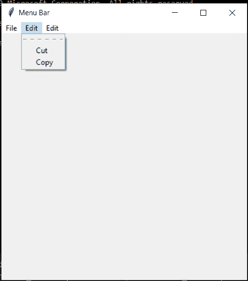

# 使用 Tkinter 的菜单和菜单按钮

> 原文：<https://www.askpython.com/python-modules/tkinter/menu-bar-and-menubutton>

在这篇文章中，我们将讨论使用 Python 和 Tkinter 创建菜单栏和菜单按钮。

我将通过一个例子向您介绍这篇文章。

## 什么是菜单栏？

正如我们以前在笔记本电脑、应用程序等中使用的一样，菜单栏是位于标题栏下方屏幕顶部的水平栏，包含下拉菜单。

## 创建您的第一个 Tkinter 菜单栏

我们只是定义了一个菜单，所以我们可以随意命名它。我们姑且称之为`my_menu`，这是`Menu()`类的一个对象。我们希望这个出现在我们的`root`中，我应该提到这只是我们通常开始使用的常规代码，它将有一个 400 x 400 的小图标和一个标题。

### 1.将菜单放置在根窗口中

所以我们想把这个菜单放在根目录下，从现在开始我们将把它称为 my_menu，就像我们在 Tkinter 中使用的任何其他类型的小部件一样。

```py
from tkinter import *

root = Tk()
root.title("Menu Bar")

root.geometry("400x400")

my_menu=Menu(root)
root.config(menu=my_menu)

root.mainloop()

```

### 2.添加菜单项

现在，我们将告诉 Tkinter 使用`my_menu`作为菜单，它知道菜单是什么。它知道菜单在顶部，也知道点击时菜单会下拉。

所以现在，我们需要创建一个菜单项。

所以我们姑且称之为“**文件 _ 菜单**”。这将是我们菜单中的第一项，我们只需将它设置为一个菜单(在本例中为 my_menu)。我们需要把它放到屏幕上。

我们一般是网格或者打包。但在这里，我们将使用级联。

```py
file_menu= Menu(my_menu)
my_menu.add_cascade(label="File", menu=file_menu)
file_menu.add_command(label="New...",command=our_command)
file_menu.add_separator()
file_menu.add_command(label="Exit",command=root.quit)

```

我们在这里使用了 my_menu.add_cascade()，但是我们可以在这里放一个“label”参数。我们在这里做的是创建小的子菜单，我们把第一个子菜单叫做 file_menu。

现在，我们需要向新的小子菜单添加内容，这样我们就可以说 file_menu.add_command()。

我通过调用 file_menu.add_separator()在“新建”和“退出”按钮之间放置了小分隔符，这只是一个函数。

类似地，我们创建 edit_menu 和 option_menu。

```py
edit_menu = Menu(my_menu)
my_menu.add_cascade(label="Edit",menu=edit_menu)
edit_menu.add_command(label="Cut",command=our_command)
edit_menu.add_command(label="Copy",command=our_command)

option_menu = Menu(my_menu)
my_menu.add_cascade(label="Edit",menu=option_menu)
option_menu.add_command(label="Find",command=our_command)
option_menu.add_command(label="Find Next",command=our_command)

```

### 3.添加菜单按钮

菜单按钮小部件向下拉菜单添加按钮。

简而言之，我将菜单按钮命名为`mButton`。我们将使用`mButton.grid()`，这将指定我们需要一个网格，这是我们将要放置列表项的地方。

现在，我们需要做`mButton.menu = Menu(mButton)`来指定我们实际上想要一个菜单风格的系统。

```py
mButton=Menubutton(root,text="Click")
mButton.grid()

# insert any menu here

mButton.menu.add_checkbutton(label="Copy")
mButton.pack()

```

## 实现 Tkinter 菜单和 Menubutton 的完整代码

完整的代码如下所示，其输出也显示出来供您参考。

```py
from tkinter import *

root = Tk()
root.title("Menu Bar")

root.geometry("400x400")

my_menu=Menu(root)
root.config(menu=my_menu)

def our_command():
    my_label = Label(root, text="Clicked!!").pack()

file_menu= Menu(my_menu)
my_menu.add_cascade(label="File", menu=file_menu)
file_menu.add_command(label="New...",command=our_command)
file_menu.add_separator()
file_menu.add_command(label="Exit",command=root.quit)

mButton=Menubutton(root,text="Click")
mButton.grid()

edit_menu = Menu(my_menu)
my_menu.add_cascade(label="Edit",menu=edit_menu)
edit_menu.add_command(label="Cut",command=our_command)
edit_menu.add_command(label="Copy",command=our_command)

mButton.menu.add_checkbutton(label="Copy")
mButton.pack()

option_menu = Menu(my_menu)
my_menu.add_cascade(label="Edit",menu=option_menu)
option_menu.add_command(label="Find",command=our_command)
option_menu.add_command(label="Find Next",command=our_command)

root.mainloop()

```


Output 1



Output 2


Output 3

## 结论

所以，让我们快速回顾一下，你可以从配置你的菜单开始。

1.  我们称它为“我的菜单”,它是一个菜单小工具，我们把它放在了根目录下。唯一奇怪的是我们必须配置它。所以它是 root.config，然后我们告诉我们的程序使用什么菜单。
2.  为了创建项目，我们设计了一个顶级的东西，比如文件/编辑/选择，并将其添加到我们的菜单中，然后我们就级联。
3.  要添加项目，你只需添加命令并设置标签，然后输入你的命令就可以了。唯一的另一件奇怪的事情是这个小分离器，它超级简单，非常酷。

一定要试试这个例子，并在下面的评论区告诉我们你的想法。