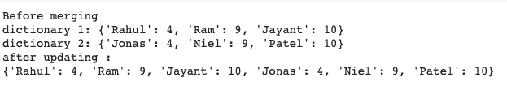
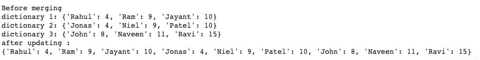

# Python 中如何合并字典？

> 原文：<https://www.askpython.com/python/dictionary/merge-dictionaries>

本文涵盖了 Python 中合并字典的所有方法。字典是在 Python 中存储数据的一种便捷方式。它们以键值对的形式存储数据。

使用[字典](https://www.askpython.com/python/dictionary/python-dictionary-dict-tutorial)时，您可能想要合并两个字典。

## Python 中合并字典的不同方法

当涉及到合并两本词典时，有不止一种方法。

在本教程中，我们将讨论合并两个词典的不同方法。

### 1.使用 for 循环

您可以使用一个 [for 循环](https://www.askpython.com/python/python-for-loop)将一个字典的条目复制到另一个字典。这是合并两本词典的幼稚方法。

您必须使用 for 循环遍历一个字典，同时将条目添加到另一个字典中。

执行此操作的 python 代码如下:

```py
dict1 = {  'Rahul': 4, 'Ram': 9, 'Jayant' : 10 }
dict2 = {  'Jonas': 4, 'Niel': 9, 'Patel' : 10 }

print("Before merging")
print("dictionary 1:", dict1)
print("dictionary 2:", dict2)

dict3 = dict1.copy()

for key, value in dict2.items():
    dict3[key] = value

print("after updating :")
print(dict3)

```



### 2.使用。更新()

Python 中的字典有一个[内置方法](https://www.askpython.com/built-in-methods)用于合并两个字典。您可以在其中一个字典上调用此方法，并将另一个字典作为参数传递。

这可以使用以下代码行来完成:

```py
dict1.update(dict2)

```

完整的代码如下所示:

```py
dict1 = {  'Rahul': 4, 'Ram': 9, 'Jayant' : 10 }
dict2 = {  'Jonas': 4, 'Niel': 9, 'Patel' : 10 }

print("Before merging")
print("dictionary 1:", dict1)
print("dictionary 2:", dict2)

dict1.update(dict2)
print("after updating :")
print(dict1)

```


使用 update 方法的一个缺点是只能传递一个字典作为参数。这限制了您一次只能合并两个字典。

您可以使用** (kwargs)运算符将多个字典合并在一起。我们接下来会看到这一点。

### 3.使用**kwargs

Kwargs 又名**解包操作符(**** )也允许你合并两个或更多的字典。

[Kwargs](https://www.askpython.com/python/args-kwargs-in-python) 是**关键字参数的简称。**它让你发送[可变长度](https://www.askpython.com/python/array/array-length-in-python)键-值对。

要使用 ****** 合并字典，请使用以下代码行:

```py
dict3 = {**dict1, **dict2}

```

完整的代码如下:


您也可以使用相同的方法来合并两个以上的字典。

```py
dict3 = {**dict1, **dict2, **dict3}

```

完整的代码如下:

```py
dict1 = {  'Rahul': 4, 'Ram': 9, 'Jayant' : 10 }
dict2 = {  'Jonas': 4, 'Niel': 9, 'Patel' : 10 }
dict3 = {  'John': 8, 'Naveen': 11, 'Ravi' : 15 }

print("Before merging")
print("dictionary 1:", dict1)
print("dictionary 2:", dict2)
print("dictionary 3:", dict3)

dict3 = {**dict1, **dict2, **dict3}
print("after updating :")
print(dict3)

```



Merge 3 Dictionaries

### 4.使用合并运算符

合并字典的最好方法是使用 merge 操作符。这使得执行合并操作变得非常简单。

您可以使用下面的代码行合并两个字典。

```py
dict1 |= dict2

```

完整的代码如下:

```py
dict1 = {  'Rahul': 4, 'Ram': 9, 'Jayant' : 10 }
dict2 = {  'Jonas': 4, 'Niel': 9, 'Patel' : 10 }

print("Before merging")
print("dictionary 1:", dict1)
print("dictionary 2:", dict2)

dict1 |= dict2
print("after updating :")
print(dict1)

```


## 结论

本教程涵盖了四种不同的方法，你可以用它们来合并 python 中的字典。希望你和我们一起学习愉快！