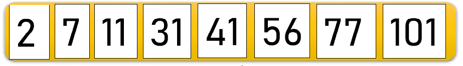

# 理解 Python 中的合并排序

> 原文：<https://www.askpython.com/python/examples/merge-sort-in-python>

在本文中，我们将了解一种高效的排序算法——Python 中的 **Merge Sort。合并排序算法用于按升序或降序对现有数据进行排序。让我们来看看如何利用该算法并用 Python 实现它。**

* * *

## 在 Python 中使用合并排序

合并排序是一种纯粹基于**分治法**的通用排序技术。

在分治技术中，元素被分成更小的部分或列表。然后将适当的函数应用于主输入列表的每一半。此外，两半合并在一起得到结果。

Merge Sortis 是一个`recursive technique`函数，其中未排序的元素被分成两半/两部分，该函数以这样一种方式为分开的两半调用它自己，使得两半保持递归地将它们自己分成两部分，直到整个数组被排序。

它递归地调用半列表或子列表，直到所有的元素都被分离，并且没有进一步分割的可能，即**每个子列表包含 1 个(单个)元素**。

然后，使用比较和交换的基本技术对元素进行排序。最后，它**将所有元素**合并在一起，以获得最终的数据项排序列表。

让我们借助一个例子来理解 Python 中归并排序的工作原理；

考虑元素列表:11，31，7，41，101，56，77，2


**Merge Sort in Python -Example**

如上所述，最初，我们将数据元素的原始列表分成两半。

由于上面的原始数组包含 8 个元素，我们将该数组分成 4 个元素的子数组。该数组不断递归地将自身划分为子列表，直到每个子列表获得一个元素，即不可能再进一步划分。


**Merge Sort in Python-Splitting Of The Data Elements**

如前所述，列表被递归地分成两部分，直到所有的元素都被分离成一个单独的元素。

拆分元素后，您将看到如下所示的各个元素:


**Merge Sort in Python-Result After Recursive Splitting Of Elements**

一旦元素被分离，我们需要以与分离元素相同的方式组合数据元素。

考虑元件 **11** 和 **31** 。当它们处于排序后的位置时，我们将它们组合在一起，并将其合并到一个数组中。元素 **7** 和 **41** 也出现在它们排序后的位置，所以我们也合并它们。

现在，如果你看一下元素 **101** 和 **56** ，我们需要交换它们的位置并将它们合并在一起。以类似的方式，元素 **77** 和 **2** 相对于它们的位置被交换并合并在一起。


**Merging and Sorting Iteration 1**

接下来，在第二次迭代中，我们将两个元素的子数组与另一个子数组进行比较，如果发现元素已排序，我们将子数组合并在一起。子阵**【11，31】**与**【7，41】**比较，子阵**【56，101】**与**【2，77】**比较。由于数据项不在它们的排序顺序中，它们的位置被交换。


Merging And Sorting Iteration 2

在第三次迭代中，4 个元素的子阵列与另一个子阵列进行比较，即**【7，11，31，41】**与**【2，56，77，101】**进行比较。可以清楚地看到，元素不在它们排序的位置上，所以元素被交换和合并以获得最终排序的数组。



Merging And Sorting Iteration 3

* * *

## 合并排序算法

以递归方式执行以下步骤来执行合并排序并获得适当的结果:

*   找到将原数组分成两部分所需的**中间元素**。
*   **以递归方式将原始列表分成两半**，直到每个子列表都包含一个元素。即每半个递归调用 merge_sort()函数。
*   检查数据值，如果发现未排序，交换元素并**合并子列表以获得原始排序列表**。

* * *

## 在 Python 中实现合并排序

```py
def merge_sort(inp_arr):
    size = len(inp_arr)
    if size > 1:
        middle = size // 2
        left_arr = inp_arr[:middle]
        right_arr = inp_arr[middle:]

        merge_sort(left_arr)
        merge_sort(right_arr)

        p = 0
        q = 0
        r = 0

        left_size = len(left_arr)
        right_size = len(right_arr)
        while p < left_size and q < right_size:
            if left_arr[p] < right_arr[q]:
              inp_arr[r] = left_arr[p]
              p += 1
            else:
                inp_arr[r] = right_arr[q]
                q += 1

            r += 1

        while p < left_size:
            inp_arr[r] = left_arr[p]
            p += 1
            r += 1

        while q < right_size:
            inp_arr[r]=right_arr[q]
            q += 1
            r += 1

inp_arr = [11, 31, 7, 41, 101, 56, 77, 2]
print("Input Array:\n")
print(inp_arr)
merge_sort(inp_arr)
print("Sorted Array:\n")
print(inp_arr)

```

**输出:**

```py
Input Array:

[11, 31, 7, 41, 101, 56, 77, 2]
Sorted Array:

[2, 7, 11, 31, 41, 56, 77, 101]

```

* * *

## 归并排序的时间复杂度

归并排序的时间复杂度为: **O(nlogn)**

* * *

## 结论

因此，在本文中，我们已经理解了 Python 中合并排序的工作原理。看看 Python 中的其他[排序算法。](https://www.askpython.com/python/list/python-sort-list)