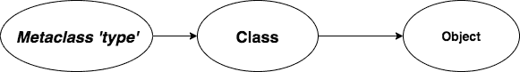

# Python 中的元类

> 原文：<https://www.askpython.com/python/metaclass-in-python>

一个 ***元类*** 是一个类的类。每当创建一个类(对象)的实例时，该对象的行为方式由该类定义。元类定义了类本身的行为。

* * *

## Python 中元类的使用

使用元类的原因是 Python 类本身就是对象。因为类是对象，所以我们可以对它进行各种操作，比如给变量赋值，复制等等。

因为它们是对象，我们可以动态地创建它们，就像我们可以创建任何其他对象一样。

* * *

为了更好地理解元类的概念，我们首先看看 Python 是如何定义类的。该语言将一切都定义为对象，无论是`int`、`string`还是其他任何东西。

如果您还记得的话，为了查看任何 Python 对象的类型，我们使用了`type`函数。

```py
>>> print(type(123))
<class 'int'>
>>> print(type([1, 2, 3]))
<class 'list'>

>>> class A():
...     def __init__(self):
...             pass
...
>>> a = A()
>>> print(type(a))
<class '__main__.A'>

```

正如我们所观察到的，它为每种情况返回一个`class`。但是要了解 Python 如何定义类本身，我们只需看看它的类型。

```py
>>> print(type(type(123))
<class 'type'>
>>> print(type(A))
<class 'type'>

```

如你所见，类型(`class`)是类`type`！所以原来类是由类本身定义的？这是什么现象？

这是元类的概念，用于定义其他类。基本上就是一个类工厂，从中可以定义其他类如`int` s、`str` s。



Metaclass hierarchy

`type`是语言用来创建*一个*对象的元类。(这就是为什么每个对象都有一个类型)

因为`type`是一个元类，我们可以从它创建其他类。

* * *

## 动态创建类

我们可以通过类型构造函数实例化来动态创建类:`type(name, bases, attr)`

*   ***名称*** - >班级名称

*   ***bases*** - >新类继承的类

*   ***attr*** - >字典中包含的属性+方法的类

```py
>>> Animal = type('Animal', (), dict(__init__ = lambda self: None, worth = lambda self, value: value))

```

这与以下内容相同:

```py
class Animal():
    def __init__(self):
        pass

    def worth(self, value):
        return value

```

与第二段代码相比，第一段代码更容易编写。即使在动态声明期间编写类体也不能提供很大的灵活性。

因此，元类提供了一种强大而简单的动态创建新类的方法。

* * *

## 创建自定义元类

为了创建我们自己的元类，我们需要继承现有的“类型”元类，并覆盖一些特殊的方法:

*   __ **新** __() - >这是之前叫的`__init__()`。它负责创建对象并返回它。

*   __ **init** __() - >这用于初始化新创建的对象，该对象作为参数传递(`self`参数)

下面的代码片段显示了如何创建元类:

```py
class MyMetaclass(type):
    def __new__(cls, name, bases, dict):
        print('Creating a new object of', name)
        # Invoke __new__() method of the metaclass type
        return super(MyMetaclass, cls).__new__(cls, name, bases, dict)

    def __init__(cls, name, bases, dict):
        print('Initialising class', name)
        super(MyMetaclass, cls).__init__(name, bases, dict)

```

既然我们已经创建了我们的自定义元类，我们需要确保创建使用我们的元类的其他类。

为此，我们在新的类定义中传递`metaclass`参数，它告诉类使用我们的自定义元类作为它自己的元类，而不是`type`。

```py
class Student(metaclass=MyMetaclass):
    def __init__(self, name):
        self.name = name

    def get_name(self):
        return self.name

```

这里，`Student`使用`MyMetaclass`作为它的元类。因此，当创建 Student 的实例时，我们的自定义元类方法将被调用，而不是`type`元类。

```py
stud = Student('Amit')
print(stud.get_name())
print('Type of Student object:', type(stud))
print('Type of Student Class:', type(Student))

```

输出

```py
Creating a new object of Student
Initialising class Student
Amit
Type of Student object: <class '__main__.Student'>
Type of Student Class: <class '__main__.MyMetaclass'>

```

**注意**:2.7 或更低版本的旧 Python 使用`__metaclass__`关键字来指定所使用的元类。Python3 改变了这种行为，将`metaclass`作为参数传递。

* * *

## 结论

虽然元类是创建自定义 API 和定义它们在对象和类创建过程中的行为的一种非常强大的方法，但它们在实践中很少使用，因为还有其他解决方法。

这篇文章只是作为这个主题的一个起点，并且是关于理解 Python 如何用`type`元类来定义一切。

我们看了如何创建元类，以及在创建类的过程中调用的方法。

* * *

## 参考

StackOverflow 关于元类的帖子(这提供了关于这个主题的深入讨论。如果你想了解更多关于元类的知识，推荐):[https://stack overflow . com/questions/100003/what-are-meta classes-in-python](https://stackoverflow.com/questions/100003/what-are-metaclasses-in-python)