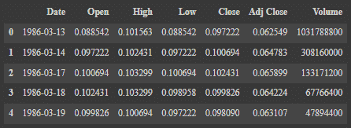
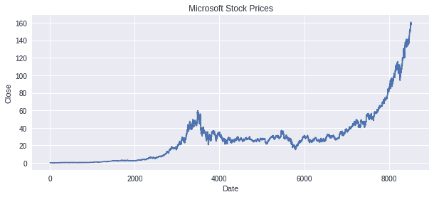
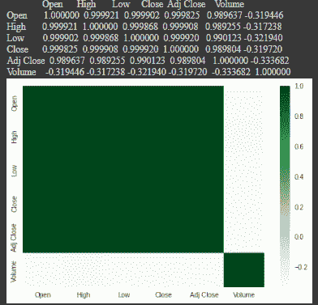
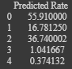

# 使用 Python 预测微软股票价格

> 原文：<https://www.askpython.com/python/examples/microsoft-stock-price-prediction>

在这个 Python 教程里我们来说说微软股价预测。微软现在是世界顶尖的科技公司之一，在全球雇佣了超过 163，000 名员工。它以生产 Windows 操作系统而闻名，这是使用最广泛的计算机操作系统之一。

这篇文章将教你如何预测微软股票的未来价值。在这篇文章中，我将通过使用 Python 的机器学习来指导您预测微软股票价格的过程。

* * *

## 导入必要的模块/库和数据集

让我们通过加载相关的 Python 模块和数据集来开始预测微软股票价格的挑战:

```py
import numpy as np
import pandas as pd
import matplotlib.pyplot as plt
import seaborn as sns
sns.set()
plt.style.use('seaborn')

data = pd.read_csv("MSFT.csv")
data.head()

```



Microsoft Stock Price Prediction Dataset

* * *

## 数据可视化

该数据集中的 **Close** 列包含我们希望预测其未来值的值。因此，让我们更深入地了解一下微软股价的历史收盘价:

```py
plt.figure(figsize=(10, 4))
plt.title("Microsoft Stock Prices")
plt.xlabel("Date")
plt.ylabel("Close")
plt.plot(data["Close"])
plt.show()

```



Microsoft Stock Price Prediction DataVisualization

* * *

## *寻找数据之间的相互关系*

现在让我们来看看数据集特征之间的相关性:

```py
print(data.corr())
sns.heatmap(data.corr(),cmap="Greens")
plt.show()

```



Microsoft Stock Price Prediction correlation

* * *

## 将数据分为训练和测试数据

我现在准备[机器学习](https://www.askpython.com/python/machine-learning-introduction)模型的数据。在这个阶段，我将把最重要的特征添加到 x，把目标列添加到 y，然后[把数据集分成训练集和测试集](https://www.askpython.com/python/examples/split-data-training-and-testing-set):

```py
x = data[["Open", "High", "Low"]]
y = data["Close"]
x = x.to_numpy()
y = y.to_numpy()
y = y.reshape(-1, 1)

from sklearn.model_selection import train_test_split
xtrain, xtest, ytrain, ytest = train_test_split(x, y, test_size=0.2, random_state=42)

```

* * *

## 应用机器学习模型

现在，让我们使用决策树回归算法来训练 Microsoft 股票价格预测模型，并查看未来 5 天的预计股票价格:

```py
from sklearn.tree import DecisionTreeRegressor
model = DecisionTreeRegressor()
model.fit(xtrain, ytrain)
ypred = model.predict(xtest)
data = pd.DataFrame(data={"Predicted Rate": ypred})
print(data.head())

```



Microsoft Stock Price Prediction Predictions

* * *

因此，使用 Python 编程语言，您可以使用机器学习来预测微软股票价值。由于 Windows 11 的推出指日可待，微软再次吸引了全球的兴趣。

因此，预测微软的股价是一个美妙的时刻，因为它受到了很多关注。

* * *

## 结论

恭喜你！你刚刚学会了如何预测微软的股票价格。希望你喜欢它！😇

喜欢这个教程吗？无论如何，我建议你看一下下面提到的教程:

1.  [利用 Python 预测股价](https://www.askpython.com/python/examples/stock-price-prediction-python)
2.  [用 Python 进行加密价格预测](https://www.askpython.com/python/examples/crypto-price-prediction)
3.  [利用 Python 进行股票价格预测](https://www.askpython.com/python/examples/stock-price-prediction-python)
4.  [Python 中的票房收入预测——简单易行](https://www.askpython.com/python/examples/box-office-revenue-prediction)

感谢您抽出时间！希望你学到了新的东西！！😄

* * *