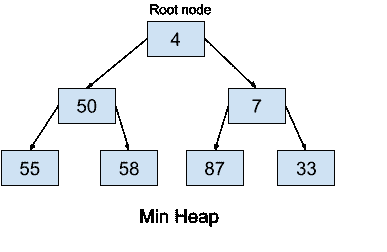
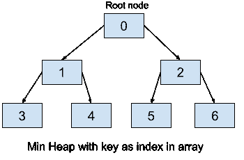

# 最小堆数据结构 Python 中的完整实现

> 原文：<https://www.askpython.com/python/examples/min-heap>

在本文中，我们将了解更多关于最小堆(Python 中称为堆队列)的知识。我们已经学习了 python 中的[堆及其库函数(在 heapq 模块中)。我们现在将学习最小堆及其实现，然后看看自己实现`heapify`、`heappush`和`heappop`函数的 Python 代码。让我们快速回顾一下。](https://www.askpython.com/python/examples/heaps-in-python)

## **什么是 Min 堆？**

最小堆是完全二叉树(完全[二叉树](https://www.askpython.com/python/examples/binary-tree-implementation)是完全填充的树，除了最深/最后一级中最右边的节点之外)，其中每个节点小于或等于其所有子节点。因此堆的根节点是最小的元素。最小堆数据结构通常用于表示优先级队列。



Min Heap Example

## 堆在数组中是如何表示的？

我们已经看到了堆是如何在内存中以数组的形式表示的，这只是一个简单的提醒:

*   根元素将位于数组的第零个位置，即 Heap[0]。
*   对于任何其他节点，比如说 Heap[i]，我们有以下内容:
    *   父节点由下式给出:Heap[(i -1) / 2]
    *   左边的子节点由下式给出:Heap[(2 * i) + 1]
    *   右边的子节点由下式给出:Heap[(2 * i) + 2]



Min Heap Python

## 理解在实现 Min 堆中使用的函数

### 1. **min-heapify** **功能**

此函数使一个节点及其所有后代(子节点及其子节点)遵循 heap 属性。它通过交换节点来重新排列它们，从而使给定的堆成为其子树中最小的节点，遵循 heap 属性。

该函数首先在给定节点及其子节点中找到具有最小值的节点。然后，它将给定的节点(比如 I)与找到的最小值节点(比如 j)交换，然后对节点 j 调用 min-heapify 函数(递归)，以确保分配给节点 j 的新值不会破坏其子树中的堆属性。

由于最多要遍历树的深度，所以它的时间复杂度是 O(d)，其中 d 是深度，或者就节点数而言，O(log n)，n 是堆中的元素数。

### 2.**构建堆函数**

这个函数从一个任意列表(或任何其他可迭代的列表)构建一个堆，也就是说，它获取列表并重新排列每个元素，以满足 heap 属性。它可以简单地通过对每个节点重复应用 min-heapify 来实现。这个函数的时间复杂度为 O(n ),其中 n 是堆中元素的数量。

### 3.**帮助功能**

这个函数弹出堆的最小值(根元素)。

这实际上是通过用最后一个节点交换根节点并删除现在的最后一个节点(包含最小值),然后为根节点调用 min-heapify 来完成的，以便在由于交换而改变之后保持堆属性。

因为我们只需要处理后代，所以时间复杂度是 O(log n)，其中 n 是元素的数量，或者是 O(h)，其中 h 是 log n 的树的高度，因为它是一个完整的树。

### 4. **heappush 函数**

该函数将一个新元素推入堆中，并将其排列到正确的位置，同时保持堆属性。

这实际上是通过在堆的末尾添加一个新节点来实现的。现在，为了维护堆属性，我们从最后一个节点向上遍历(并在需要的地方交换)以修复可能被违反的堆属性。

与 heappop 类似，这里的时间复杂度是 O(log n ),因为我们只需要遍历子树的高度。

### 5.**提取最小功能**

这个函数从堆中返回优先级最高的元素(根元素)。因为我们只需要返回根的值，并且不对堆做任何改变，并且根是在 O(1)时间内可访问的，因此该函数的时间复杂度是 O(1)。

## 完成 Min 堆数据结构的 Python 实现

下面是用 python 实现最小堆的完整程序。

```py
import sys

#defining a class min_heap for the heap data structure

class min_heap: 
    def __init__(self, sizelimit):
        self.sizelimit = sizelimit
        self.cur_size = 0
        self.Heap = [0]*(self.sizelimit + 1)
        self.Heap[0] = sys.maxsize * -1
        self.root = 1

    # helper function to swap the two given nodes of the heap
    # this function will be needed for heapify and insertion to swap nodes not in order
    def swapnodes(self, node1, node2):
        self.Heap[node1], self.Heap[node2] = self.Heap[node2], self.Heap[node1]

    # THE MIN_HEAPIFY FUNCTION
    def min_heapify(self, i):

        # If the node is a not a leaf node and is greater than any of its child
        if not (i >= (self.cur_size//2) and i <= self.cur_size):
            if (self.Heap[i] > self.Heap[2 * i]  or  self.Heap[i] > self.Heap[(2 * i) + 1]): 
                if self.Heap[2 * i] < self.Heap[(2 * i) + 1]:
     # Swap the node with the left child and then call the min_heapify function on it
                    self.swapnodes(i, 2 * i)
                    self.min_heapify(2 * i)

                else:
                # Swap the node with right child and then call the min_heapify function on it
                    self.swapnodes(i, (2 * i) + 1)
                    self.min_heapify((2 * i) + 1)

    # THE HEAPPUSH FUNCTION
    def heappush(self, element):
        if self.cur_size >= self.sizelimit :
            return
        self.cur_size+= 1
        self.Heap[self.cur_size] = element 
        current = self.cur_size
        while self.Heap[current] < self.Heap[current//2]:
            self.swapnodes(current, current//2)
            current = current//2

    # THE HEAPPOP FUNCTION
    def heappop(self):
        last = self.Heap[self.root]
        self.Heap[self.root] = self.Heap[self.cur_size]
        self.cur_size -= 1
        self.min_heapify(self.root)
        return last

    # THE BUILD_HEAP FUNCTION
    def build_heap(self): 
        for i in range(self.cur_size//2, 0, -1):
            self.min_heapify(i)

    # helper function to print the heap
    def print_heap(self):
        for i in range(1, (self.cur_size//2)+1):
            print("Parent Node is "+ str(self.Heap[i])+" Left Child is "+ str(self.Heap[2 * i]) +                  " Right Child is "+ str(self.Heap[2 * i + 1]))

# Driver Code
minHeap = min_heap(10)
minHeap.heappush(15)
minHeap.heappush(7)
minHeap.heappush(9)
minHeap.heappush(4)
minHeap.heappush(13)
minHeap.print_heap()

```

输出:

```py
Parent Node is 4 Left Child is 7 Right Child is 9
Parent Node is 7 Left Child is 15 Right Child is 13

```

## 结论

在本文中，我们学习了最小堆。我们研究了`heapify`、`heappush`和`heappop`的函数是如何工作的。我们进一步用 python 从头开始实现了 min heap 数据结构。请继续关注更多内容丰富的文章。

快乐学习！