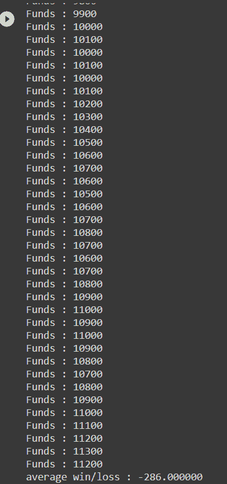
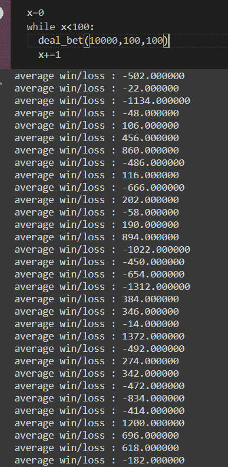
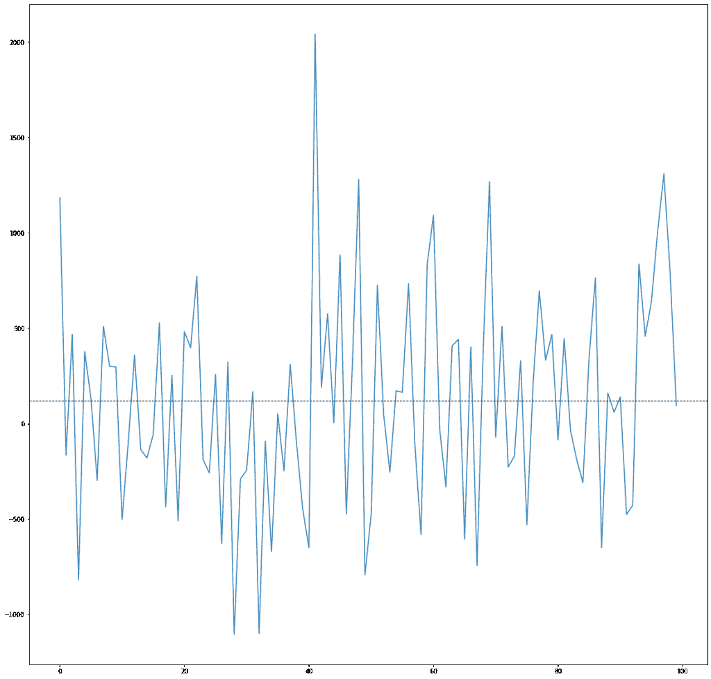

# Python 中的蒙特卡洛

> 原文：<https://www.askpython.com/python/examples/monte-carlo-in-python>

今天我们来看看 Python 中一个非常著名的方法，叫做**蒙特卡罗**，它可以用来解决任何有概率解释的问题。让我们从一些有趣的历史开始。

## 一点蒙特卡洛历史

它被用来解决复杂的数值问题，如布丰针问题([https://en.wikipedia.org/wiki/Buffon%27s_needle_problem](https://en.wikipedia.org/wiki/Buffon%27s_needle_problem)):

> 假设我们有一个由平行木条制成的地板，每条木条宽度相同，我们将一根针放在地板上。针穿过两条带之间的线的概率是多少？

自 20 世纪 40 年代以来，它已被用于:

*   在洛斯阿拉莫斯国家实验室研究核武器项目的中子扩散，ENIAC 被用于执行 M-C 模拟。
*   也被用于氢弹的研发
*   在流体力学中，求解复杂的微分方程(非线性抛物型偏微分方程)
*   为了估计粒子传输能量
*   高级信号处理和贝叶斯推理
*   关于遗传类型突变选择学习机(当今生物信息学领域的早期介绍)等。

## 用 Python 实现蒙特卡罗

蒙特卡洛**允许我们模拟看似随机的事件**，而**评估风险**(当然，还有其他结果)。它被用来评估某一交易策略的风险。

在本教程中，我们将模拟一个赌场(因为我们无法模拟核武器试验😀)

一般来说，问题越复杂，你需要的伪随机数值变量就越多。

打开您的[谷歌合作实验室](https://colab.research.google.com/)，并连接到运行时。

### 1.创建赌场轮盘的基本滚动

让我们导入我们的[熊猫](https://www.askpython.com/python-modules/numpy/python-numpy-module)和[熊猫](https://www.askpython.com/python-modules/pandas/python-pandas-module-tutorial)套装:

```py
import numpy as np
import pandas as pd

```

*   然后，我们将我们的“掷骰子”定义为一个从 1 到 100 的数字，让我们将它设置为客户获胜的几率为 **49-51** 。
*   这意味着对于掷骰 1-50 和正好 100，庄家(/赌场)赢。
*   对于掷 51-99，玩家获胜。

这似乎是一个公平的获胜机会，大多数玩家很可能会接受。

**让我们用 Python 来模拟一下:**

```py
def casino_roll():
    roll = np.random.randint(1,100)

    if roll <= 50 or roll == 100:
        print('rolled %d. you lose. House wins! Play again?!'%roll)
    elif 50 < roll < 100:
        print('you win! On a roll !')
        return True

```

所以，现在我们可以调用 casino_roll()，你可以看到你得到了什么。我试了 4 次，失败了 3 次。

### 2.成为经销商

接下来，让我们把一些钱投入赌注。因此，我们将创建庄家，他接受赌注，并且:

*   如果赢了，他就奖励玩家。
*   如果有损失，他会把钱装进口袋。

```py
def deal_bet(funds,initial_bet,bet_count):
    bet = 0
    funds_total = 0
    while bet < bet_count:
        if casino_roll():
            funds += initial_bet
        else:
            funds -= initial_bet

        bet += 1
        print('Funds : %d'%funds)
        funds_total += funds
    print('average win/loss : %f'%(10000-funds_total/bet_count))

```

观察我找到了总资金，然后找到了平均输赢。如果是肯定的，那就是赢了。如果是负数，那就是亏损。

### 3.100 卢比的赌注。100

因此，运行 100 次下注，每次下注 100 卢比，我们得到:

```py
deal_bet(10000,100,100)

```



Funds In Casino Bet Monte Carlo

在得到这个负值之前，我不得不运行这个程序 5 次，但是观察有多少值远远超过 10000，但是玩家总体上还是赔钱了。

这只是为了表明，我们认为有利可图的交易可能并不总是如此。

### 4.制造更多玩家

我们可以让 100 名玩家下同样的赌注:

```py
x=0
while x<100:
  deal_bet(10000,100,100)
  x+=1

```

在 **deal_bet** ()中注释掉**打印**(资金)报表。

所以，现在我们可以看到每个玩家的所有利润和损失:



Average Wins Losses Monte Carlo

### 5.用 Matplotlib 绘制平均值

让我们在这里用 matplotlib 绘制数据:

```py
return (10000-funds_total/bet_count)

```

将上述行添加到 **deal_bet** ()函数的末尾。

然后我们修改:

```py
x=0
avg_list=[]
while x<100:
  avg_list.append(deal_bet(10000,100,100))
  x+=1

```

最后，我们可以把它画出来:

```py
import matplotlib.pyplot as plt

avg_list = np.array(avg_list).astype(int)
plt.figure(figsize=(20,20))
plt.plot(avg_list)
plt.axhline(np.array(avg_list).mean(), color='k', linestyle='dashed', linewidth=1)

```



Plot Of Avg Wins And Losses **–** Monte Carlo

## 结论

今天到此为止。我希望这个例子能帮助你很好地理解 Python 中的蒙特卡罗模拟。

你现在可以为一个激进的玩家这样做。也许，他每赢一次，就赌双倍的钱。想好多种场景，自己修改下注函数。

**如果你在我的 github 上错过了什么，你会发现更多的场景和完整的代码:**

[**https://github.com/arkaprabha-majumdar/monte-carlo**](https://github.com/arkaprabha-majumdar/monte-carlo)

**下次见！！**