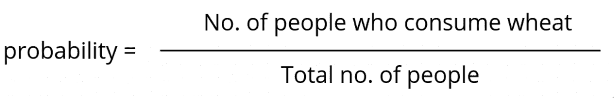

# 蒙特卡罗模拟在 python 中寻找硬币投掷的概率

> 原文：<https://www.askpython.com/python/examples/monte-carlo-simulation>

在本文中，我们将学习如何用 Python 对一个简单的随机实验进行蒙特卡罗模拟。

注:蒙特卡罗模拟是一个数学上复杂的领域。所以我们还没有进入 MC 的细节。相反，我们使用了一些直觉和例子来理解蒙特卡罗模拟的需要和实现，使没有多少数学背景的人更容易在没有太多数学知识的情况下体验概率。

## Python 中的蒙特卡罗模拟

首先，我们将使用随机库模拟掷硬币实验，并建立对蒙特卡洛实验的直觉。

### 1.随机模块

首先我们导入随机模块。

```py
# Import the random module
import random

```

我们将广泛使用随机模块中的统一函数。这个函数给出了一个介于用户提供的上限和下限之间的数字。上下界之间每个数字出现的概率是相等的。

```py
# Generates uniform random number between 4 and 6
random.uniform(4, 6)

```

**输出:**

```py
5.096077749225385

```

现在我们用这个统一的函数模拟一个简单的抛硬币。我们已经说过，上下界之间每个数字出现的机会是相等的。

所以如果我们取一个介于 0 和 1 之间的统一值，那么一个数大于 0.5 和小于 0.5 的几率是相等的。我们利用这一特点。我们从 0 到 1 取一个随机数。如果数字大于 0.5，结果是正面，否则是反面。

```py
a = random.uniform(0, 1)

if a>0.5:
    print("Head")
else:
    print("Tail")

```

**输出:**

```py
Head

```

### 2.定义一个函数来模拟一个无偏的硬币投掷

现在让我们用上一节的知识来写一个函数来模拟一次无偏的掷硬币。写一个函数会让我们的代码更易读，更模块化。

```py
def unbiased_coin_toss():
    # Generate a random number from 0 to 1
    x = random.uniform(0, 1)
    # Probability that the number falls between 0 and 0.5 is 1/2

    if x > 0.5:
        # Heads for True
        return True
    else:
        # Tails for False
        return False

```

让我们测试函数的结果。

```py
for i in range(10):
    print(unbiased_coin_toss())

```

**输出:**

```py
False
True
False
False
False
False
True
False
False
False

```

### 3.投掷硬币几次

既然我们已经模拟了一次真正的抛硬币。让我们测试一系列随机掷硬币中正面朝上的概率。实际上，我们已经定义了一个函数，它给出了每个调用的正面或反面。

现在投掷硬币几次，并将结果存储在一个列表中。人头的概率是从列表中计算出来的。

```py
N=10

# List to store the result(True/False)
results = []

# Toss the coin 10 times and store that in a list
for i in range(N):
    result = unbiased_coin_toss()
    results.append(result)

# Find the total number of heads
n_heads = sum(results)

# Find probability of heads in the experiment
p_heads = n_heads/N

print("Probability is {:.1f}".format(p_heads))

```

**输出:**

```py
Probability is 0.9

```

哎呀！！这似乎不太管用。你可以多次运行这个程序块，但是你会发现在我们的实验中正面的概率与预期的概率 0.5 相差很大。

### 我们的模拟有问题吗？

说实话，既有也有。你可能会认为，我们之前定义的函数并不完美，这导致了我们得到这些不完美的结果。实际问题在于我们如何模拟这个过程。

根据大数定律，当实验次数较多时，实验概率变得接近实际/预期概率。

上面的解释似乎有点怪异。我们不会用数学证明或假设来验证这一点，而是将我们的想法建立在简单的直觉上。

假设你的工作是寻找印度小麦消费的概率。在理想的情况下，你需要去每个人那里，问他们是否食用小麦。小麦消费的概率将是:



但是询问 13 亿人是一项繁琐的任务。所以你找一百个代表全国人口的人，在他们身上做实验。寻找概率的任务变得容易多了。但是真的吗？

如果你让更多的人来自像旁遮普这样的小麦消费州，让更少的人来自像西孟加拉邦这样的小麦消费较少的州，或者相反，你可能会发现你的实验概率有相当大的偏差。

这是因为你在实验中随机选择的 100 个人不能恰当地代表全部人口。所以结果总是容易出错。

同样的想法也适用于我们的掷硬币游戏。我们没有进行足够多的掷硬币，仓促达成了一个解决方案。让我们解决这个问题！！！

### 在 Python 中执行蒙特卡罗模拟

蒙特卡罗模拟是解决这个问题的最好方法之一。

天真地说，在蒙特卡罗模拟中，您从不同的输入值和结果的平均值(期望值)开始的值中获得不同的实验结果。

得到的平均值是我们在这里寻找的无错误(不太容易出错)的答案。

```py
prob = []

# Make 1000 experiments
for i in range(1000):

    # Each experiment have 10 coin tosses
    N = 10
    results = []

    # Toss the coin 10 times and store that in a list
    for i in range(N):
        result = unbiased_coin_toss()
        results.append(result)

    n_heads = sum(results)
    p_heads = n_heads/N
    prob.append(p_heads)

# average the probability of heads over 1000 experiments
p_heads_MC = sum(prob)/1000

print("Probability is {:.3f}".format(p_heads_MC))

```

**输出:**

```py
Probability is 0.502

```

每次运行这段代码，我们都会得到一个非常接近期望值的概率值。我们通过增加实验次数(1000 次)来提高精确度。您可以增加这个数字，并亲自测试结果。

### 结论

关于抛硬币的蒙特卡洛模拟，我们已经到了这篇文章的结尾。你可以试着在一个有偏向的硬币上用蒙特卡洛模拟，正面的概率，不是 0.5。其实你可以试试蒙特卡罗模拟，从其他随机实验中得到结果。