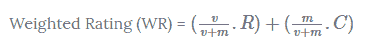
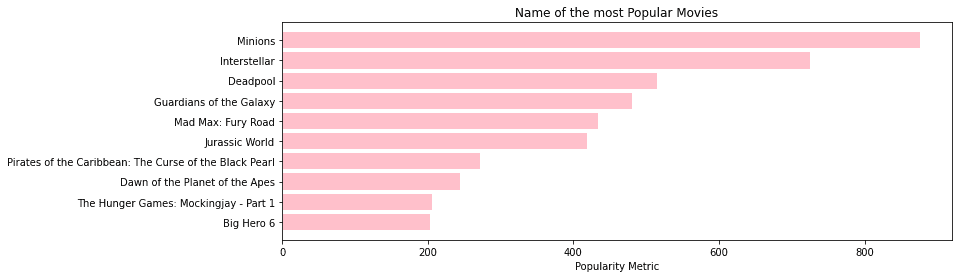

# 电影推荐系统–入门

> 原文：<https://www.askpython.com/python/examples/movie-recommendation-system>

推荐系统是一种旨在提高搜索结果质量并提供/建议与用户搜索历史更相关的事物的系统。它们有助于理解用户可能喜欢什么，在今天的教程中，我们将构建一个应用程序，向用户建议观看哪部电影。

我们开始吧！

***也读:[Python 中推荐系统的理论介绍](https://www.askpython.com/python/examples/theory-intro-recommendation-systems)***

* * *

在本教程中，我们将使用 TMDB 5000 电影数据集，可以在这里找到。我们将使用以下代码加载网站上提到的两个数据集。我们还将在两个数据集的“id”列的基础上连接这两个数据集。

```py
import pandas as pd 
import numpy as np 
df1=pd.read_csv('tmdb_5000_credits.csv')
df2=pd.read_csv('tmdb_5000_movies.csv')

df1.columns = ['id','tittle','cast','crew']
df2= df2.merge(df1,on='id')

```

接下来，我们将决定一个衡量标准来判断哪部电影比其他的好。一种方法是，我们可以直接使用数据集中给出的电影平均评级。但不会因为某部电影的投票人数不一致而公平。

因此，我们将使用`IMDB's weighted rating (wr)`，其数学描述如下



Movie Recommendation System Score Formula

在上面的公式中，

v–票数
m–需要列出的最低票数
R–电影的平均评分
C–平均票数

让我们使用下面的代码来计算`qualified`部电影的价值，方法是计算平均票数，然后只考虑投票人数比其他电影多 90%的电影来计算这部电影所需的最低票数。

```py
C= df2['vote_average'].mean()
print("Mean Average Voting : ",C)

m= df2['vote_count'].quantile(0.9)
print("\nTaking the movies which have 90% more voters than the other movies")
print("Minimum votes required : ",m)

```

现在，让我们使用下面的代码片段筛选出最受欢迎和推荐的电影。

```py
q_movies = df2.copy().loc[df2['vote_count'] >= m]

```

但是我们还没有计算出每部合格电影的标准。我们将定义一个函数`weighted_rating`，其中我们定义了一个`new feature score`，它将帮助我们使用下面的代码计算所有合格电影的值。

```py
def weighted_rating(x, m=m, C=C):
    v = x['vote_count']
    R = x['vote_average']
    return (v/(v+m) * R) + (m/(m+v) * C)

q_movies['score'] = q_movies.apply(weighted_rating, axis=1)

```

最后，让我们根据分数栏对整个数据帧进行排序，并查看所有其他电影中最值得推荐的电影。

```py
q_movies = q_movies.sort_values('score', ascending=False)

```

让我们尝试使用下面的代码来可视化排序后的数据集，并了解整个数据集中最受欢迎的电影。

```py
pop= df2.sort_values('popularity', ascending=False)

import matplotlib.pyplot as plt
plt.figure(figsize=(12,4),facecolor="w")

plt.barh(pop['title'].head(10),pop['popularity'].head(10), 
         align='center',color='pink')
plt.gca().invert_yaxis()

plt.xlabel("Popularity Metric")
plt.title("Name of the most Popular Movies")
plt.show()

```

看剧情看起来多好看，我们可以看到在排名前 10 的电影中，`Minions`是最受欢迎和推荐的电影。



Movie Recommendation System Plot

* * *

恭喜你！你用 python 编程语言搭建了一个成功的电影推荐系统！

另请参阅:

1.  [Python: Moviepy 模块](https://www.askpython.com/python-modules/moviepy-module)
2.  [Python Tkinter:随机电影建议](https://www.askpython.com/python-modules/tkinter/random-movie-suggestions)
3.  [使用 Selenium 从网页获取数据【完全指南】](https://www.askpython.com/python-modules/fetch-website-data-selenium)

* * *