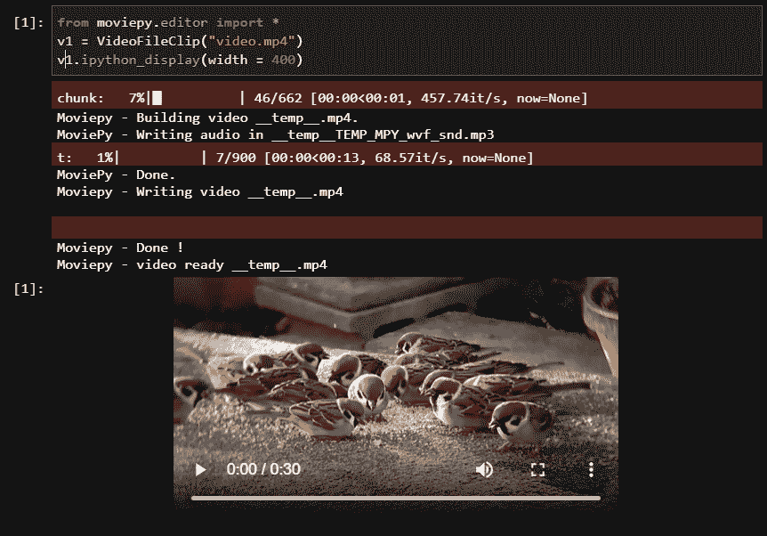
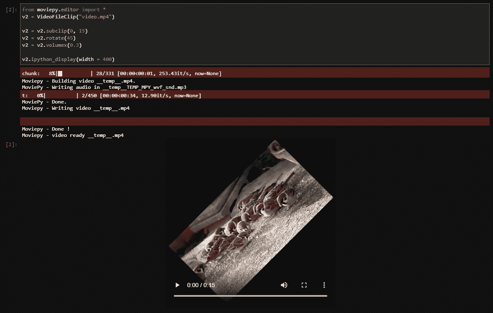

# Python: Moviepy 模块

> 原文：<https://www.askpython.com/python-modules/moviepy-module>

你好，程序员朋友！今天在本教程中，我们将学习一种非常有趣的用 Moviepy 模块编辑和加载视频的方法。

## Moviepy 模块简介

`MoviePy`模块用于从您的系统加载、下载和编辑视频，其中编辑包括裁剪、旋转、修剪成更小的剪辑和其他视频效果。

它还可以用来编辑视频中的音频。它还可以根据您的喜好在视频和其他文本项目上添加水印。

很酷吧？！所以现在就来学习实现吧！

## 实现 Moviepy

要实现 moviepy，首先我们需要使用`pip install`命令确保我们的系统中安装了 moviepy。

在您成功安装了 moviepy 模块之后，我们就可以开始实现该模块了！在接下来的教程中，我将使用一段视频，可以在[这里](https://www.youtube.com/watch?v=Ka_eP1Qwe2E)找到。你可以选择任何你喜欢的视频。

但是在进一步处理之前，我们需要导入 moviepy 模块，以使它可以按以下方式进行编辑。

```py
from moviepy.editor import *

```

### 1.加载视频

为了加载视频，我们使用了`VideoFileClip`函数，并将视频文件的路径作为参数传递。

我用的是`mp4`格式，你可以选择你喜欢的格式，因为 moviepy 模块支持多种视频格式。

我们将把函数的输出存储在一个变量中，并利用`ipython_display`函数来查看录制的视频。

您可以将括号留空，但是为了更好的可视化，我提供了一个`width`属性。

整个过程的代码和输出如下所示。这个视频完全可以播放。

```py
from moviepy.editor import *
v1 = VideoFileClip("video.mp4")
v1.ipython_display(width = 400)

```



Output Loading Video Moviepy

### 2.编辑视频

现在我们知道了如何成功加载视频，让我们开始编辑视频。

moviepy 模块的所有功能都超出了单个教程的范围，但是在本教程结束时，您将会学到一些技巧。

我们将对上面代码中加载的视频执行以下操作:

1.  将视频剪辑到 15 秒
2.  将视频旋转 45 度
3.  降低音频的音量

让我们一个接一个地学习如何做每一个编辑！

首先，我们使用函数`subclip`进行修剪，该函数以秒为单位计算视频的开始和结束时间。

我们将视频调整到 15 秒，所以我们提供开始为 0，结束为 15。完成同样工作的代码如下所示。

```py
v2 = v2.subclip(0, 15)

```

接下来，我们将视频旋转到某个角度，这可以通过`rotate`函数简单地完成，该函数获取旋转的角度。你可以使用这个函数。

我们选择 45 度角，其代码如下所示。

```py
v2 = v2.rotate(45)

```

最后但同样重要的是，我们将在`volumex`功能的帮助下设置视频中音频的音量，该功能设置音频所需的最大音量。

相同的代码如下所示。

```py
v2 = v2.volumex(0.3)

```

现在我们知道了单独的编辑是如何发生的，让我们将它们结合起来，看看视频的输出。

完整的代码和输出如下所示。

```py
from moviepy.editor import *
v2 = VideoFileClip("video.mp4")

v2 = v2.subclip(0, 15)
v2 = v2.rotate(45)
v2 = v2.volumex(0.3)

v2.ipython_display(width = 400)

```



Output Edited Video Moviepy

## 结论

恭喜你！您刚刚学会了用简单的 python 代码加载和编辑视频。但这些只是基础，关于 MoviePy 还有很多要学。

敬请关注更多此类教程！编码快乐！