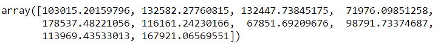

# 多元线性回归:快速介绍

> 原文：<https://www.askpython.com/python/examples/multiple-linear-regression>

欢迎来到多元线性回归教程。我们将研究多元线性回归的概念及其在机器学习中的应用。

在我们深入多元线性回归的概念之前，让我给你介绍一下简单线性回归的概念。

## 什么是简单线性回归？

回归是一种从给定数据预测值的机器学习技术。

例如，考虑一个关于雇员详细信息及其薪水的数据集。

该数据集将包含诸如“经验年数”和“薪水”等属性。这里我们可以用回归来预测一个人大概在行业工作 8 年的工资。

通过简单的线性回归，我们得到数据的最佳拟合线，并基于这条线预测我们的值。这条线的方程式如下:

```py
y = b0 + b1 * x1

```

在上面的等式中，y 是使用自变量 x1 预测的因变量。这里，b0 和 b1 是常数。

## 什么是多元线性回归？

多元线性回归是简单线性回归的扩展，其中模型依赖于多个独立变量来获得预测结果。我们的多元线性回归方程如下:

```py
y = b0 + b1 *x1 + b2 * x2 + .... + bn * xn

```

这里，y 是因变量，x1，x2，..，xn 是我们的独立变量，用于预测 y 的值。b0，b1，…bn 等值充当常数。

## 建立多元线性回归模型的步骤

在建立模型之前，我们需要执行 5 个步骤。这些步骤解释如下:

### 第一步:识别变量

在开始构建模型之前，理解因变量和自变量很重要，因为它们是影响结果的主要属性。

如果不了解因变量，你建立的模型将是一种浪费，因此要确保你花足够的时间来正确识别变量。

### 步骤 2:检查洞穴/假设

需要注意的是，多元线性回归有 5 个假设。这些措施如下:

*   线性
*   同方差性
*   多元正态性
*   误差的独立性
*   缺乏多重共线性

### 步骤 3:创建虚拟变量

假设，我想检查因变量和自变量之间的关系，虚拟变量出现了。

我们在有分类变量的地方创建虚拟变量。为此，我们将创建一个包含 0 和 1 的列。例如，我们有几个州的名称，而我们的数据集只有两个，即纽约和加利福尼亚。我们将纽约表示为 1，加州表示为 0。这个 0 和 1 是我们的虚拟变量。

### 步骤 4:避免虚拟变量陷阱

在创建虚拟变量之后，有必要确保您不会陷入虚拟陷阱的场景中。

线性回归中的一个或多个变量预测另一个变量的现象通常称为多重共线性。因此，我们的模型可能无法区分虚拟变量 D1 和 D2 的影响。这种情况是一个虚拟变量陷阱。

这个问题的解决方案可以是省略一个虚拟变量。在上面的纽约和加利福尼亚的例子中，不是有两列，即纽约和加利福尼亚，我们可以在一列中表示为 0 和 1，如下所示。


Example

### 步骤 5:最后，建立模型

我们有许多独立的输入变量来决定一个输出变量。但是我们需要记住的一个政策是垃圾进-垃圾出。这意味着我们必须只向模型中输入必要的变量，而不是所有的变量。输入所有变量可能会导致模型容易出错。

此外，请记住，当您构建模型时，有必要将模型呈现给用户。解释太多变量相对困难。

建立模型时，有 5 种方法可以遵循。逐步回归技术有:

*   全包
*   反向消除
*   预选
*   双向消除
*   范围比较

详细讨论这些模型超出了本文的范围。然而，我们将在本文中查看一个示例。

## 在 Python 中实现多元线性回归

让我们考虑一个显示 50 家创业公司利润的数据集。我们将在 matplotlib 库上工作。

到数据集的链接是-[https://github.com/content-anu/dataset-multiple-regression](https://github.com/content-anu/dataset-multiple-regression)

### 导入数据集

```py
import numpy as np
import matplotlib.pyplot as plt
import pandas as pd

dataset = pd.read_csv('50_Startups.csv')
dataset.head()

```


Output of dataset.head() method

因此，在上面显示的数据集样本中，我们注意到有 3 个独立变量——R&D 支出、管理和营销支出。

它们有助于因变量利润的计算。

数据科学家的角色是分析在这些领域中的哪一个领域的投资会增加公司的利润？

### 数据预处理

**构建特征矩阵和相关向量**。

这里，特征矩阵是独立变量矩阵。

```py
X = dataset.iloc[:,:-1].values
y = dataset.iloc[:,4].values

```

**对分类变量进行编码**

这个模型中有分类变量。State 是一个分类变量。我们将使用标签编码器。

```py
from sklearn.preprocessing import LabelEncoder, OneHotEncoder
labelEncoder_X = LabelEncoder() 
X[:,3] = labelEncoder_X.fit_transform(X[ : , 3])

from sklearn.compose import ColumnTransformer
ct = ColumnTransformer([('encoder', OneHotEncoder(), [3])], remainder='passthrough')
X = np.array(ct.fit_transform(X), dtype=np.float)

```

我们首先执行了标签编码，因为只有在转换为数字数据后才能执行一次热编码。我们需要数字来创造虚拟变量。

**避开虚拟变量陷阱**

在下面的代码中，我们从 X 中删除了第一列，但是将所有的行。我们只忽略索引 0。这是为了避免虚拟变量陷阱。

```py
X = X[:, 1:]

```

**拆分测试和训练集**

通常，我们会将数据集的 20%视为测试集，80%视为训练集。我们所说的训练集是指，我们根据这些参数训练我们的模型，并在“测试集”上执行测试，并检查我们测试的输出是否与之前数据集中给出的输出相匹配。

```py
from sklearn.model_selection import train_test_split
X_train, X_test, y_train, y_test = train_test_split(X, y, test_size = 0.2, random_state = 0)

```

**拟合模型**

```py
from sklearn.linear_model import LinearRegression
regressor = LinearRegression()
regressor.fit(X_train, y_train) 

```

上面代码片段的输出将是下面的一行。


Output of the regression fitting

### 预测测试集结果

我们创建一个包含所有测试集利润预测的向量。然后将预测的利润放入名为 y_pred 的向量中。(包含测试集中所有观察值的预测)。

“预测”方法对测试集进行预测。因此，输入是测试集。predict 的参数必须是数组或稀疏矩阵，因此输入是 X_test。

```py
y_pred = regressor.predict(X_test)
y_test

```


y-test set

```py
y_pred

```



y-pred set

到目前为止，模型拟合不一定是数据集的最佳模型。当我们建立模型时，我们使用了所有的独立变量。

但是如果这些自变量中有一些统计意义上的(有很大影响的)因变量呢？

如果我们也有一些根本不显著的变量呢？

因此，我们需要一个独立变量的最佳团队，这样每个独立变量都是强大的，具有统计显著性，并且肯定有影响。

这种影响可以是正的(自变量减少 1 个单位，利润会增加)也可以是负的(自变量增加 1 个单位，利润会减少)。

我们将使用统计模型执行反向消除。但本文不会讨论这个话题。

## Python 中多元线性回归的完整代码

```py
import numpy as np
import matplotlib.pyplot as plt
import pandas as pd

dataset = pd.read_csv('50_Startups.csv')
dataset.head()

# data preprocessing
X = dataset.iloc[:,:-1].values
y = dataset.iloc[:,4].values

from sklearn.preprocessing import LabelEncoder, OneHotEncoder
labelEncoder_X = LabelEncoder() 
X[:,3] = labelEncoder_X.fit_transform(X[ : , 3])

from sklearn.compose import ColumnTransformer
ct = ColumnTransformer([('encoder', OneHotEncoder(), [3])], remainder='passthrough')
X = np.array(ct.fit_transform(X), dtype=np.float)

X = X[:, 1:]

from sklearn.model_selection import train_test_split
X_train, X_test, y_train, y_test = train_test_split(X, y, test_size = 0.2, random_state = 0)

# Fitting the model
from sklearn.linear_model import LinearRegression
regressor = LinearRegression()
regressor.fit(X_train, y_train) 

# predicting the test set results
y_pred = regressor.predict(X_test)

y_test

y_pred

```

**输出将是如下预测:**


## 结论

简而言之，使用线性回归的优势在于它适用于任何大小的数据集，并提供有关要素相关性的信息。然而，这些模型基于某些被视为缺点的假设。