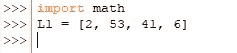
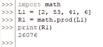
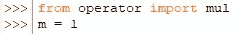
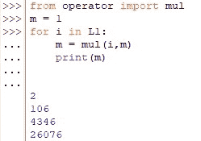
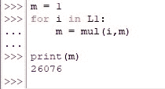
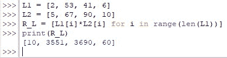
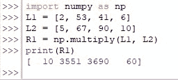

# Python 中的乘法——简单指南

> 原文：<https://www.askpython.com/python/examples/multiplying-in-python>

数据分析的基础在于稳健的算法。一个人可以开发的所有复杂算法都可以缩小为基本算术，如加、减、乘或除；甚至微积分也是进行这些基本运算的简单方法。也就是说，我们将开始探索在 Python 中实现这样一个基本操作——乘法！

以下是可以在 Python 中部署的不同技术，以满足您特定的乘法需求，

*   **将列表中的数字相乘**
    *   使用 math.prod()
    *   使用 mul()
*   **将两个列表相乘**
    *   将*用于*语句
    *   使用 *numpy*

* * *

## 使用 math.prod()将列表中的数字相乘

我们应该从导入 Python 中的 *math* 库开始，

```py
import math

```

然后你将在列表中进食你希望被繁殖的，如下所示。



Creating A List Of Numbers

现在让我们为结果分配一个变量 R1，并用 math.prod()命令将它绑定起来。

```py
R1 = math.prod(L1)

```

现在，列表中给定的所有数字将被相乘成一个单独的数字实体，可以使用 print()命令查看该实体。



Result Of The List Multiplied

* * *

## 使用 mul()将列表中的数字相乘

类似于上面使用的*数学*库，你也可以调用*运算符*库来完成 Python 中的乘法运算。但是我们没有像上一个案例那样导入整个库，而是使用下面的代码从*操作符*库中专门提取 *mul* 函数。

```py
from operator import mul

```

一旦完成，我们现在将设置一个变量' m '并将其初始化为 1。



Importing Operator Initialising A Variable

现在，我们将继续为''语句构造一个*,该语句使用下面的代码，借助 mul()函数将列表中的每个数字相乘。*

```py
for i in L1:
    m = mul(i,m)
    print(m)

```

它的作用是打印乘法的结果，每次列表中的两个数相乘。他们说*‘展示比告诉*’更好，所以我们开始吧！



Results Of Multiplication

这里显示的最后一个数字是列表中所有数字相乘后的最终结果。但是如果一个人不想在每一步都看到答案，而是直接跳到最后的结果呢？

这也可以通过调整我们的代码来实现，如下所示:

```py
m = 1
for i in L1:
    m = mul(i,m)
print(m)

```

运行上面的代码可以直接得到最终的结果！



Only Final Result Displayed

* * *

## 使用 *for* 语句将两个列表相乘

为了将两个列表中的元素相乘，我们将采用嵌套在' *for'* '语句中的 range( ) & len()函数的组合，如下所示。

```py
R_L = [L1[i]*L2[i] for i in range(len(L1))]

```

len()所做的是返回列表 L1 中的数字计数，该计数用作 range()函数的引用，该函数反过来告诉' *for'* '语句，它需要将两个列表之间的一个数字与另一个数字相乘多少次。运行代码会导致，



Multiplying Two Lists Using For Statement

* * *

## 使用 *numpy* 将两个列表相乘:

这是一个相当简单的技术，首先通过键入来导入 [*numpy* 库](https://www.askpython.com/python-modules/numpy/numpy-average-function)，

```py
import numpy as np

```

一旦完成，我们就可以使用函数 np.multiply()在眨眼之间得到两个列表相乘的结果！

```py
R1 = np.multiply(L1, L2)

```



Multiplying Two Lists Using Numpy

* * *

## 摘要

既然我们已经到了本文的结尾，希望它已经详细阐述了如何使用 Python 编程来倍增实体。这里有另一篇文章详细介绍了 Python 中日期和时间的[比较。在](https://www.askpython.com/python/examples/comparing-date-time-in-python) [AskPython](https://www.askpython.com/) 中还有许多其他有趣的&文章，这些文章可能对那些想提高 Python 水平的人有很大帮助。*欢呼*！