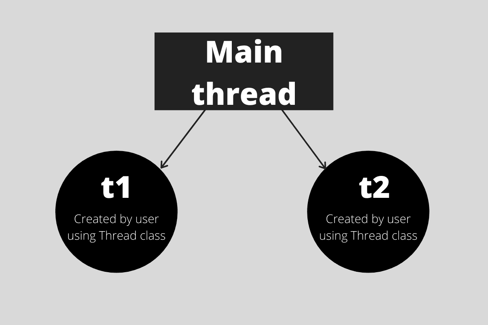

# Python 中的多线程:简单参考

> 原文：<https://www.askpython.com/python-modules/multithreading-in-python>

python 中的多线程是使用线程概念在 Python 中实现多任务的一种方式。

### 什么是线程？

线程是由操作系统管理的任何进程的组件。操作系统通过在线程之间划分进程来实现并行或多任务处理。这是一个轻量级的过程，确保了独立的执行流程。

### Python 中多线程的好处是什么？

创建多线程应用程序有很多好处。让我们看看这里的一些好处:

*   资源的有效利用
*   更有责任感
*   资源共享使它更经济
*   由于并行性，可有效利用多处理器架构
*   节省时间
*   线程(因为是同一个进程的一部分)相互之间的通信比它们是单独的进程更容易
*   它们不需要太多的内存开销
*   多线程服务器和交互式图形用户界面专门使用多线程。

## Python 中如何实现多线程？

让我们继续创建我们的第一个多线程应用程序。

### 1.导入线程模块

对于线程的创建，我们将使用`threading`模块。

```py
import threading

```

`threading`模块由一个`Thread`类组成，该类被实例化以创建一个线程。

可以通过创建 thread 类的对象来创建线程。该类的参数如下:

1.  **目标:**线程要调用的函数在这里指定。这个函数是一个可调用的对象，由线程的`run()`方法调用。
2.  **参数:**这里，我们指定了`target`函数的参数。

```py
def print_hi(num): 
    print("Hi, you are customer ",num)

t1 = threading.Thread(target=print_square, args=(10,))

```

上面的代码片段调用了作为`target`参数调用的`print_hi()`函数。该功能有一个参数，即使用`args`指定的`num`。



Illustration Of Main Thread And Child Threads

### 2.开始线程

通过调用线程对象上的`threading`模块的`start()`方法来启动线程。下图显示了相同的情况:

```py
t1.start()

```

每个线程对象最多只能调用一次。它安排在一个单独的控制线程中调用对象的`run()`方法。

如果在同一个线程对象上多次调用，这个方法将引发一个`RuntimeError`。

线程在程序中被调用，程序本身就是一个进程。因此，在线程执行期间，主程序也继续执行。

因此，我们可以暂停主程序(由主线程运行)的活动，直到创建的线程完成。同样的例子如下。

### 3.螺纹连接方法

```py
def print_hi(num): 
    print("Hi, you are customer ",num)

t1 = threading.Thread(target = print_hi, args=(10,))
t1.start()
t1.join()
print("End")

```

在上面的代码片段中，`Thread`类用于创建一个对象，并被命名为 t1。在标记线程活动开始的线程对象 t1 上调用`start()`方法。

然后调用`join()`方法。通过这样做，我们确保主程序暂停主线程的执行，并等待直到线程 t1 完成。一旦 t1 完成了它的活动，主线程(主程序)就可以继续执行。因此，行`print("End")`仅在线程活动完成后执行。

```py
Hi, you are customer 10
End

```

如果不使用`join()`方法，解释器可以在两个打印语句——`print("Hi, you are customer ", num)`和`print("End")`之间进行选择。在这种情况下，无法预测哪个[打印语句](https://www.askpython.com/python/examples/python-print-without-newline)将首先显示，因为这些行的执行是由解释器选择的。

### 4.在 Python 中同步线程

线程同步被定义为确保没有两个线程执行访问共享资源的特定程序段的机制。程序的这些部分被称为**关键部分**。

有必要确保两个线程不会同时访问这个资源，因为这会导致**竞争条件**。

> 竞争条件被定义为两个或多个线程使用写权限访问共享资源并试图更改数据的情况。因此，这些变量的值变得不可预测。

因此，我们在程序中使用锁来暂时停止程序的执行，直到锁被释放。这样做是为了确保两个线程不会访问同一个变量而导致冲突。

### **多线程的缺点**

*   增加了程序的复杂性。
*   共享资源(对象、数据)的同步是必要的。
*   难以调试不可预测的结果
*   构建和同步线程是 CPU/内存密集型的。

### 参考

[https://docs.python.org/3/library/threading.html](https://docs.python.org/3/library/threading.html)