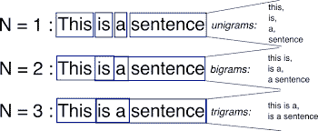

# 使用 Python NLTK 实现 N 元语法——分步指南

> 原文：<https://www.askpython.com/python/examples/n-grams-python-nltk>

在本教程中，我们将讨论 n 元语法的含义以及如何在 Python 编程语言中实现 n 元语法。

***也可阅读:[BLEU score in Python——初学者概述](https://www.askpython.com/python/bleu-score)***

* * *

## 理解 N 元语法

文本 n 元语法通常用于自然语言处理和文本挖掘。它本质上是同时出现在同一个窗口中的一串单词。

当计算 n-gram 时，您通常前进一个单词(尽管在更复杂的情况下，您可以移动 n 个单词)。n-gram 有多种用途。



N Grams Demonstration

例如，在创建语言模型时，n 元模型不仅用于创建单元模型，还用于创建二元模型和三元模型。

谷歌和微软已经创建了网络规模的语法模型，可用于各种活动，如拼写纠正、断字和文本摘要。

* * *

## 用 Python 实现 n 元语法

为了实现 n 元语法，使用了`nltk`中的`ngrams`函数，该函数将执行所有的 n 元语法操作。

```py
from nltk import ngrams
sentence = input("Enter the sentence: ")
n = int(input("Enter the value of n: "))
n_grams = ngrams(sentence.split(), n)
for grams in n_grams:
    print(grams)

```

## 抽样输出

```py
Enter the sentence: Let's test the n-grams implementation with this sample sentence! Yay!
Enter the value of n: 3
("Let's", 'test', 'the')
('test', 'the', 'n-grams')
('the', 'n-grams', 'implementation')
('n-grams', 'implementation', 'with')
('implementation', 'with', 'this')
('with', 'this', 'sample')
('this', 'sample', 'sentence!')
('sample', 'sentence!', 'Yay!')

```

* * *

看看结果有多惊人！你可以在一些句子中尝试使用相同的代码。编码快乐！😇

* * *

## 另请参阅:

1.  [Python 中的词干化和词汇化](https://www.askpython.com/python/examples/stemming-and-lemmatization)
2.  [用 python 从头开始创建单词包模型](https://www.askpython.com/python/examples/bag-of-words-model-from-scratch)
3.  [如何使用 NLTK 删除 Python 中的停用词？](https://www.askpython.com/python/examples/remove-stop-words-nltk)
4.  [文字云使用 Python](https://www.askpython.com/python/examples/word-cloud-using-python)

* * *