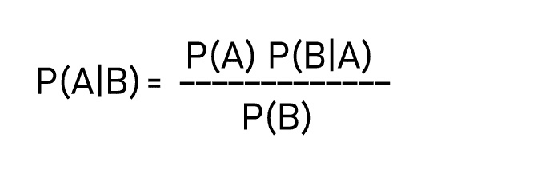
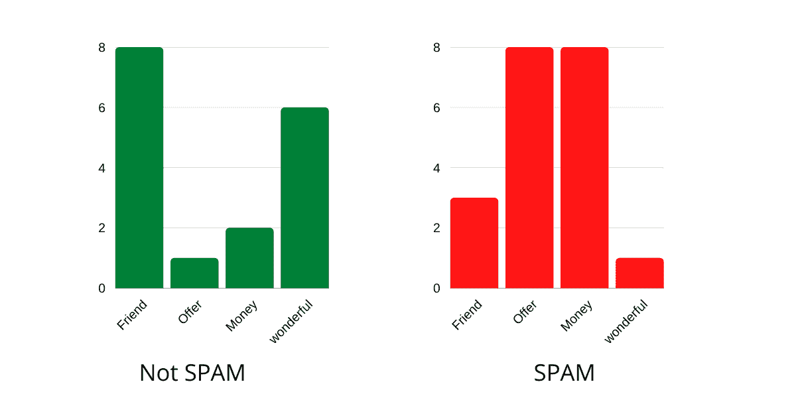
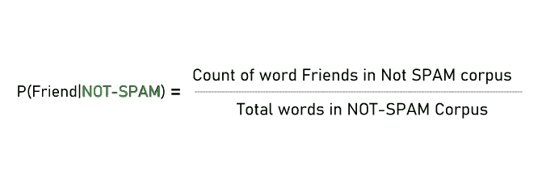
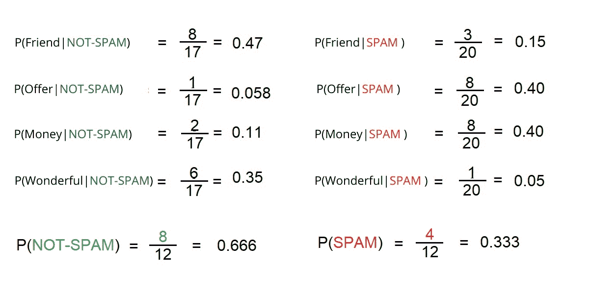
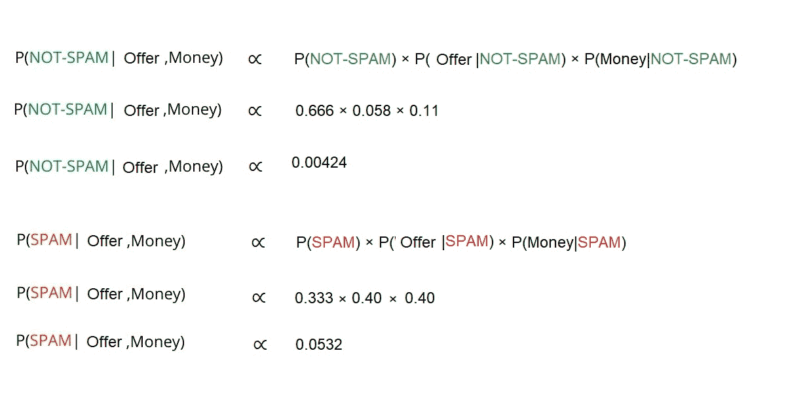

# 基于 Python 的朴素贝叶斯分类器

> 原文：<https://www.askpython.com/python/examples/naive-bayes-classifier>

朴素贝叶斯分类器是一种概率分类器，基于贝叶斯定理。

在机器学习中，分类问题表示在给定数据的情况下选择最佳假设。

给定一个新的数据点，我们尝试对这个新数据实例属于哪个类标签进行分类。关于过去数据的先验知识有助于我们对新数据点进行分类。

## 朴素贝叶斯定理



**Bayes Theorem**

假设事件 B 已经发生，贝叶斯定理给出了事件 A 发生的概率。比如说。

鉴于天气多云，下雨的可能性有多大？下雨的概率可以称为我们的假设，代表多云天气的事件可以称为证据。

*   p(A | B)–称为后验概率
*   p(B | A)–是给定 A 时 B 的条件概率。
*   p(A)–称为事件 A 的先验概率。
*   p(B)——不考虑假设，是事件 B 发生的概率。

现在我们对贝叶斯定理有了一些了解，让我们看看朴素贝叶斯是如何工作的。

## 朴素贝叶斯分类器是如何工作的？

为了演示朴素贝叶斯分类器是如何工作的，我们将考虑一个垃圾邮件分类问题，该问题对一封电子邮件是否是垃圾邮件进行分类。

让我们考虑一下我们总共有 12 封电子邮件。其中 8 个不是垃圾邮件，其余 4 个是垃圾邮件。

*   非垃圾邮件的数量–8
*   垃圾邮件数量–4 封
*   电子邮件总数–12 封
*   因此，P(非垃圾邮件)= 8/12 = 0.666，P(垃圾邮件)= 4/12 = 0.333

假设整个语料库只包含四个词*【朋友、提议、金钱、美妙】*。下面的直方图表示每个类别中每个单词的字数。



**Word Counts In our Example**

我们现在将计算每个单词的条件概率。

假设邮件不是垃圾邮件，下面给出的公式将计算单词 **Friend** 出现的概率。



**Calculating Conditional Probabilities**

计算整个文本语料库的概率。



**Conditional Probabilities of Each Words**

现在我们有了所有的先验概率和条件概率，我们可以对它应用贝叶斯定理。

假设我们收到一封电子邮件:“**Offer Money”**，根据我们之前计算的概率，我们需要将其分类为垃圾邮件或非垃圾邮件。



**Probability Score Calculation**

给定单词 Offer 和 Money，电子邮件是垃圾邮件的概率大于该邮件不是垃圾邮件的概率。(0.0532 > 0.00424).

因此，我们的分类器会将此电子邮件归类为垃圾邮件。总之，我们只是计算了后验概率，如贝叶斯定理所示。

如果我们遇到一个不在其他类别中的变量，那么该变量的字数将变为 0，我们将无法做出预测。

这个问题也被称为“零频率”问题。为了避免这种情况，我们使用平滑的方法。即拉普拉斯估计。平滑技术不影响条件概率。

## 朴素贝叶斯分类器的类型:

*   **多项式**–用于离散计数。我们在上面的例子中描述的是多项式型朴素贝叶斯的一个例子。
*   **高斯**–这种类型的朴素贝叶斯分类器假设数据遵循正态分布。
*   **伯努利**–当我们的特征向量是二进制时，这种类型的分类器是有用的。

## 用 Python 实现朴素贝叶斯

我们将利用威斯康星乳腺癌数据集。这里可以了解更多关于数据集[的内容。](https://scikit-learn.org/stable/modules/generated/sklearn.datasets.load_breast_cancer.html)

Scikit Learn 为我们提供了实现朴素贝叶斯算法的`GaussianNB`类。

```py
#Loading the Dataset
from sklearn.datasets import load_breast_cancer

data_loaded = load_breast_cancer()
X = data_loaded.data
y = data_loaded.target

```

数据集有 30 个需要进行预测的要素。我们可以通过使用`.data`方法来访问数据。数据集包含要素和目标变量。

```py
#Splitting the dataset into training and testing variables
from sklearn.model_selection import train_test_split

X_train, X_test, y_train, y_test = train_test_split(data.data, data.target, test_size=0.2,random_state=20)

#keeping 80% as training data and 20% as testing data.

```

现在，导入高斯朴素贝叶斯类并使用[拟合训练数据](https://www.askpython.com/python/examples/split-data-training-and-testing-set)。

```py
from sklearn.naive_bayes import GaussianNB

#Calling the Class
naive_bayes = GaussianNB()

#Fitting the data to the classifier
naive_bayes.fit(X_train , y_train)

#Predict on test data
y_predicted = naive_bayes.predict(X_test)

```

`GaussianNB`类的`.fit`方法需要特征数据(X_train)和目标变量作为输入参数(y_train)。

现在，让我们用准确性指标来看看我们的模型有多准确。

```py
#Import metrics class from sklearn
from sklearn import metrics

metrics.accuracy_score(y_predicted , y_test)

```

**精度= 0.956140350877193**

我们得到了大约 95.61 %的准确率

请随意试验这些代码。在拟合算法之前，您可以对数据应用各种[转换。](https://www.askpython.com/python/examples/standardize-data-in-python)

## 结论

在本文中，我们对朴素贝叶斯分类器有了一些直觉。我们还看到了如何使用 sklearn 实现朴素贝叶斯。学习愉快！