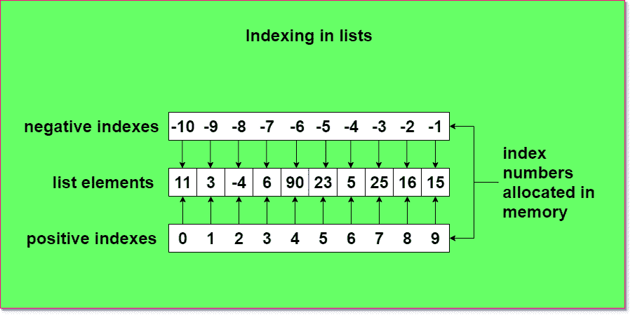

# 负索引 Python 列表–如何使用“-1”参数

> 原文：<https://www.askpython.com/python/list/negative-indexing>

Python 列表可以通过多种方式进行索引，包括正数和负数。本文将讨论如何使用“-”减号参数来访问列表中的特定元素。

## 基本列表结构和操作

列表是用方括号和其中的元素定义的。每个元素都用逗号隔开。

**语法:**

```py
list_name = [element_!, element_2, ..., element_n]

```

**代码:**

```py
int_list= [3, 4, 5, 5, 6] # a list containing all integers
char_list = ['a', 'b', 'c', 'd'] # al list of characters
str_list = ["apple", 'banana', 'lemon', 'orange'] # a list of strings

```

## 什么是列表索引？

索引是任何编程语言中任何线性数据结构的基本单位。对于每台计算机，默认索引从 0 开始，一直到 n-1。这里 n 表示相应数据结构中元素的总数。类型有:

1.  **正分度:从 0 开始增加**
2.  **负索引:从最后一个元素开始，每次遍历都是从头到尾移动。**

这些帮助我们访问这个数据结构的单个元素。让我们看看下一节中的操作。

### 列表中的负索引

这是我们话题的重点。列表中的“-1”参数表示 Python 解释器的操作是从最后一个元素开始的。首先，我们将了解如何使用索引号访问元素。



Indexing In Lists

## ****使用负索引检索列表数据****

```py
my_list = [45, 5, 33, 1, -9, 8, 76]
print(my_list[-1]) 
print(my_list[-2])
print(my_list[-3])

```

**输出:**

```py
76
8
-9

```

## 用负索引反转列表

使用内置函数**“reverse()”**:

```py
my_list = [45, 5, 33, 1, -9, 8, 76]
my_list.reverse()

```

**输出:**

```py
[76, 8, -9, 1, 33, 5, 45]

```

**使用-1** 反转列表

```py
my_list = [45, 5, 33, 1, -9, 8, 76]
my_list[::-1]

```

**输出:**

```py
[76, 8, -9, 1, 33, 5, 45] # reversed list

```

## 移除具有负索引的元素

使用 pop()函数，并在其中给定-1 作为参数，我们可以删除列表中的最后一个元素，并得到一个新的列表。

```py
my_list = [45, 5, 33, 1, -9, 8, 76]
my_list.pop(-1)
my_list

```

**输出:**

```py
76 # popped out element
[45, 5, 33, 1, -9, 8] # new list returned

```

## 在 Python 列表中使用负索引的优势

1.  减少代码行数并在一行中进行反向操作。
2.  简化复杂的操作。
3.  操作时间最短，复杂性更低。

## 结论

我们的 Python 负索引教程到此结束。我们希望它对您有所帮助！如果你有任何问题或意见，请在下面分享。感谢阅读！