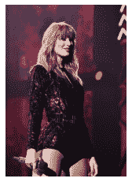
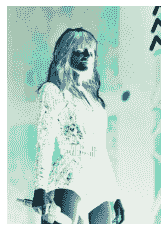
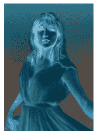

# Python 中图像的负变换

> 原文：<https://www.askpython.com/python/examples/negative-transformation-of-image>

在本文中，您将学习如何使用 Python 中的 PIL 对图像执行负变换。PIL 是 [Python 图像库](https://www.askpython.com/python-modules/pillow-module)的缩写。该库用于多种图像转换。PIL 让处理图像变得超级简单，可以帮助你编辑图像的不同部分，而不需要很多行代码。

* * *

## 导入模块

为此，让我们使用 PIL 的图像类。因此，脚本的第一行如下所示:

```py
from PIL import Image

```

在这种情况下，Image 类由许多属性和方法组成。要打开图像、查看图像、从给定图像中检索像素以及更改图像中的像素，我们需要 open、show、getpixel 和 putpixel 方法。

那么，让我们来看看如何打开一个图像。可以这样做，如下所示。

```py
from PIL import Image
import matplotlib.pyplot as plt
img=Image.open("fig.jpg")
plt.axis('off')
plt.imshow(img)

```

## 加载图像

这里，img 是所提供图像的图像对象，它可以在图像的路径中找到。“让我们来看看图像中颜色的负转换。



Negative Transformation Input

* * *

众所周知，在 RGB 颜色模型下，每种颜色都有一个小数索引，范围从 0-255。值 0 表示最低，值 255 表示最高。例如，(255，255，255)表示白色。

同样，(0，0，0)代表黑色。我们打算进行颜色的负转换，这意味着反转颜色，如下所示。

设颜色 X 表示为(r，g，b)=(100，100，100)。它可以转换如下

*R = 255-R = 255-100 = 155 =>R = 155
类似地，G=155 和 B=155
因此 X 的负变换颜色指数是(R，G，B) =(155，155，155)*

## 实现图像的负变换

因此，让我们为图像的每个像素实现颜色的负变换。

```py
w,h=img.size
for i in range(w):
    for j in range(h):
        r,g,b=img.getpixel((i,j))
        r=255-r
        g=255-g
        b=255-b
        img.putpixel((i,j),(r,g,b))
plt.axis('off')
plt.imshow(img) 

```



Negative Transformation Output

* * *

## Python 中图像负变换的代码

```py
from PIL import Image
import matplotlib.pyplot as plt
img=Image.open("fig.jpg")

w,h=img.size
for i in range(w):
    for j in range(h):
        r,g,b=img.getpixel((i,j))
        r=255-r
        g=255-g
        b=255-b
        img.putpixel((i,j),(r,g,b))
plt.axis('off')
plt.imshow(img) 

```


Negative Transformation Input 2



Negative Transformation Output 2

* * *

## *结论*

恭喜你！你刚刚学会了如何得到一个图像的负变换。希望你喜欢它！😇

喜欢这个教程吗？无论如何，我建议你看一下下面提到的教程:

1.  [Python patch ify——从大型图像中提取补丁](https://www.askpython.com/python-modules/python-patchify)
2.  [用 Python 对服装图像进行分类——完全指南](https://www.askpython.com/python/examples/classifying-clothing-images)
3.  [Python 中的图像去噪——分步指南](https://www.askpython.com/python/examples/denoising-images-in-python)
4.  [使用直方图可视化图像中的颜色–Python OpenCV](https://www.askpython.com/python/visualizing-colors-in-images)

感谢您抽出时间！希望你学到了新的东西！！😄

* * *