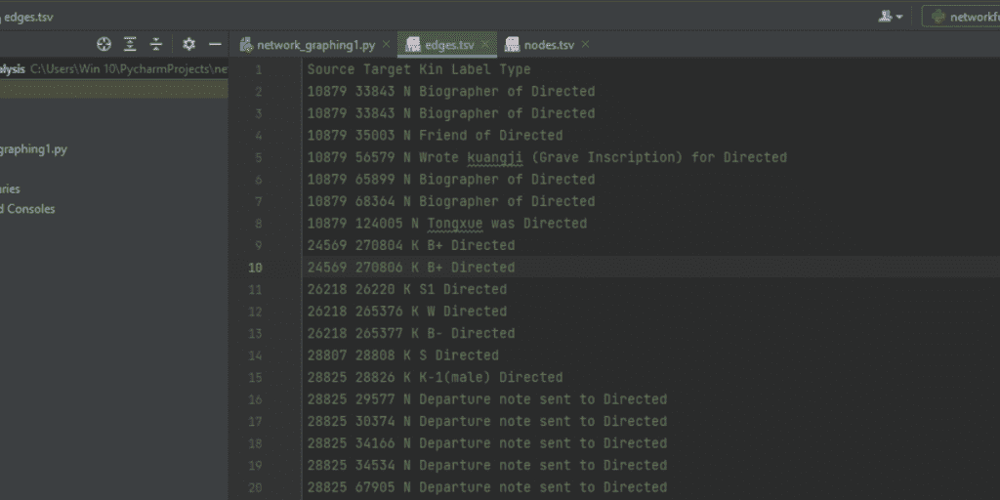
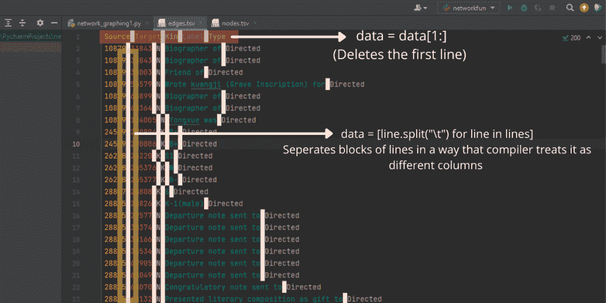
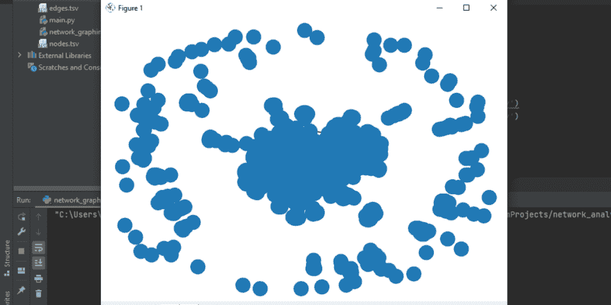

# Python 中的网络分析-完整指南

> 原文：<https://www.askpython.com/python/examples/network-analysis-in-python>

一种用于评估、管理和跟踪管理过程和工作流的方法被称为网络分析。此外，数据分析有助于创建节点和结构元素的[图形图](https://www.askpython.com/python-modules/networkx-package)，但与工作流不同，网络图检查按时间顺序排列的事件、目标和任务，以及它们的时间框架和相关性，并将它们可视化地描绘为树或表格，如甘特图。

在制定项目计划时，项目负责人可能需要网络分析，因为它有助于处理以下因素:

*   任务的相互依赖性
*   动作之间的持续时间以及如何有效地缓冲它们。
*   开始和结束日期，从最早的日期到最近的日期
*   活动间隔
*   为最重要的任务和活动制定路线。

网络分析方法通常用于设计到开发阶段，以加强项目控制并确保任务在预算内按时交付。

## 如何在 Python 中实现网络分析

在 Python 中有许多方法可以进行网络分析。此外，有许多工具可用于绘制网络分析图，但在本文中，我们将特别使用 networkx 和 [matplotlib](https://www.askpython.com/python-modules/matplotlib/python-matplotlib) ，因为它们是功能强大的网络绘制工具。

我们将通过使用一些在线可用的用户数据库来理解网络绘图。在这个例子中，我们获取了两个基于 16 世纪的中国人口记录，它们可能生活在一部著名小说的作者生活的时代，我们将尝试创建一个可能认识他的人的图表。

### **让我们从导入包开始**

```py
import networkx as nx
import matplotlib.pyplot as plt

```

Github 链接提取数据库:[链接](https://github.com/vierth/networkanalysis)

git 文件夹中有多个文件，但我们只需要“edges.tsv”和“nodes.tsv”。这些 word 文件包含所有的历史数据。



Raw data when extracted from .tsv file

这些历史数据库在。tsv 文件格式。正如你在上面的图像中看到的，数据是分散的，没有经过过滤。为了将这些数据图形化，我们需要将其分离，以便编译器可以轻松地开始读取数据。

下面的代码演示了如何将这些文件加载到一个(get_data)方法中，并根据我们的需要对它们进行分离。

```py
def data_extraction(name_ofile):
    # Here, data loading will be done through a context manager
    with open(name_ofile, 'r', encoding='utf8') as rf:
        # transform file into string and split along new line
        filelines = rf.read().split("\n")

        # new line will be created at tab spaces
        filedata = [line.split("\t") for line in filelines]

        # picks the header
        fileheader = filedata[0]

        # header gets deleted
        filedata = filedata[1:]

    # return header and data
    return fileheader, filedata

# load data in from file
headerofnode, data_ofnode = data_extraction('nodes.tsv')
headerofedge, data_ofedge = data_extraction('edges.tsv')

```



The above image represents how the compiler starts to segregate the data after reading the above lines of code.

### **创建图形并将节点信息添加到** **it:**

```py
Graph = nxnas.Graph()

# graph gets data of node added to it
for nxnode in data_ofnode:
    # sequentially adding id, name, chinese name, and index year
    Graph.add_node(int(nxnode[0]), pname=nxnode[1], chinese_name=nxnode[2], year_inindex=int(nxnode[3]))

#  graph gets data of edge added to it
for nxedge in data_ofedge:
    # sequentially adding node 1, node 2, kin, and label
    Graph.add_edge(int(nxedge[0]), int(nxedge[1]), nxkin=nxedge[2], nxlabel=nxedge[3])

```

### **为图表添加数据指标**

```py
degree_centrality = nxnas.degree_centrality(Graph)
closeness_centrality = nxnas.closeness_centrality(Graph)
betweenness_centrality = nxnas.betweenness_centrality(Graph)

```

度量是 networkx python 包中提供的各种算法，可用于研究您的网络。在本例中，我们使用了三个数据指标来绘制图表。让我们了解它们的功能和用途。

*   度中心性:一个节点的边数。
*   Closeness _ centrality:查找它们之间距离最小的节点。通过这种方式，可以测量节点传输数据的效率。
*   中间中心性:寻找最短路径。

### **Python 中网络分析的完整代码**

```py
import networkx as nxnas
import matplotlib.pyplot as myplot

# This function is employed to extract data from the .tsv files
def data_extraction(name_ofile):
    # Here, a data loading will be done through a context manager
    with open(name_ofile, 'r', encoding='utf8') as rf:
        # transform file into string and split along new line
        filelines = rf.read().split("\n")

        # new line will be created at tab spaces
        filedata = [line.split("\t") for line in filelines]

        # picks the header
        fileheader = filedata[0]

        # header gets deleted
        filedata = filedata[1:]

    # return header and data
    return fileheader, filedata

# load data in from file
headerofnode, data_ofnode = data_extraction('nodes.tsv')
headerofedge, data_ofedge = data_extraction('edges.tsv')

# create graph object
Graph = nxnas.Graph()

# graph gets data of node added to it
for nxnode in data_ofnode:
    # sequentially adding id, name, chinese name, and index year
    Graph.add_node(int(nxnode[0]), pname=nxnode[1], chinese_name=nxnode[2], year_inindex=int(nxnode[3]))

#  graph gets data of edge added to it
for nxedge in data_ofedge:
    # sequentially adding node 1, node 2, kin, and label
    Graph.add_edge(int(nxedge[0]), int(nxedge[1]), nxkin=nxedge[2], nxlabel=nxedge[3])

# Data metrics for the graph
degree_centrality = nxnas.degree_centrality(Graph)
closeness_centrality = nxnas.closeness_centrality(Graph)
betweenness_centrality = nxnas.betweenness_centrality(Graph)

# The process of depicting the graph
nxnas.draw_spring(Graph)
myplot.show()

```

### 输出:



Network Graph

### 结论:

本文详细解释了网络分析图以及如何绘制它们。我们已经学会了如何绘制公共领域中可用记录的网络图，并从中得出关系。我们还了解了 networkx 指标以及如何调用和使用它们。

### 参考资料:

*   [Networkx 指标](https://networkx.org/documentation/stable/reference/algorithms/centrality.html)