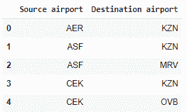

# 从熊猫的数据框架构建网络图

> 原文：<https://www.askpython.com/python/examples/network-graphs-from-pandas-dataframe>

在本教程中，我们将尝试从熊猫数据框中生成一个令人惊叹的交互式网络图，让事情更上一层楼！

***也读作: [NetworkX 包——Python 图库](https://www.askpython.com/python-modules/networkx-package)***

不要耽搁，让我们开始吧！

* * *

## 加载和预处理数据

本节重点介绍数据集的加载和预处理。本教程选择的数据集是 Kaggle 上提供的 [OpenFlights 机场数据集](https://www.kaggle.com/datasets/divyanshrai/openflights-airports-database-2017)。截至 2017 年 1 月，OpenFlights 机场数据库包含全球超过 10，000 个机场的**数据。**

***阅读更多:[用 Python 处理数据帧行和列](https://www.askpython.com/python-modules/pandas/dataframe-rows-and-columns)***

在下面的代码中，我们将导入`pandas`模块并将`routes.csv`文件加载到程序中。现在，在数据集中的所有列中，我们只需要数据集中的`source`和`destination`机场。

```py
import pandas as pd
df = pd.read_csv('routes.csv')
df = df[['Source airport','Destination airport']]
df = df[:500]
df.head()

```

为了使处理更容易，计算更简单，我们将只从数据集中取出最上面的`500`行。我们将使用`head`函数显示数据集的前五行。



OpenFlight Dataset 5 Rows

我们将使用下面的 Python 代码将源节点和目的节点分成两个单独的列表。

```py
sources = list(df['Source airport'])
destinations = list(df['Destination airport'])

```

现在，在下一节中，我们将继续使用 networkx 和 pyviz 库来生成网络图。

* * *

## 网络图的生成

我们将首先使用`net.Network`函数创建一个空图，并传递空网络图的一些属性。下一步是迭代`sources`列表并添加节点及其标签和标题。

之后，我们将使用 add_edge 函数添加边。我们将利用异常处理来确保所有的错误都被考虑在内(如果有的话)。

***也读作: [Python 异常处理——尝试，除，最后](https://www.askpython.com/python/python-exception-handling)***

看看下面提到的代码。

```py
g_from_data =net.Network(height='600px',width='50%',
              bgcolor='white',font_color="black",
              heading="A Networkx Graph from DataFrame",directed=True)

for i in range(len(sources)):
  try:
    g_from_data.add_node(sources[i],label=sources[i],title=sources[i])
  except:
    pass

for (i,j) in zip(sources,destinations):
    try:
      g_from_data.add_edge(i,j)
    except:
      pass

g_from_data.show_buttons(['physics'])

g_from_data.show('A_Complete_Networkx_Graph_From_DataFrame.html')
display(HTML('A_Complete_Networkx_Graph_From_DataFrame.html'))

```

看看下面生成的网络图。令人惊讶的是，这个图表看起来如此有趣。

* * *

## 结论

我希望您能够理解如何使用 Python 编程语言中的 pyviz 库使用 pandas 数据框生成网络图。感谢您的阅读！

我建议你阅读下面的教程:

1.  [Python 中的网络分析——完整指南](https://www.askpython.com/python/examples/network-analysis-in-python)
2.  [Python 中的神经网络——初学者完全参考](https://www.askpython.com/python/examples/neural-networks)
3.  [内部威胁风险及其防范的终极指南](https://www.askpython.com/python/ultimate-guide-insider-threat-risks-prevention)

* * *