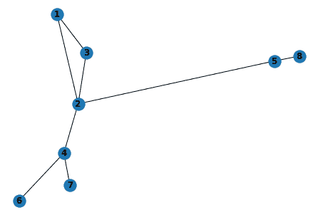
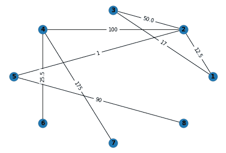
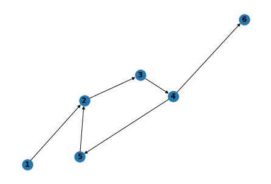

# NetworkX 包–Python 图形库

> 原文：<https://www.askpython.com/python-modules/networkx-package>

NetworkX 包是一个用于研究图形和网络的 Python 库。它提供了创建、操作和研究动态复杂网络结构的工具。使用 NetworkX，我们可以加载和存储多种数据格式的网络，生成多种类型的随机和经典网络，分析网络结构，构建网络模型，设计新的网络算法，绘制网络，等等。在本教程中，我们将学习如何使用 NetworkX 来创建图形和研究网络。

## 导入 NetworkX 包

为了使用 NetworkX 包，我们需要将它下载到本地机器上。您可以使用 [pip 命令](https://www.askpython.com/python-modules/python-pip)下载它。

```py
pip install networkx

```

然后您可以像下面这样导入库。

```py
import networkx as nx

```

## 向图中添加节点

首先，我们将通过调用如下所示的`Graph()`类来创建一个空图。

```py
G = nx.Graph()

```

NetworkX 中的节点可以是任何[可散列的](https://docs.python.org/3/glossary.html#term-hashable)对象，即整数、文本串、图像、XML 对象等。它也可以是网络 x 图。在图中添加节点有两种方法。

*   ***add_node():*** 该方法用于一次添加 1 个单节点。
*   ***add _ nodes _ from():***该方法采用 list、set 等可迭代容器，同时添加多个节点。

```py
import networkx as nx

G = nx.Graph()

G.add_node(1)
G.add_nodes_from([2,3,"node 5"])
print(G.nodes())

```

```py
[1, 2, 3, 'node 5']

```

## 向图表添加边

边是两个节点之间的链接。这两种方法主要用于给图添加边。参数中指定的未知节点会自动添加到图形中。

*   ***add_edge():*** 该方法一次添加一条边。
*   ***add _ edges _ from():***该方法采用一个可迭代的边元组容器，如链表、迭代器等。

再次向图中添加一个节点或一条边将被 NetworkX 忽略。

```py
import networkx as nx

G = nx.Graph()

# Adding one edge at a time
# Node 1 and 2 will be automatically added
G.add_edge(1,2)
G.add_edge(3,2)

# Adding multiple edges at a time
G.add_edges_from([(4,2), (3,5), (5,4)])

# Adding duplicates will be ignored.
G.add_node(1)
G.add_edge(1,2)

print(G.nodes())
print(G.edges())

```

```py
[1, 2, 3, 4, 5]
[(1, 2), (2, 3), (2, 4), (3, 5), (4, 5)]

```

## 从图中删除节点和边

与添加节点和边类似，我们可以一次删除单个节点和边，也可以一次删除多个节点和边。

*   ***remove_node():*** 该方法从图中删除一个节点以及与该节点相关联的边。如果图中不存在该节点，它将引发`NetworkXError`。
*   ***remove _ nodes _ from():***该方法采用一个可迭代容器，从图中删除所有节点和与这些节点相关联的边。如果任何节点在图中不存在，它将默默地丢弃它，不做任何更改。
*   ***remove_edge():*** 该方法从图中删除一条边，保持节点不变。如果图中不存在边，它会提高`NetworkXError`。
*   ***remove _ edges _ from():***这个方法采用一个可迭代的容器，从图中移除边。如果图中不存在任何边，它将默默地丢弃它，不做任何更改。

```py
import networkx as nx

G = nx.Graph()

# Creating graph
G.add_edges_from([(1, 2), (2, 3), (3, 4), (4, 1)])
G.add_edges_from([(5, 6), (5, 7), (5, 8), (7, 8)])

print(G.nodes())
print(G.edges())

# Removing edge 1-2 from graph
G.remove_edge(2, 1)
# Removing edge 3-4 and 1-4 at once
G.remove_edges_from([(3, 4), (1, 4)])

print()
print(G.nodes())
print(G.edges())

# Removing node 5 from graph
G.remove_node(5)
# Removing node 7 and 8
G.remove_nodes_from([7,8])

print()
print(G.nodes())
print(G.edges())

```

```py
[1, 2, 3, 4, 5, 6, 7, 8]
[(1, 2), (1, 4), (2, 3), (3, 4), (5, 6), (5, 7), (5, 8), (7, 8)]

[1, 2, 3, 4, 5, 6, 7, 8]
[(2, 3), (5, 6), (5, 7), (5, 8), (7, 8)]

[1, 2, 3, 4, 6]
[(2, 3)]

```

## 访问图的元素

我们可以在 NetworkX 图形中访问 4 个基本图形属性。

*   ***G.nodes:*** 返回图中的节点列表。
*   ***G.edges:*** 返回图中的边列表。
*   ***G.adj:*** 返回所有节点的邻接表。节点 X 的邻接表包含直接链接到节点 X 的相邻节点，你可以使用下标符号(在`G.adj`后使用方括号)访问一个节点的所有相邻节点。
*   ***G.degree:*** 返回图中每个节点链接的节点数。您可以使用下标符号(在`G.degree`后使用方括号)来访问节点的度数。

```py
import networkx as nx

G = nx.Graph()

G.add_edges_from([(1,2), (1,3), (3,4), (3,5)])

print("Nodes")
print(G.nodes)
print("Edges")
print(G.edges)
print("Adjacency List")
print(G.adj)
print("Degree")
print(G.degree)

print()

print("Adjacency List for node 3")
print(G.adj[3])
print("Degree for node 3")
print(G.degree[3])

```

```py
Nodes
[1, 2, 3, 4, 5]
Edges
[(1, 2), (1, 3), (3, 4), (3, 5)]
Adjacency List
{1: {2: {}, 3: {}}, 2: {1: {}}, 3: {1: {}, 4: {}, 5: {}}, 4: {3: {}}, 5: {3: {}}}
Degree
[(1, 2), (2, 1), (3, 3), (4, 1), (5, 1)]

Adjacency List for node 3
{1: {}, 4: {}, 5: {}}
Degree for node 3
3

```

## 图形、节点和边的属性

每个图、节点和边都可以在关联的属性字典中保存键/值属性对。默认情况下，这些是空的，但是可以使用`add_edge`、`add_node`或直接操作图形`G`的属性字典`G.graph`、`G.nodes`和`G.edges`来添加或更改属性。

### 1.图表属性

您可以在使用`nx.Graph()`创建图形时为其分配属性。

```py
import networkx as nx
G = nx.Graph(graph_description = "This is an empty graph")
print(G.graph)
# Output: {'graph_description': 'This is an empty graph'}

```

或者您可以像字典对象一样在以后添加/修改属性

```py
import networkx as nx
G = nx.Graph()
G.graph["description"] = "This is empty graph" 
G.graph["data"] = 5
print(G.graph)
# Output: {'description': 'This is empty graph', 'data': 5}

```

### 2.节点属性

您可以使用`add_node()`、`add_nodes_from()`或`G.nodes`为节点添加属性。您可以使用`G.nodes.data()`获得所有节点的属性。对于特定节点，使用方括号，如图所示。

```py
import networkx as nx
G = nx.Graph()

# Using add_node
G.add_node(1, data = "data1")

# Using add_nodes_from
G.add_nodes_from([(2, {"data": "data2"}),
                  (3, {"data": "data3"})], 
                   node_type = "child node")

# Adding more attributes on node 1 using G.nodes
G.nodes[1]["type"] = "root node"

print(G.nodes.data())
# Output: [(1, {'data': 'data1', 'type': 'root node'}), (2, {'node_type': 'child node', 'data': 'data2'}), (3, {'node_type': 'child node', 'data': 'data3'})]

print(G.nodes[1])
# Output: {'data': 'data1', 'type': 'root node'}

```

### 3.边属性–制作加权图

您可以使用`add_edge()`、`add_edges_from()`、`G.edges`或下标符号为边添加属性。通过给边分配属性，我们可以创建一个如图所示的加权图。

```py
import networkx as nx
G = nx.Graph()

# Using add_edge
G.add_edge(1, 2, weight = 50)

# Using add_edges_from
G.add_edges_from([
                  (1, 3, {"weight": 70}),
                  (1, 4, {"weight": 100})
                ])

# Using subscript notation
G.add_edge(4,5)
G[4][5]["weight"] = 175

# Using G.edges
G.edges[1, 2]["weight"] = 10

print(G.edges.data())

# Output: [(1, 2, {'weight': 10}), (1, 3, {'weight': 70}), (1, 4, {'weight': 100}), (4, 5, {'weight': 175})]

```

## 可视化 NetworkX 软件包图表

我们可以使用如图所示的`draw()`方法在 NetworkX 包中绘制图形并可视化它们。

```py
import networkx as nx

G = nx.Graph()

# Using add_edge
G.add_edge(1, 2, weight = 12.5)
G.add_edge(3, 2, weight = 50.0)
G.add_edge(1, 3, weight = 17)
G.add_edge(4, 2, weight = 100)
G.add_edge(2, 5, weight = 1)
G.add_edge(4, 6, weight = 25.5)
G.add_edge(7, 4, weight = 175)
G.add_edge(5, 8, weight = 90)

nx.draw(G, with_labels= True, font_weight='bold')

```



NetworkX Graph Visualization

如果您想绘制带权重的图形，使用`draw_networkx_edge_labels()`和`nx.draw()`指定图形、位置和边缘标签属性

```py
import networkx as nx
import matplotlib.pyplot as plt

G = nx.Graph()

# Using add_edge
G.add_edge(1, 2, weight = 12.5)
G.add_edge(3, 2, weight = 50.0)
G.add_edge(1, 3, weight = 17)
G.add_edge(4, 2, weight = 100)
G.add_edge(2, 5, weight = 1)
G.add_edge(4, 6, weight = 25.5)
G.add_edge(7, 4, weight = 175)
G.add_edge(5, 8, weight = 90)

pos=nx.circular_layout(G)
nx.draw(G, pos, with_labels=True, font_weight='bold')
edge_weight = nx.get_edge_attributes(G,'weight')
nx.draw_networkx_edge_labels(G, pos, edge_labels = edge_weight)
plt.show()

```



NetworkX Graph Visualization With Weights

## 使用 NetworkX 包创建有向图

NetworkX 还允许您使用`DiGraph()`类创建有向图，该类提供了针对有向边的附加方法和属性，例如`DiGraph.out_edges`、`DiGraph.in_degree`、`DiGraph.predecessors()`、`DiGraph.successors()`等。

```py
import networkx as nx

DG = nx.DiGraph()

DG.add_edges_from([(1,2), (2,3), (3,4), (4,5), (5,2), (4, 6)])

# Print edges going out from node 4
print("Out edges of node 4 are:",DG.out_edges(4))

# Print in degree of node 2
print("In Degree of node 2 is:",DG.in_degree(2))

# Print successors of node 4
print("Successors of node 4 are:",list(DG.successors(4)))

# Print predecessors of node 2
print("Predecessors of node 2 are:",list(DG.predecessors(2)))

nx.draw(DG, with_labels= True, font_weight='bold')

```

```py
Out edges of node 4 are: [(4, 5), (4, 6)]
In Degree of node 2 is: 2
Successors of node 4 are: [5, 6]
Predecessors of node 2 are: [1, 5]

```



NetworkX Directed Graph

## 结论

在本教程中，您了解了 NetworkX 包以及如何使用它来创建、操作和可视化图形。这个库对研究复杂的网络和图形很有帮助。它被数学家、物理学家、生物学家、计算机科学家等用于研究。

感谢阅读！！