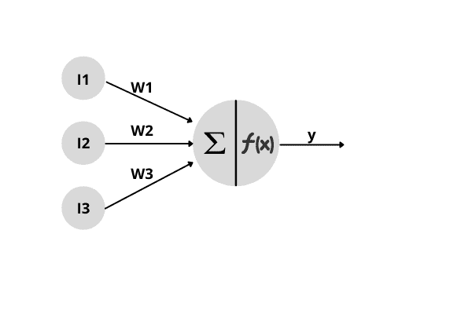
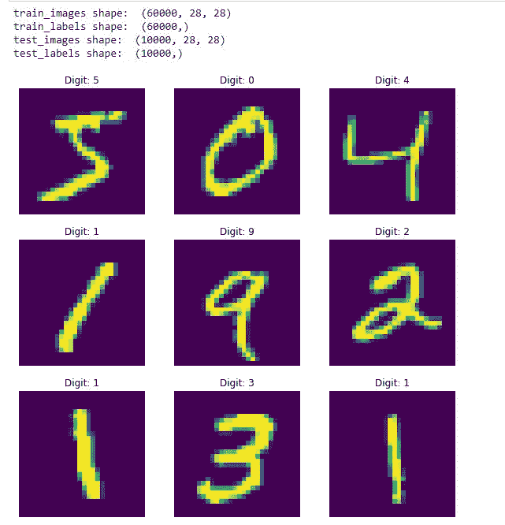
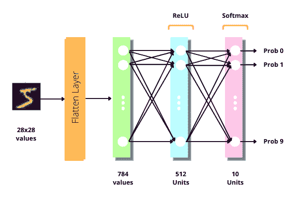
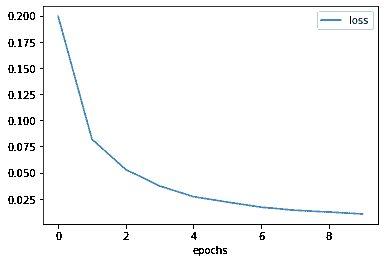
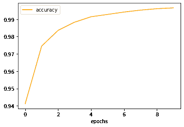
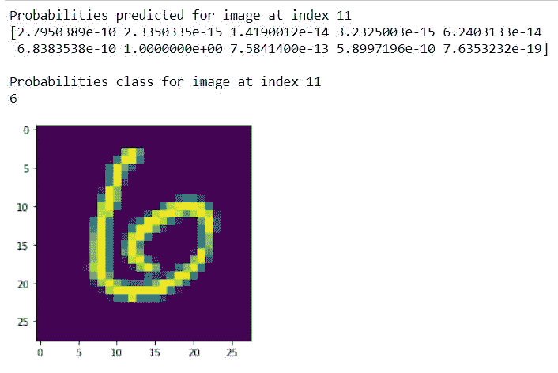

# Python 中的神经网络——初学者的完整参考

> 原文：<https://www.askpython.com/python/examples/neural-networks>

神经网络是一组处理数学计算的相互连接的神经元，并且由于它们在人工智能领域中的成功应用而获得了广泛的流行。在本教程中，您将学习如何使用 Tensorflow 简单实现一个可以识别图像中数字的神经网络。

* * *

## 什么是神经网络？

神经网络是一种用于机器学习的强大学习算法，它提供了一种逼近复杂函数的方法，并尝试学习数据和标签之间的关系。神经网络受到人脑工作的启发，并模仿其运作方式。

### 神经元

受生物神经元的启发，单个人工神经元是一个树状结构，由输入节点、单个输出和其他组件组成，如下所示:



Artificial Neuron

单个神经元中涉及的组件有:

1.  ***输入节点:*** 输入节点包含实数值形式的信息。这个信息由神经元处理。
2.  ***权值:*** 在单个输入节点和神经元之间，存在一个与其相关联的权值的连接，该权值决定了将要传递给神经元的信息的比例。这些权重是由神经网络学习以学习关系映射的参数。
3.  ***求和:*** 在下一步中，将所有输入节点及其相关权重集合在一起，并计算加权和，即`***y[sum] = Σ Wj*Ij***`或 *`**y[sum] = W[1]*I[1] + W[2]*I[2] + ... + W[n]*I[n]**`* 。
4.  ***激活函数:*** 求和的结果将被输入到一个叫做激活函数的函数中。激活函数使用计算出的加权和 ***来决定神经元是否应该激活自己。*** 这一步的输出 ***`y = f(y[sum])`*** 其中`***f()***`是激活函数。
5.  ***输出节点:*** 激活函数的结果传递给神经网络中存在的其他神经元。

### 层

神经网络中的一层由相同类型的节点/神经元组成。它是神经元的堆叠集合。为了定义全连接神经网络中的层，我们指定层的两个属性:

1.  ***单位:*** 一层中存在的神经元数量。
2.  ***激活函数:*** 触发层内存在神经元的激活函数。常用的激活功能有:
    *   ***ReLU 激活:*** 整流线性单位(ReLU)函数如果值为正则返回相同值，否则返回 0。这是一个非线性激活函数。
    *   ***Sigmoid 激活:*** Sigmoid 函数将一个值从范围(-∞，∞)映射到(0，1)。sigmoid 函数广泛用于二元分类问题，在这种情况下，我们只有 2 个类别要预测，并且表示其中一个类别的概率。
    *   ***Softmax 激活:***soft max 函数计算 n 个事件的概率分布。它取 n 个值，并将每个值转换为 0–1，表示其出现的概率。它用于多类分类，其中我们有两个以上的类别要预测。

### 神经网络

当多个层以某种方式连接时，就形成了一个神经网络。因此，神经网络是多层的堆叠集合。根据需要，层可以以线性方式以及树状结构连接。

神经网络的第一层称为输入层，神经网络给出输出的最后一层称为输出层，所有其他中间层称为隐藏层。

定义神经网络需要 3 个属性:

1.  ***架构:*** 你在神经网络中使用的层数和类型，以及你如何连接它们来定义神经网络的架构。神经网络的不同结构给出不同的结果。
2.  **损失函数**:损失函数告诉我们的模型如何找到实际值和模型预测值之间的误差。我们希望我们的模型最小化损失函数的值。常用的损失函数有:
    *   [二元交叉熵](https://www.tensorflow.org/api_docs/python/tf/keras/losses/BinaryCrossentropy)
    *   [分类交叉熵](https://www.tensorflow.org/api_docs/python/tf/keras/losses/CategoricalCrossentropy)
    *   [均方误差](https://www.tensorflow.org/api_docs/python/tf/keras/losses/MeanSquaredError)
    *   [稀疏分类交叉熵](https://www.tensorflow.org/api_docs/python/tf/keras/losses/SparseCategoricalCrossentropy)
3.  ***优化器:*** 优化器通过查看数据和损失函数值告诉我们的模型如何更新模型的权重/参数。常用的优化器有:
    *   [亚当](https://www.tensorflow.org/api_docs/python/tf/keras/optimizers/Adam)
    *   [新币](https://www.tensorflow.org/api_docs/python/tf/keras/optimizers/SGD)
    *   [RMS-Prop](https://www.tensorflow.org/api_docs/python/tf/keras/optimizers/RMSprop)

* * *

## 如何制作一个神经网络？

在本教程中，我们将使用 Tensorflow 模块在 python 中制作一个可以对图像中出现的数字进行分类的神经网络。

### 1.导入模块

首先，我们将导入实现中使用的模块。我们将使用 [Tensorflow](https://www.askpython.com/python-modules/tensorflow-vs-pytorch-vs-jax) 来制作神经网络，使用 [Matplotlib](https://www.askpython.com/python-modules/matplotlib/python-matplotlib) 来显示图像和绘制指标。

```py
import tensorflow as tf
import matplotlib.pyplot as plt

```

### 2.探索数据

接下来，我们将在笔记本中加载数据集，并检查其外观。我们将使用已经存在于我们的 Tensorflow 模块中的 [MNIST 数据集](https://www.askpython.com/python/examples/load-and-plot-mnist-dataset-in-python)，可以使用 API `tf.keras.dataset.mnist`访问该数据集。

MNIST 数据集由 60，000 幅训练图像和 10，000 幅测试图像以及表示图像中存在的手指的标签组成。每个图像由 28×28 灰度像素表示。我们将使用`load_data()`方法加载数据集。

```py
mnist = tf.keras.datasets.mnist
(train_images, train_labels) , (test_images, test_labels) = mnist.load_data()

```

让我们看看上面的变量的形状，以及我们的数据集看起来像什么

```py
# Printing the shapes
print("train_images shape: ", train_images.shape)
print("train_labels shape: ", train_labels.shape)
print("test_images shape: ", test_images.shape)
print("test_labels shape: ", test_labels.shape)

# Displaying first 9 images of dataset
fig = plt.figure(figsize=(10,10))

nrows=3
ncols=3
for i in range(9):
  fig.add_subplot(nrows, ncols, i+1)
  plt.imshow(train_images[i])
  plt.title("Digit: {}".format(train_labels[i]))
  plt.axis(False)
plt.show()

```



MNIST Dataset

### 3.预处理数据

在移动数据来训练神经网络之前，你应该总是对数据进行预处理。预处理数据集使其可以作为机器学习模型的输入。

我们数据集中的图像由 0–255 范围内的灰度像素组成。如果数据集使用的值范围较小，机器学习模型会工作得更好。因此，我们将其除以 255，将其范围转换为 0–1。

我们还将我们的标签从数字标签转换为独热编码向量。独热编码向量是标签的二进制向量表示，其中除了值为 1 的相应标签的索引之外，所有元素都为 0。我们将使用`to_categorical()`方法将标签转换为一个热点。

例如，对于标签 2，索引 2 将有 1，其余都将是 0。(`[ 0 0 1 0 0 0 0 0 0 0 ]`)。

```py
# Converting image pixel values to 0 - 1
train_images = train_images / 255
test_images = test_images / 255

print("First Label before conversion:")
print(train_labels[0])

# Converting labels to one-hot encoded vectors
train_labels = tf.keras.utils.to_categorical(train_labels)
test_labels = tf.keras.utils.to_categorical(test_labels)

print("First Label after conversion:")
print(train_labels[0])

```

它的输出是:

```py
First Label before conversion:
5
First Label after conversion:
[0\. 0\. 0\. 0\. 0\. 1\. 0\. 0\. 0\. 0.]

```

### 4.构建你的神经网络

构建神经网络需要两个步骤:配置层和编译模型。

#### 设置图层

这将是我们模型的架构:

1.  ***展平图层:*** 我们输入的图像是 2D 数组。Flatten layer 通过一个接一个地拆分行，将 2D 数组(28 x 28 像素)转换为 1D 数组(0 像素)。这一层只是改变数据形状，没有学习参数/权重。
2.  ***隐层:*** 我们唯一的隐层由一个全连通的密集层`512`个节点(或神经元)组成，每个节点都具有`relu`个激活函数。
3.  ***输出层:*** 神经网络的输出层由一个具有 10 个输出神经元的密集层组成，输出 10 个概率，每个概率对应于数字 0-9，表示图像是相应数字的概率。输出层被赋予`softmax`激活函数，以将输入激活转换为概率。



Neural Network Architecture

由于每一层的输出只输入到一个层，并且所有的层都以线性方式堆叠，我们将使用`Sequential()` API，它接受一系列依次出现的层。

```py
# Using Sequential() to build layers one after another
model = tf.keras.Sequential([

  # Flatten Layer that converts images to 1D array
  tf.keras.layers.Flatten(),

  # Hidden Layer with 512 units and relu activation
  tf.keras.layers.Dense(units=512, activation='relu'),

  # Output Layer with 10 units for 10 classes and softmax activation
  tf.keras.layers.Dense(units=10, activation='softmax')
])

```

#### 编译模型

在我们训练我们的模型之前，我们需要告诉我们的模型一些事情。下面是在模型编译步骤中赋予模型的 3 个属性:

1.  ***损失函数:*** 这告诉我们的模型如何找到实际标签和模型预测的标签之间的误差。该指标衡量我们的模型在训练过程中的准确性。我们希望我们的模型最小化这个函数值。我们将为我们的模型使用`categorical_crossentropy`损失函数。
2.  ***优化器:*** 这告诉我们的模型如何通过查看数据和损失函数值来更新模型的权重/参数。我们将为我们的模型使用`adam`优化器
3.  ***指标*** (可选):它包含一个用于监控训练和测试步骤的指标列表。我们将使用我们的模型正确分类的图像的准确性或数量。

```py
model.compile(
  loss = 'categorical_crossentropy',
  optimizer = 'adam',
  metrics = ['accuracy']
)

```

### 5.训练神经网络

训练神经网络需要大量样板代码，包括正向传播、使用损失函数寻找损失、反向传播错误以及使用优化器更新权重。然而，像 Tensorflow 这样的框架会为您处理所有这些事情。

为了训练我们的神经网络，我们将在`model`上调用`fit()`方法，该方法需要:

1.  ***训练数据:*** 在这里，我们将使用由图像组成的`train_images`，这些图像将被输入到神经网络中。
2.  ***训练标签:*** 在这里，我们将使用由标签组成的`train_labels`来表示我们的训练图像的输出。
3.  ***历元:*** 历元是我们的模型将在所有训练样本上迭代的次数。例如，如果我们指定 10 个时期，那么我们的模型将在所有 60，000 个训练图像上运行 10 次。

`fit()`方法返回一个历史对象，该对象包含每个时期后编译期间指定的丢失值和度量。

```py
history = model.fit(
  x = train_images,
  y = train_labels,
  epochs = 10
)

```

它的输出是:

```py
Epoch 1/10
1875/1875 [==============================] - 8s 4ms/step - loss: 0.1994 - accuracy: 0.9412
Epoch 2/10
1875/1875 [==============================] - 8s 4ms/step - loss: 0.0818 - accuracy: 0.9745
Epoch 3/10
1875/1875 [==============================] - 8s 4ms/step - loss: 0.0529 - accuracy: 0.9836
Epoch 4/10
1875/1875 [==============================] - 9s 5ms/step - loss: 0.0372 - accuracy: 0.9883
Epoch 5/10
1875/1875 [==============================] - 8s 4ms/step - loss: 0.0270 - accuracy: 0.9915
Epoch 6/10
1875/1875 [==============================] - 9s 5ms/step - loss: 0.0218 - accuracy: 0.9928
Epoch 7/10
1875/1875 [==============================] - 8s 4ms/step - loss: 0.0169 - accuracy: 0.9942
Epoch 8/10
1875/1875 [==============================] - 9s 5ms/step - loss: 0.0139 - accuracy: 0.9953
Epoch 9/10
1875/1875 [==============================] - 9s 5ms/step - loss: 0.0122 - accuracy: 0.9961
Epoch 10/10
1875/1875 [==============================] - 8s 4ms/step - loss: 0.0104 - accuracy: 0.9966

```

我们得到了 99.6%的准确率，相当不错。在这里，我们可以看到，在每一步之后，我们的损耗值都在下降，精度在提高。我们还可以使用 matplotlib 以图形方式绘制这些值。

```py
# Showing plot for loss
plt.plot(history.history['loss'])
plt.xlabel('epochs')
plt.legend(['loss'])
plt.show()

# Showing plot for accuracy
plt.plot(history.history['accuracy'], color='orange')
plt.xlabel('epochs')
plt.legend(['accuracy'])
plt.show()

```



Loss Value Plot



Accuracy Value Plot

### 6.评估神经网络

现在我们已经训练了我们的神经网络，我们想看看它在我们的模型以前没有见过的数据上表现如何。为此，我们将使用我们的测试数据集来看看它有多准确。为此，我们将在`model`上调用`evaluate()`方法。

```py
# Call evaluate to find the accuracy on test images
test_loss, test_accuracy = model.evaluate(
  x = test_images, 
  y = test_labels
)

print("Test Loss: %.4f"%test_loss)
print("Test Accuracy: %.4f"%test_accuracy)

```

```py
313/313 [==============================] - 1s 2ms/step - loss: 0.0852 - accuracy: 0.9799
Test Loss: 0.0852
Test Accuracy: 0.9799

```

利用我们训练好的模型，我们还可以对新图像进行预测，并查看我们的模型在图像中识别出了什么。我们分两步进行预测:

1.  ***预测概率:*** 我们将使用`model.predict()`将一个图像的概率返回给其中一个类。在我们的例子中，对于单个图像，它将为每个图像返回 10 个概率，代表它是数字 0-9 的概率。
2.  ***预测类:*** 现在我们有 10 个概率，概率最大的类就是模型预测的那个。为了找到这一点，我们将使用`tf.argmax()`返回具有最大值的索引。

```py
predicted_probabilities = model.predict(test_images)
predicted_classes = tf.argmax(predicted_probabilities, axis=-1).numpy()

```

现在你可以看到我们的模型预测了什么。您可以更改索引来查看不同测试图像的输出。

```py
index=11

# Showing image
plt.imshow(test_images[index])

# Printing Probabilities
print("Probabilities predicted for image at index", index)
print(predicted_probabilities[index])

print()

# Printing Predicted Class
print("Probabilities class for image at index", index)
print(predicted_classes[index])

```



Neural Network Prediction

* * *

## 最终代码

```py
import tensorflow as tf
import matplotlib.pyplot as plt

mnist = tf.keras.datasets.mnist
(train_images, train_labels) , (test_images, test_labels) = mnist.load_data()

# Printing the shapes
print("train_images shape: ", train_images.shape)
print("train_labels shape: ", train_labels.shape)
print("test_images shape: ", test_images.shape)
print("test_labels shape: ", test_labels.shape)

# Displaying first 9 images of dataset
fig = plt.figure(figsize=(10,10))

nrows=3
ncols=3
for i in range(9):
  fig.add_subplot(nrows, ncols, i+1)
  plt.imshow(train_images[i])
  plt.title("Digit: {}".format(train_labels[i]))
  plt.axis(False)
plt.show()

# Converting image pixel values to 0 - 1
train_images = train_images / 255
test_images = test_images / 255

print("First Label before conversion:")
print(train_labels[0])

# Converting labels to one-hot encoded vectors
train_labels = tf.keras.utils.to_categorical(train_labels)
test_labels = tf.keras.utils.to_categorical(test_labels)

print("First Label after conversion:")
print(train_labels[0])

# Defining Model
# Using Sequential() to build layers one after another
model = tf.keras.Sequential([

  # Flatten Layer that converts images to 1D array
  tf.keras.layers.Flatten(),

  # Hidden Layer with 512 units and relu activation
  tf.keras.layers.Dense(units=512, activation='relu'),

  # Output Layer with 10 units for 10 classes and softmax activation
  tf.keras.layers.Dense(units=10, activation='softmax')
])

model.compile(
  loss = 'categorical_crossentropy',
  optimizer = 'adam',
  metrics = ['accuracy']
)

history = model.fit(
  x = train_images,
  y = train_labels,
  epochs = 10
)

# Showing plot for loss
plt.plot(history.history['loss'])
plt.xlabel('epochs')
plt.legend(['loss'])
plt.show()

# Showing plot for accuracy
plt.plot(history.history['accuracy'], color='orange')
plt.xlabel('epochs')
plt.legend(['accuracy'])
plt.show()

# Call evaluate to find the accuracy on test images
test_loss, test_accuracy = model.evaluate(
  x = test_images, 
  y = test_labels
)

print("Test Loss: %.4f"%test_loss)
print("Test Accuracy: %.4f"%test_accuracy)

# Making Predictions
predicted_probabilities = model.predict(test_images)
predicted_classes = tf.argmax(predicted_probabilities, axis=-1).numpy()

index=11

# Showing image
plt.imshow(test_images[index])

# Printing Probabilities
print("Probabilities predicted for image at index", index)
print(predicted_probabilities[index])

print()

# Printing Predicted Class
print("Probabilities class for image at index", index)
print(predicted_classes[index])

```

* * *

## 结论

恭喜你！现在你知道了神经网络以及如何用 python 制作一个神经网络来分类数字图像。希望你喜欢它！敬请关注，了解更多信息！

感谢阅读！