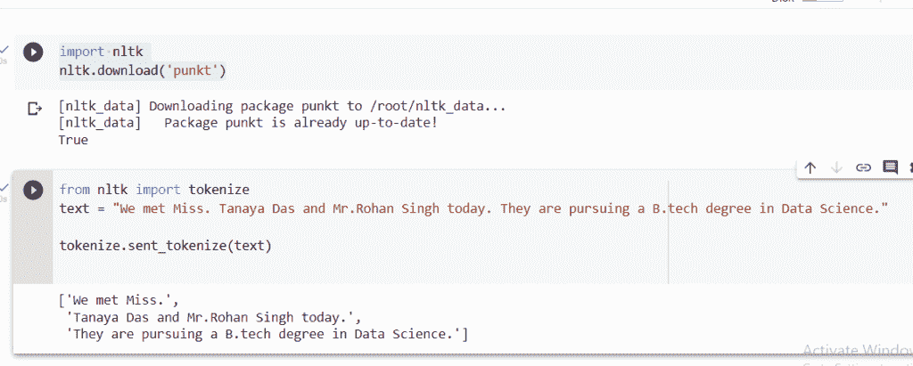
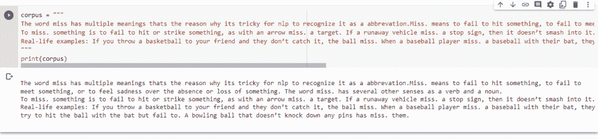
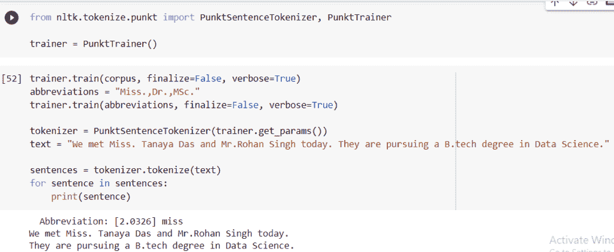

# 什么是 NLTK 点？

> 原文：<https://www.askpython.com/python-modules/nltk-punkt>

读者们好，在这篇文章中，我们将尝试理解 NLTK 中的一个名为 PUNKT 的模块。在 Python 中使用 NLTK ( [自然语言工具包](https://www.askpython.com/python/top-python-libraries-for-natural-language-processing))来实现自然语言处理领域下的程序。它包含各种不同用途的库，如文本分类、解析、词干分析、标记化等。

***也读作:[在 Python 中使用 NLTK 进行标记化](https://www.askpython.com/python-modules/tokenization-in-python-using-nltk)***

## 什么是 PunktSentenceTokenizer？

在 NLTK 中，PUNKT 是一个无监督的可训练模型，这意味着它可以在未标记的数据上训练(没有用识别其特征、属性或类别的信息标记的数据称为未标记数据。)

它通过使用无监督的技术为开始句子的单词、介词短语和缩写开发模型，从文本中生成句子列表。在没有投入使用之前，它必须接受目标语言中大量明文的训练。

## PunktSentenceTokenizer 用在哪里？

在自然语言处理领域的任何项目中，nltk 都是最重要的模块。现在，nltk 确实有广泛的功能，但有时为了提高效率和验证输出是准确的，并且开发的模型考虑了所有情况，我们需要导入一些额外的模块。

例如，将一个长文本拆分成句子，下面是提供的输入文本和将输入拆分成不同句子的任务。

```py
We met Miss. Tanaya Das and Mr.Rohan Singh today. They are pursuing a B.tech degree in Data Science.

```

作为先决条件的一部分，在开始使用程序之前，一定要记住导入 nltk 模块并下载 punkt 包以避免错误。下面是导入相同内容的代码。

```py
import nltk
nltk.download('punkt')

```



Implementation

**输出:**

```py
['We met Miss.',
 'Tanaya Das and Mr.Rohan Singh today.',
 'They are pursuing a B.tech degree in Data Science.']

```

代码的输出是相关的，但不完全正确。在这里，punkt 包成功地识别了缩写“Mr .”但是没有识别出缩写“Miss”后面的句点不是句子的结尾。

如前所述，这个包的主要优点是它使用了一个无监督的算法，这意味着可以训练模型，从而使整个代码更加准确。

### 在语料库上训练 punkt 标记器

让我们试着训练 punkt 句子标记器。首先为了训练，我们需要定义一个语料库。(包括用于自然语言处理的文本和语音数据的语料库可用于训练 AI 和机器学习系统。)

```py
corpus = """
The word miss has multiple meanings thats the reason why its tricky for nlp to recognize it as a abbrevation.Miss. means to fail to hit something, to fail to meet something, or to feel sadness over the absence or loss of something. The word miss. has several other senses as a verb and a noun.
To miss. something is to fail to hit or strike something, as with an arrow miss. a target. If a runaway vehicle miss. a stop sign, then it doesn’t smash into it.
Real-life examples: If you throw a basketball to your friend and they don’t catch it, the ball miss. When a baseball player miss. a baseball with their bat, they try to hit the ball with the bat but fail to. A bowling ball that doesn’t knock down any pins has miss. them.
"""

```

一旦我们定义了相关的语料库，我们进一步使用`punktTrainer()`–学习 Punkt 句子边界检测中使用的参数，之后，我们使用“训练”功能从给定的文本中收集学习信息。如果 finalize 设置为 True，它将选择句子边界检测的所有参数。如果既没有执行 get params()也没有执行 finalize training()，这将被推迟。如果 verbose 为 True，将列出检测到的缩写。

```py
Syntax: train(train_text, verbose=False)
```



Corpus



Screenshot 601

输出:

```py
Abbreviation: [2.0326] miss 
We met Miss. Tanaya Das and Mr.Rohan Singh today. 
They are pursuing a B.tech degree in Data Science.
```

通过这种方式，我们成功地训练了模型来识别单词“Miss ”,并且不会将它后面的句点误解为句子的结尾。同样，我们可以定义语料库，并训练一个无监督的模型来学习其他缩写词、首字母缩写词等。使用`punktTrainer()`可以做到这一点。

## 摘要

自然语言处理是人工智能下理解人类语言结构和意义的广阔领域。在 python 中，我们使用 nltk(自然语言工具包)来实现它。punkt 是 nltk 中的一个模块。Punkt 以无监督的方式从语料库中学习与目标领域相关的参数，例如缩写、首字母缩写等的列表。

## 参考

[https://www.nltk.org/api/nltk.tokenize.punkt.html](https://www.nltk.org/api/nltk.tokenize.punkt.html)

[https://stack overflow . com/questions/4576077/how-can-I-split-a-text-into-sentences](https://stackoverflow.com/questions/4576077/how-can-i-split-a-text-into-sentences)