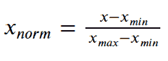
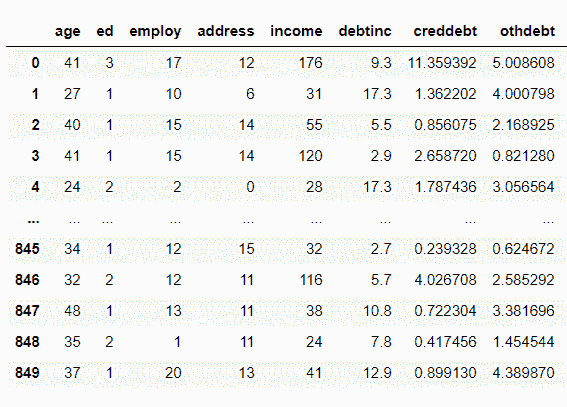
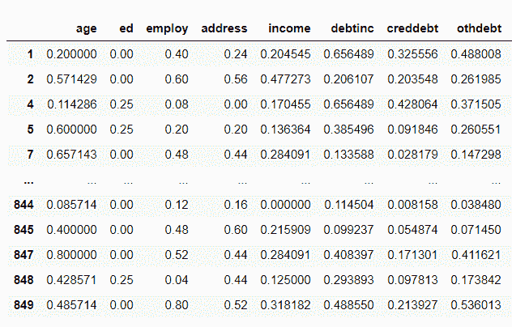

# 如何在 Python 中规范化数据——您需要知道的一切

> 原文：<https://www.askpython.com/python/examples/normalize-data-in-python>

读者你好！在这篇文章中。我们将关注如何在 Python 中规范化数据。那么，让我们开始吧。

* * *

## 什么是正常化？

在开始正常化之前，让我们先了解一下它的必要性！！

**特征缩放**是数据分析和准备建模数据的重要步骤。其中，我们使数据无标度，以便于分析。

归一化是特征缩放技术之一。当数据在任一轴上**偏斜**时，即当数据不符合**高斯分布**时，我们特别应用归一化。

在**归一化**中，我们**将不同尺度的数据特征转换为一个共同的尺度**，这进一步使得数据易于处理用于建模。因此，所有的数据特征(变量)对建模部分都有相似的影响。

根据下面的公式，我们通过从数据变量中减去最小数据值，然后除以变量的范围来标准化每个特征，如下所示



Normalization

因此，我们将这些值转换到**【0，1】**之间的范围。现在，让我们在下一节中尝试用 Python 实现规范化的概念。

* * *

## Python 中规范化数据的步骤

Python 中有各种方法，我们可以通过它们来执行规范化。

今天，我们将使用一种最流行的方式——**minmax scaler**。

让我们先来看看我们将要扩展的数据集。

**数据集:**



**Dataset For Normalization**

此外，我们将在 sklearn 中使用**最小和最大缩放来执行标准化。**

**举例:**

```py
import pandas as pd
import os
from sklearn.preprocessing import MinMaxScaler
#Changing the working directory to the specified path--
os.chdir("D:/Normalize - Loan_Defaulter")

data = pd.read_csv("bank-loan.csv") # dataset
scaler = MinMaxScaler()

loan=pd.DataFrame(scaler.fit_transform(data),
            columns=data.columns, index=data.index) 
print(loan)

```

在这里，我们创建了一个`MinMaxScaler()` [类的对象](https://www.askpython.com/python/oops/python-classes-objects)。此外，我们使用了`fit_transform() method`来标准化数据值。

**输出:**

因此，可以清楚地看到，我们已经转换并标准化了 0 和 1 范围内的数据值。



**Dataset After Normalization Using MinMaxScaler**

* * *

## 摘要

因此，从上述解释中，可以得出以下见解

*   当数据值**偏斜**且**不遵循高斯分布**时，使用归一化。
*   数据值在 0 和 1 的**范围内转换。**
*   标准化使数据**无标度**。

* * *

## 结论

到此，我们就到了本文的结尾。如果你遇到任何问题，请随时在下面评论。

在那之前，请继续关注@ [Python 和 AskPython](https://www.askpython.com/) 并继续学习！！