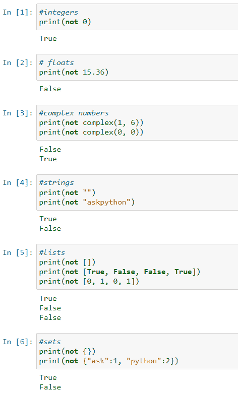

# Python 中的“非”布尔运算符

> 原文：<https://www.askpython.com/python/not-boolean-operator>

布尔运算符从一个或多个输入值生成单个布尔输出值。布尔代数中有三种布尔运算符: **[和](https://www.askpython.com/python/python-and-operator)** 、**或**、**非**。Python 使用`and`、`or`和`not`来实现它们。我们将在本教程中学习 Python 的 not 操作符。

* * *

## **不是**运算符

它用于得到一个值的否定，即它允许我们反转一个给定布尔表达式的真值。该操作符可应用于布尔情况，如 if 语句和 while 循环。它在非布尔设置中也起作用，使您能够反转变量的真值。

下表显示了对某些输入值应用 not 运算符时的结果。

| **输入** | **输出** |
| 真实的 | 错误的 |
| 错误的 | 真实的 |

`not`是一元运算符，这意味着它只接受一个输入值。它可以用于任何布尔表达式或 Python 对象。

* * *

## 对不同的数据类型使用 not



`not` with Different Data Types

* * *

## 在条件语句中使用 not

让我们看看 Python 中的 not 操作符是如何处理不同类型的条件语句的。

### 如果语句

```py
num = 25

if not num%2==0:
    print("num is an odd number")
else:
    print("num is an even number")

```

**输出:**

```py
num is an odd number

```

在这里，num%2 即 25%2 等于 1 而不是 0。`if`语句检查 num%2==0 是否为假。因为条件满足，所以输出说数字是奇数。如果是偶数的话，`else`条件就满足了。

* * *

### while 循环

```py
count = 1

while not count>5:
    print(count)
    count = count + 1

```

**输出:**

```py
1
2
3
4
5

```

条件 count>5 检查记录数是否大于 5。`while`循环执行到`count`小于 5。一旦`count`的值变为 6，循环将终止。

* * *

## Python 中实现 **not** 布尔运算符的方法

### 方法 1:使用“not”关键字

```py
var  = False
print(not var)

```

**输出:**

```py
True

```

```py
var = True
print(not var)

```

**输出:**

```py
False

```

以上是在 Python 中使用`not`关键字的简单例子。

* * *

### 方法 2:使用“~”运算符

~ '称为求反运算符。

```py
flag = True

print("Flag is ", flag)

print("Flag is ", bool(~flag))

```

**输出:**

```py
Flag is  True
Flag is  False

```

在本例中，首先将`flag`设置为`True`，并打印其值。在下一行中，我们首先通过写`~flag`得到`flag`的否定，我们已经写了`bool(~flag)`，因为如果该标志最初不是布尔值，那么它将被转换为布尔值。

* * *

### 方法 3:使用操作员模块

Python 中的**运算符**模块提供了各种方法，如加、减、取幂、左移、右移等。这些众多方法中的一种就是`not_()`。它返回提供给它的参数的取反值。

```py
import operator

initial_list = [False, True, True, False]
print("Initial list:", initial_list)
negated_list = []

for i in range(0, len(initial_list)):
    negated_list.append(operator.not_(initial_list[i]))

print("Negated list:", negated_list)

```

**输出:**

```py
Initial list: [False, True, True, False]
Negated list: [True, False, False, True]

```

这里，我们首先导入了操作符模块。然后我们创建了一个布尔值列表。该循环遍历“初始列表”，使用来自**运算符**模块的`not_()`方法对每个值求反，并将其附加到“求反列表”中。

* * *

### 方法 4:使用 NumPy 中的 bitwise_not()方法

Numpy 提供了一个`bitwise_not()`方法来寻找一个值的反值。它对其参数执行按位非运算。

```py
import numpy as np

print(np.bitwise_not(True))
print(np.bitwise_not(False))

```

**输出:**

```py
False
True

```

上面的代码使用`bitwise_not()`方法只求单个值的反。我们也可以使用 NumPy 元素数组，如下所示。

```py
import numpy as np
a = np.array([True, False, False])
a = np.bitwise_not(a)
print(a)

```

**输出:**

```py
[False  True  True]

```

* * *

### 方法 5:使用 NumPy 中的 invert()方法

此方法还对传递给它的参数执行按位 NOT 运算。它可以用于单个元素或元素数组。

```py
import numpy as np

print(np.invert(False))
print(np.invert(True))

```

**输出:**

```py
True
False
```

**再比如:**

```py
import numpy as np

a = [True, False, False]
a = np.invert(a)
print(a)

```

**输出:**

```py
[False  True  True]

```

* * *

### 方法 6:使用 NumPy 中的 logical_not()方法

这种方法也可以用来寻找一个布尔值的否定。就像 bitwise_not()和 invert()方法一样，该方法也可以应用于两者，一个参数或一组参数，如下所示。

```py
import numpy as np

print(np.logical_not(False))
print(np.logical_not(True))

```

**输出:**

```py
True
False

```

**再比如:**

```py
import numpy as np

a = [True, False, True]
a = np.logical_not(a)
print(a)

```

**输出:**

```py
[False  True False]

```

* * *

## 结论

仅此而已！我们已经学习了 **not** 操作符，以及在 Python 中使用它的不同方式。