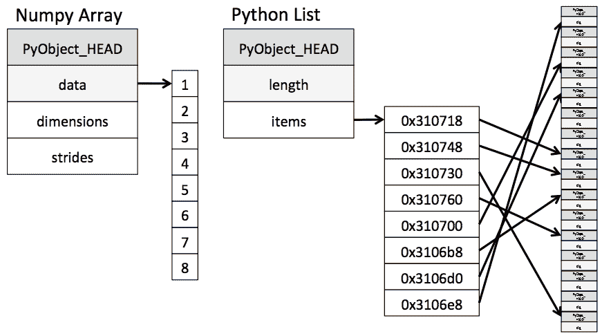

# Numba:让你的 python 代码快 100 倍

> 原文：<https://www.askpython.com/python-modules/numpy/numba>

Numba 是一个用于 Python 数组和数值函数的编译器，它让您能够使用直接用 Python 编写的高性能函数来加速您的应用程序。

## 是什么让 python 变慢的？

Python 已经被用于科学计算很长一段时间了。尽管 python 是一种很好的原型语言，但准系统 Python 缺乏进行如此巨大计算的优势。具有讽刺意味的是，使 python 天生缓慢的是使 Python 作为一种语言如此流行的特性。让我们逐一回顾一下:

*   **动态类型** : Python 是一种动态类型语言，即用户不需要指定与变量相关的数据类型。虽然这在表面上使事情变得简单了许多，但内部机制却变得复杂了许多倍，因为解释器需要在每次操作完成时检查数据类型和相关的转换。这些增加的、复杂的指令主要负责 python 的速度。
*   **内存开销**:由于 Python 的灵活性，需要为每个小对象分配单独的内存，比如一个列表中的 int(不像 C 为一个数组占用一个连续的内存块)。这意味着列表中的对象在内存中的位置并不相邻，这会影响每次获取操作的时间开销。



Python memory cost for list compared to numpy implementation of arrays.

*   **非编译**:类似 LLVM、GCC 这样的编译器，可以对程序进行前瞻，做一些高层的优化，既节省内存又节省速度。另一方面，Python 解释器不知道下一行执行，所以它不能应用任何节省时间的优化。
*   **GIL 锁**:全局解释器锁(GIL)不允许[多线程](https://www.askpython.com/python-modules/multithreading-in-python)。它确保只有一个线程执行 Python 字节码。这简化了 CPython 的实现，因为它使得对象模型对于并发访问是隐式安全的。

在本文中，我们将看到 numba 如何克服这些困难，以及如何使用它来加速我们的代码达到 C/C++和 FORTRAN 之类的水平。


## 什么是 Numba？

根据官方文档，*“Numba 是一个针对 Python 的即时编译器，最适合使用 NumPy 数组和函数以及循环的代码”*。JIT 编译器是提高解释语言性能的有效方法之一。在程序执行期间，LLVM 编译器将代码编译成本机代码，这通常比代码的解释版本快得多。如前所述，编译器可以添加一些高级优化，这对用户在内存和速度方面都有好处。

Numba 附带了 Anaconda 发行版，也有轮子，所以它可以由

```py
conda install numba
```

或者，

```py
pip install numba

```

注意: *Linux 用户可能需要使用 [pip3](https://www.askpython.com/python-modules/python-pip) 而不是 pip* 。

## 在 Python 中使用 Numba

Numba 使用[函数装饰器](https://www.askpython.com/python/examples/decorators-in-python)来提高函数的速度。重要的是，用户必须将计算包含在函数中。numba 中使用最广泛的装饰器是@jit 装饰器。使用这个装饰器，您可以通过 Numba 的 JIT 编译器为优化标记一个函数。让我们看一个平凡函数的用例。

```py
from numba import jit
import numpy as np

@jit            # Placing the @jit marks the function for jit compilation
def sum(a, b):
    return a + b

```

Numba 将保存编译直到第一次执行。在第一次执行期间，numba 将推断输入类型，并根据该信息编译代码。编译器还添加了一些特定于该输入数据类型的优化。这样做的直接后果是，对于不同类型的变量，函数将有不同的执行代码。

用户第一次执行该功能时可能会有一些延迟。这种明显的时间差距是由于函数的编译。编译后，用户可以期待 numba 编译函数的正常速度。一个常见的技巧是在第一次执行代码时使用一个小的虚拟变量。

注意*:不要改变函数内部变量的数据类型。更改数据类型意味着 numba 不再能够正确地推断数据类型和优化函数。*

### 1。渴望模式

上述方法的一个缺点是我们必须等到第一次执行编译。我们可以通过渴望模式来克服它。在**急切模式**中，我们指定了输入的数据类型，因此编译器不需要从输入中推断，并立即编译函数。这叫做急切执行，我们可以这样做，

```py
@jit(int32(int32, int32))
def sum(a, b):
    return a + b

```

编译器不再等待第一次执行，而是应用给定类型的专门化来编译代码。它允许用户越来越多地控制要使用的变量类型。

### 2。没有 GIL 模式

编译代码将我们从 python 全局解释器锁中解放出来。我们可以使用`nogil=True`指定不使用 GIL

```py
@jit(nogil=True)
def sum(a, b):
    return a + b

```

### 3。非 python 模式

有两种执行模式- *nopython* 和 *object* 模式。在 nopython 模式下，编译器在没有解释器参与的情况下执行代码。使用 numba.jit()进行编译是最好的方法。

```py
@jit(nopython=True)
def sum(a, b):
    return a + b

```

Numba 与 numpy 数组和函数配合得最好。下面是一个来自官方文档的使用 numpy 函数的例子。

```py
from numba import jit
import numpy as np

x = np.arange(100).reshape(10, 10)

@jit(nopython=True)
def go_fast(a): # Function is compiled to machine code when called the first time
    trace = 0.0
    for i in range(a.shape[0]):   # Numba likes loops
        trace += np.tanh(a[i, i]) # Numba likes NumPy functions
    return a + trace              # Numba likes NumPy broadcasting

print(go_fast(x))

```

## 结论

与 C/C++、FORTRAN、Java 等相比，Numba 提供了更快的速度。而不影响 python 的任何语法。numba 的一个缺点是，它使 python 代码不太灵活，但允许对变量进行细粒度控制。如果您正在使用 python 进行繁重的科学模拟(需要快速处理和并行化能力)，Numba 可以让您的生活变得更加轻松。

### 参考

*   [https://numba . pydata . org/numba-doc/latest/user/5 minguide . html](https://numba.pydata.org/numba-doc/latest/user/5minguide.html)
*   [https://numba.pydata.org/numba-doc/latest/user/jit.html](https://numba.pydata.org/numba-doc/latest/user/jit.html)