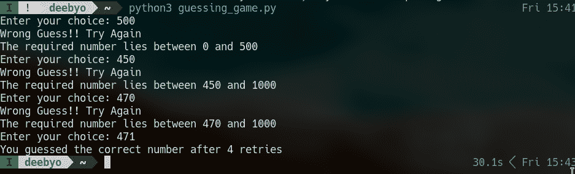

# 用 Python 创建一个数字猜谜游戏:第 1 部分(命令行)

> 原文：<https://www.askpython.com/python/examples/number-guessing-game-command-line>

在本教程中，我们将使用标准 python 库创建一个随机数猜测游戏。本教程分为两部分——命令行界面(CLI)和图形用户界面(GUI)。

这是教程的第一部分，我们实现了游戏，并在命令行中运行它，没有任何图形视觉糖果。教程的下一部分是本教程的扩展，为游戏添加图形界面。这是一个初学者水平的项目，但对 python 非常基本的理解是期望的。

***也读作: [Python Hi-lo 游戏](https://www.askpython.com/python/examples/pygame-graphical-hi-lo-game)***

## 理解猜数字游戏的规则

在我们继续编写应用程序之前，清楚地理解应用程序应该做什么以及它应该如何表现是非常重要的。

所以我们首先列出游戏的基本规则:

1.  计算机会猜出 1 到 1000 之间的一个数字，你需要猜出这个数字。
2.  将提供无限次数的重试，直到您猜出正确的号码。重试次数最少的人赢得游戏。
3.  如果玩家选择了一个错误的数字，电脑会给用户一个提示——电脑会告诉玩家 target 是否在 0 和用户猜测的数字之间。例如:如果你选择 78，数字是 45，目标数字(45)位于 0 和 78 之间，所以计算机会相应地提示。

## 创建一个 Python 数字猜谜游戏

因此，让我们深入了解代码的实现。

注意:虽然这个代码库只是在 CLI 中实现的，但它将作为游戏 GUI 版本的主干。

### 生成 1 到 1000 之间的随机数

为了生成 1 到 1000 之间的随机数，我们将使用 python 中的[随机库](https://www.askpython.com/python-modules/python-random-module-generate-random-numbers-sequences)中的 [randint()函数](https://www.askpython.com/python-modules/python-randint-method)。

```py
# Import the random module
import random

# Computer chooses a random number between 1 and 1000
target = random.randint(1, 1000)

```

### 用户输入一个数字

要从用户输入一个数字 a，我们将使用 input()函数

```py
# Input the guess from the user
choice = int(input("Enter your guess: "))

```

现在我们有了用户输入，我们可以比较这两个数字并显示一个输出。为了让游戏继续进行，直到用户选择了正确的选项，我们必须将所有东西放入一个循环中。

### 循环整个过程

还有三件事我们需要注意:

1.  为猜测和提示生成正确的提示:这可以使用嵌套的 [if-else 块](https://www.askpython.com/python/python-if-else-elif-statement)来实现。
2.  计算退役次数:每次玩家做出错误选择时，取一个计数器变量并增加。
3.  重复所有操作，直到做出正确的猜测:将所有操作封闭在一个无限循环中，该循环只有在做出正确的猜测时才会中断。

我们一起解决这三个子问题的是这段代码:

```py
# Counter Variable
retries = 0

while(True):

  # Taking user choice
  choice = int(input("Enter your choice: "))
  retries += 1

  # Wrong guess
  if target != choice:

    print("Wrong Guess!! Try Again")

    # Hint
    if target < choice:
      print("The required number lies between 0 and {}".format(choice))
    else:
      print("The required number lies between {} and 1000".format(choice))

  # Correct choice
  else:
    print("You guessed the  correct number after {} retries".format(retries))
    # User guessed the correct value
    # So let's end the infinite loop
    break;

```

### 我们猜数字游戏的最终 Python 代码

将所有代码块放在一起，最终的 Python 程序如下所示:

```py
# Import the random module
import random

# Computer chooses a random number between 1 and 1000
target = random.randint(1, 1000)

retries = 0

while(True):

  # Taking user choice
  choice = int(input("Enter your choice: "))
  retries += 1

  # Wrong guess
  if target != choice:

    print("Wrong Guess!! Try Again")

    # Hint
    if target < choice:
      print("The required number lies between 0 and {}".format(choice))
    else:
      print("The required number lies between {} and 1000".format(choice))

  # Correct choice
  else:
    print("You guessed the correct number after {} retries".format(retries))
    # User guessed the correct value
    # So let's end the infinite loop
    break;

```

要运行该程序，请将其保存在 python 文件中。我们用“guessing_game.py”这个名字保存了它。您可以选择任何其他名称，但要确保扩展名为。py，表示该文件是 python 文件。

从命令行运行 python 文件。如果你愿意，你可以在你最喜欢的 IDE 中执行它。

```py
python3 guessing_game.py

```



Output of the CLI version of the Guessing Game

## 结论

这就把我们带到了教程前半部分的结尾，在这里我们实现了游戏的命令行版本。请继续关注教程的下一部分:游戏的 GUI 版本和更多类似的 python 教程。